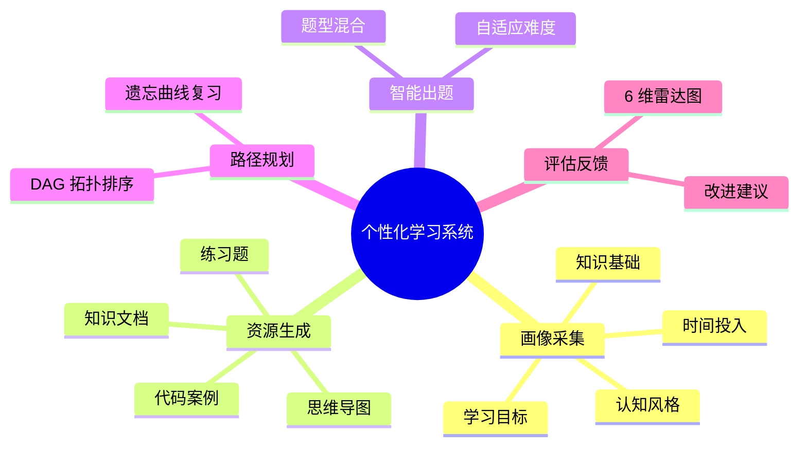
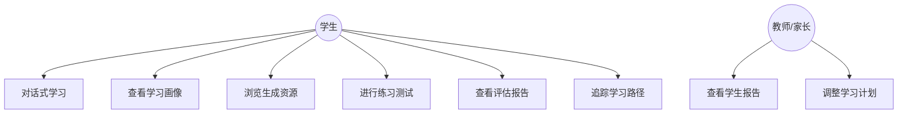
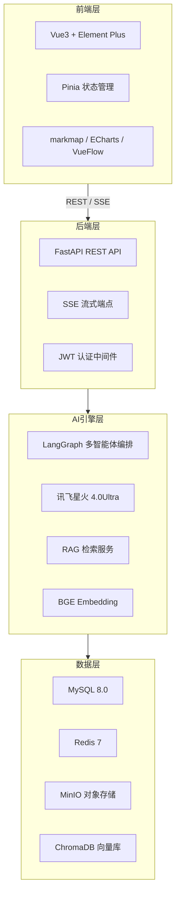
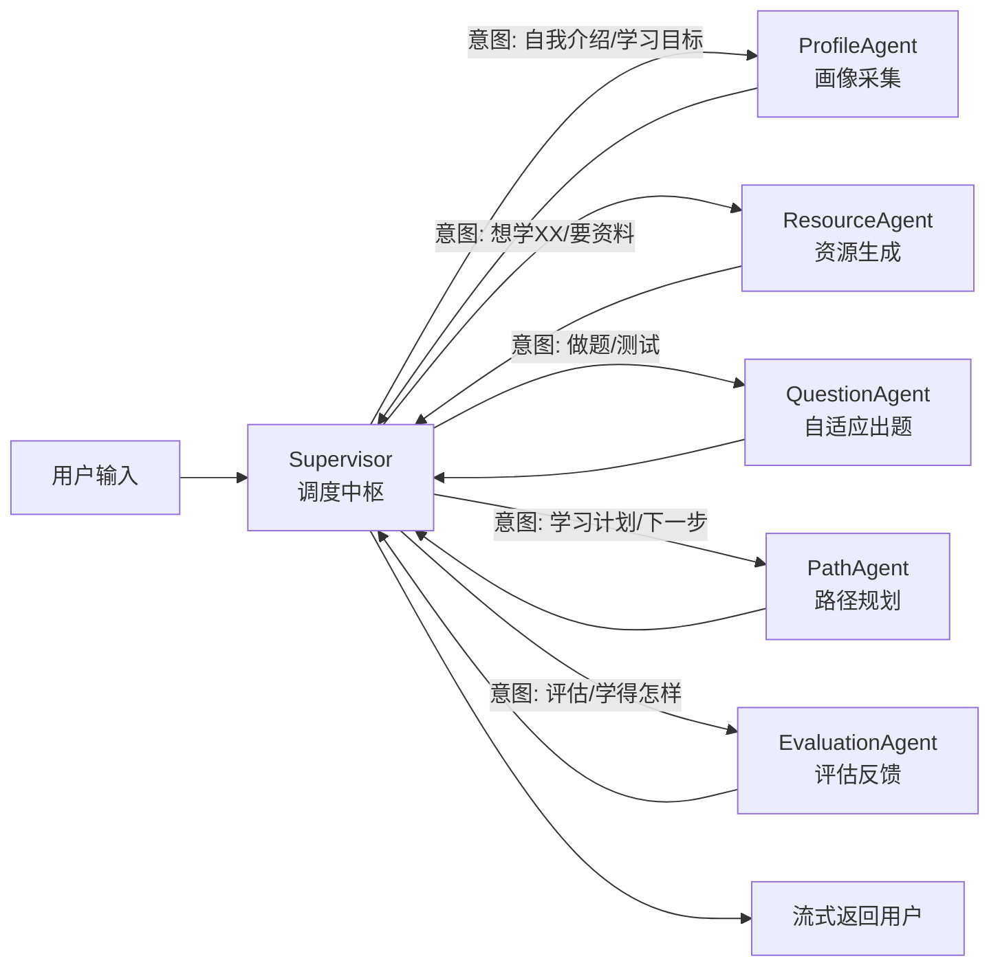
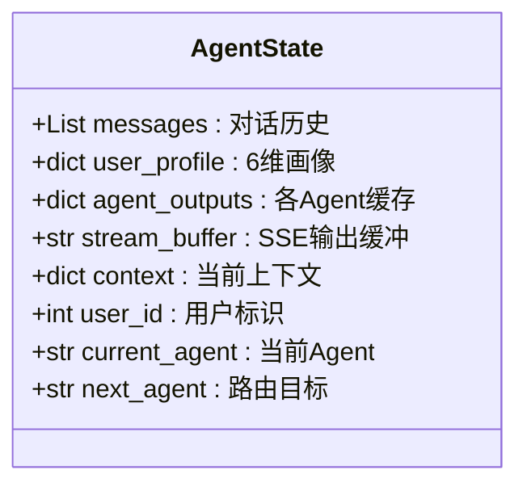
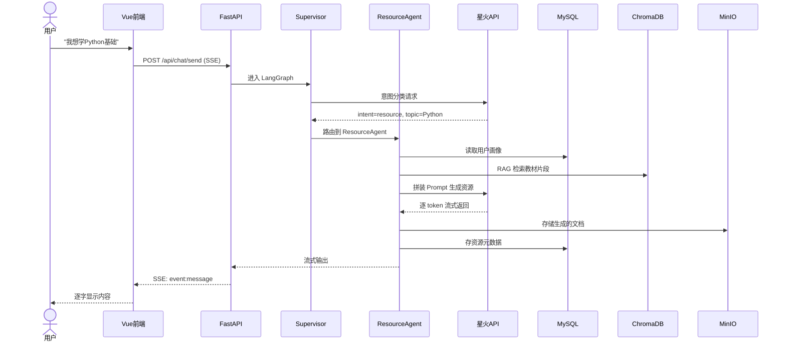
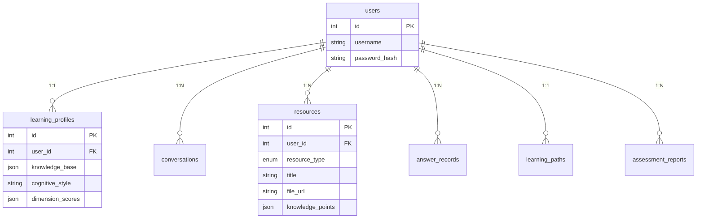
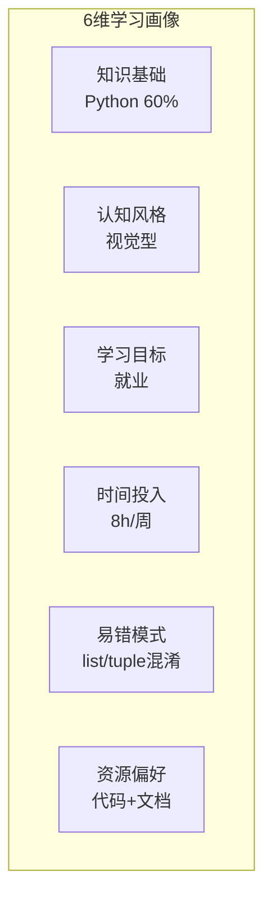

# PPT 生成完整指令（发给 AI）

> 把我发你的《项目完整总结.md》配合下面指令一起发给 AI

---

## 一、背景信息

```
中国软件杯参赛项目 PPT 生成任务：

赛题：基于大模型的个性化资源生成与学习多智能体系统开发
出题方：科大讯飞（硬性要求：必须使用讯飞星火大模型 API）
比赛阶段：省级选拔赛答辩 / 决赛答辩
PPT 用途：现场答辩演示，评委打分依据
时长要求：5-7 分钟演讲 + 3-5 分钟评委提问
```

## 二、PPT 整体要求

```
1. 总页数：16-20 页（含封面和封底）
2. 设计风格：科技蓝为主色调，深色背景 + 白色文字 + 蓝色强调色，简洁专业
3. 字体：中文用思源黑体或微软雅黑，英文和代码用 Consolas 或 JetBrains Mono
4. 页面原则：每页 ≤ 5 个要点，每要点 ≤ 20 字，多用图表少用文字
5. 图表来源：所有架构图/流程图/ER图用 Mermaid 代码描述，你渲染成图放到对应页面
6. 动画建议：要点逐条弹出，图表从左到右展开，不要花哨
7. 文件格式：输出 .pptx 或给出完整的页面 Markdown（标清每页标题+内容+图的位置）
```

## 三、逐页内容规格（共 18 页）

---

### 第 1 页 — 封面

```
内容：
- 项目名称（大号加粗）：A3 个性化学习多智能体系统
- 副标题（中号）：基于大模型的个性化资源生成与学习多智能体系统开发
- 比赛名称 + 赛题编号：中国软件杯 · 科大讯飞命题
- 团队名称 + 日期：你的团队名 | 2026.06

设计：深蓝渐变背景，项目名居中偏上，底部放团队名和日期
不要放任何图
```

---

### 第 2 页 — 目录

```
标题：汇报提纲

左侧用数字列表，右侧对应关键词：
1. 赛题理解        → 背景 · 痛点 · 目标
2. 需求分析        → 用户 · 功能 · 数据
3. 技术方案        → 架构 · 智能体 · 数据库
4. 核心功能        → 6 大模块演示
5. 创新亮点        → 8 个得分点
6. 总结展望        → 价值 · 下一步

不要放图，纯文字排版
```

---

### 第 3 页 — 赛题背景与痛点

```
标题：为什么需要个性化学习？

左侧放 3 个痛点（图标 + 文字）：
🔴 千人一面 — 传统学习平台同一套内容给所有人
🔴 缺乏诊断 — 学生不知道自己薄弱点在哪
🔴 被动学习 — 没有自适应调整，学了就忘

右侧放 1 句话解决方案：
"用大模型 + 多智能体，给每个学生配一个 AI 私教团队"

不加图，用大图标加粗文字排版
```

---

### 第 4 页 — 赛题拆解

```
标题：赛题拆解 —— 我们要做几件事？

用 Mermaid 思维导图渲染，把赛题拆成 5 个子任务：



图放页面中央，不用额外文字
```

---

### 第 5 页 — 用户与需求

```
标题：谁在用？要什么？

上半部分（用 Mermaid 用例图）：



下半部分：功能需求列表（3 列排列）：
- 智能对话 | 画像采集 | 资源生成
- 自适应出题 | 路径规划 | 评估反馈
- 多模态交互 | RAG 检索 | 用户认证
```

---

### 第 6 页 — 整体架构图（第一张架构图）

```
标题：系统整体架构

用 Mermaid 画出 4 层架构：



图放页面中央占 70% 面积
右上角加 3 个关键词标签：四层架构 · 松耦合 · 可扩展
```

---

### 第 7 页 — 多智能体架构（第二张架构图，核心页！）

```
标题：多智能体协作引擎 —— 6 个 AI 教师各司其职

用 Mermaid 画 Agent 协作流程图：



图放页面中央，占 60% 面积
图下方用 3 行文字解释：
• Supervisor 调用星火 API 做意图分类，JSON 结构化输出决定路由
• 5 个专业 Agent 各负责一个子任务，执行完回到 Supervisor
• 共享 AgentState，所有 Agent 可读写同一份画像和上下文
```

---

### 第 8 页 — Agent 共享状态设计

```
标题：共享状态 —— Agent 之间怎么传递信息？

画一个状态对象结构图：



图占左边 50%
右边放 3 个要点：
• LangGraph 自动在节点间传递，Agent 只需读写
• Redis checkpoint 持久化，中断可从断点恢复
• user_profile 是核心——每个 Agent 都在读它、写它
```

---

### 第 9 页 — 数据流时序图

```
标题：一次对话的数据流 —— 以"生成学习资源"为例

用 Mermaid 画时序图：



图占整页 80%
图的右上角标注时间：完整链路 2-5 秒
```

---

### 第 10 页 — 数据库设计

```
标题：数据持久化方案

左侧放 MySQL ER 图（Mermaid）：



右侧放 ChromaDB + Redis 说明（4 个集合 + 5 种键，用简表）
```

---

### 第 11 页 — SSE 流式协议

```
标题：实时交互 —— SSE 流式通信协议

左侧用代码块展示 SSE 数据格式：

```
event: message
data: {"type":"text","content":"Python","agent":"resource"}

event: agent_switch
data: {"from":"supervisor","to":"resource_agent",
       "reason":"生成学习资源"}

event: message
data: {"type":"resource","resource_type":"mindmap",
       "url":"/api/resources/123"}

event: done
data: {"total_tokens":1234,
       "agents_used":["supervisor","resource_agent"]}
```

右侧列 4 个优势：
• 单向推送，比 WebSocket 更轻量
• 原生支持断线重连
• Agent 切换对用户透明
• 资源生成完自动内嵌到聊天
```

---

### 第 12 页 — 核心功能展示：学习画像

```
标题：功能一 · 6 维学习画像

画一个雷达图示意（用 Mermaid 或表格描述 6 维）：



图下方说明画像更新机制：
• 第1次对话：用户自我介绍 → ProfileAgent 采集初始画像
• 每次答题：正确率 + 错题模式 → 自动更新画像
• 每个 Agent 生成资源前都读取最新画像 → 内容始终匹配当前水平
```

---

### 第 13 页 — 核心功能展示：资源生成 + 出题 + 路径 + 评估

```
标题：功能二至六 · 个性化学习全流程

用 4 列并排卡片布局，每列一个功能：

┌─────────────┐ ┌─────────────┐ ┌─────────────┐ ┌─────────────┐
│  资源生成    │ │  自适应出题  │ │  路径规划    │ │  评估反馈    │
│             │ │             │ │             │ │             │
│ 📄 文档     │ │ 🔢 选择题   │ │ 🗺️ DAG图    │ │ 🎯 雷达图   │
│ 🧠 导图     │ │ ✏️ 填空题   │ │ 📈 难度升序 │ │ 📊 趋势对比 │
│ 📝 练习题   │ │ 💻 代码题   │ │ ⏰ 时间估算 │ │ 💡 改进建议 │
│ 🎬 视频脚本 │ │ 📈 AI自适应 │ │ 🔄 遗忘复习 │ │ 🏆 6维评分   │
└─────────────┘ └─────────────┘ └─────────────┘ └─────────────┘

每列下方加一行小字描述核心算法/策略
不要放复杂图，用 emoji + 关键词的卡片式排版
```

---

### 第 14 页 — 前端页面展示

```
标题：前端界面设计

用 3 行 2 列的截图占位布局，展示 6 个核心页面：

┌──────────────┐ ┌──────────────┐
│ [截图占位]   │ │ [截图占位]   │
│ 学习仪表盘   │ │ Agent对话页  │
│ Dashboard    │ │ ChatView     │
└──────────────┘ └──────────────┘
┌──────────────┐ ┌──────────────┐
│ [截图占位]   │ │ [截图占位]   │
│ 学习画像     │ │ 资源库       │
│ ProfileView  │ │ ResourceView │
└──────────────┘ └──────────────┘
┌──────────────┐ ┌──────────────┐
│ [截图占位]   │ │ [截图占位]   │
│ 评估报告     │ │ 学习路径     │
│ Assessment   │ │ LearningPath │
└──────────────┘ └──────────────┘

标注：每张截图需替换为实际运行截图
截图下方标注页面路由和核心组件名
```

---

### 第 15 页 — 创新亮点（答辩得分关键页）

```
标题：创新亮点

用 8 个圆角卡片排列（2 行 4 列），每个卡片 = emoji + 标题 + 一句话：

🏛️ 多智能体协作          🔍 RAG + 防幻觉
6 Agent 分工，非          向量检索增强，减少
单一模型对话              大模型"编造"内容

👤 6维学习画像            ⚡ SSE 流式体验
认知风格+易错模式        逐字打字，Agent 切
真正"因材施教"           换对用户透明

🗺️ DAG 学习路径           📈 自适应难度
VueFlow 可视化知识        连对升难度、答错降
图谱，一眼看到全局        难度，最佳挑战水平

🔄 全流程闭环             🧠 遗忘曲线复习
画像→资源→练习→          艾宾浩斯遗忘曲线，
路径→评估，全覆盖        在临界点自动插入复习

每个卡片用浅蓝底色 + 深蓝边框
这是评委打分的关键页，一定要设计精美
```

---

### 第 16 页 — 技术选型说明

```
标题：技术选型与理由

表格，4 列：

| 技术选择 | 用途 | 为什么不选别的 | 替代方案 |
|----------|------|---------------|---------|
| FastAPI | 后端框架 | 原生 async + SSE，比 Flask 性能好 | Flask / Django |
| LangGraph | Agent编排 | 状态图可视化 + checkpoint，比 AutoGPT 可控 | CrewAI / AutoGen |
| 讯飞星火 | 大模型 | 赛题硬约束；WebSocket 流式效果好 | GPT-4o / 文心一言 |
| BGE-large-zh | Embedding | 中文 SOTA，免费本地运行 | OpenAI Embedding |
| ChromaDB | 向量库 | Python 原生，比 Milvus 轻量 | Milvus / Pinecone |
| Vue3 | 前端 | 团队熟悉，生态丰富 | React / Angular |
| MySQL | 关系库 | 结构化数据，JSON 字段灵活 | PostgreSQL |
| Docker | 部署 | 一键启动，评委可复现 | 手动安装 |
```

每行标一个理由颜色（蓝色 = 最佳选择，灰色 = 弃用原因）
```

---

### 第 17 页 — 项目进度与规划

```
标题：开发进度与后续计划

左侧放 Gantt 图（Mermaid）：

```mermaid
gantt
    title 开发路线图
    dateFormat  MM-DD
    axisFormat  %m-%d
    
    section 一·调研验证
    星火API调通           :done, a1, 05-09, 05-10
    脚手架搭建            :done, a2, 05-14, 05-15
    
    section 二·MVP闭环
    6个Agent实现          :active, b1, 05-16, 05-31
    
    section 三·前端体验
    完整UI+可视化         :c1, 06-01, 06-10
    
    section 四·加分项
    RAG+多模态+优化       :d1, 06-11, 06-20
    
    section 五·文档演示
    文档+视频+PPT         :e1, 06-21, 06-29
    
    section 提交
    最终提交              :milestone, f1, 06-30
```

右侧放当前进度文字：
✅ 已完成：星火 API、脚手架、Docker、前端骨架
🔧 进行中：6 个 Agent 实现、ChatView UI
📅 预计 5.31 完成 MVP 闭环
```

---

### 第 18 页 — 总结与致谢

```
标题：总结与展望

上半部分：3 句话总结
1. 我们用 LangGraph 构建了 6 个 AI Agent 协作的个性化学习系统
2. 每个学生都能获得量身定制的学习内容、路径和评估
3. 全流程闭环，从画像采集到评估反馈一步到位

中间：未来计划（3 列）
• 短期：完成 MVP，6 月通过选拔
• 中期：开源社区版，降低使用门槛
• 长期：对接学校 LMS，服务真实教学场景

底部：
致谢 — 科大讯飞 · 中国软件杯组委会 · 指导老师
联系方式 + GitHub 仓库地址

深蓝背景，白色文字居中排版
不放图
```

---

## 四、配图规格汇总

| 页码 | 图类型 | 渲染方式 | 尺寸占比 |
|------|--------|---------|---------|
| 第 4 页 | 赛题拆解思维导图 | Mermaid mindmap | 80% |
| 第 5 页 | 系统用例图 | Mermaid graph TD | 50% |
| 第 6 页 | 四层架构图 | Mermaid graph TB（带 subgraph） | 70% |
| 第 7 页 | Agent 协作流程图 | Mermaid graph LR | 60% |
| 第 8 页 | 共享状态类图 | Mermaid classDiagram | 50% |
| 第 9 页 | 数据流时序图 | Mermaid sequenceDiagram | 80% |
| 第 10 页 | ER 图 + 非关系库表 | Mermaid erDiagram + 表格 | 60% + 40% |
| 第 13 页 | 功能卡片 | HTML 表格 / CSS Grid | 100% |
| 第 14 页 | 前端截图占位 | 3×2 Grid 布局 | 100% |
| 第 15 页 | 创新亮点卡片 | 2×4 Grid 布局 | 100% |
| 第 17 页 | 甘特图 | Mermaid gantt | 60% |

---

## 五、设计规范

```
配色方案：
- 主背景：深蓝 #1a2332
- 卡片/区块背景：浅蓝 #e8f0fe
- 强调文字：亮蓝 #1976d2
- 普通文字：白色 #ffffff（深色背景）/ 深灰 #333（浅色背景）
- 代码块背景：深灰 #2d2d2d
- 成功/完成色：绿色 #4caf50
- 进行中色：橙色 #ff9800

字体大小规范：
- 封面标题：48pt
- 页面标题：32pt
- 一级要点：24pt
- 二级说明：18pt
- 图表标注：14pt
- 代码块：14pt

每页布局：
- 标题在顶部，左对齐，占页面高度 15%
- 内容区占 85%
- 底部留白至少 5%
- 每页右上角放章节小标签（如"技术方案"）
```

---

## 六、演讲配合建议（附在 PPT 备注里）

```
第 3 页讲痛点时：停顿 2 秒让评委看，再说"所以我们要做这件事"
第 6 页讲架构时：从下往上讲（数据层→AI层→后端→前端），不要从上往下
第 7 页是核心：至少花 1 分钟在这页，把 6 个 Agent 的协作流程讲清楚
第 9 页时序图：说"我们从一个真实例子看数据怎么流的"然后用激光笔跟着箭头指
第 15 页创新亮点：不要逐条念，说"各位评委，这 8 个点是我们觉得最亮的"然后讲前 3 个
第 16 页技术选型：快速过，除非评委提问
第 18 页致谢：说完"谢谢"后停 3 秒再翻到结束页
```

---

## 七、附录：评委常见问题预设

```
Q1：为什么用 LangGraph 而不是 LangChain 直接调？
A：LangGraph 提供状态图编排和 checkpoint 持久化，
   6 个 Agent 的协作流程用图来表达更清晰，答辩时状态图本身就是得分点

Q2：讯飞星火的延迟高吗？怎么优化？
A：流式模式下首 token 延迟约 1-2 秒，我们用 SSE 逐字推前端，
   用户感知延迟几乎为零。长文本生成用 Redis 缓存避免重复调用

Q3：和直接用 ChatGPT 对话学习有什么不同？
A：ChatGPT 是"一个老师在回答"，我们是"6 个 AI 老师在协作"——
   有人管画像、有人管出题、有人管评估。而且我们基于学生画像生成内容，
   不是通用回复，是真正的个性化

Q4：怎么保证生成内容的准确性？
A：RAG 检索先找权威教材片段，拼到 Prompt 里让星火基于原文生成；
   后续会加入人工审核机制和用户反馈评分

Q5：系统能支持多少并发用户？
A：当前 MVP 阶段单机支持 50-100 并发。FastAPI 异步架构 +
   Redis 队列缓冲，水平扩展只需加实例

Q6：6 个 Agent 会不会互相冲突？
A：不会。Supervisor 是唯一的路由决策者，Agent 之间不直接通信，
   所有信息通过共享状态 AgentState 传递，这是 LangGraph
   Supervisor 模式的标准设计
```

---

> 把这份文档 + 《项目完整总结.md》一起发给 AI，说"请逐页生成 PPT"
