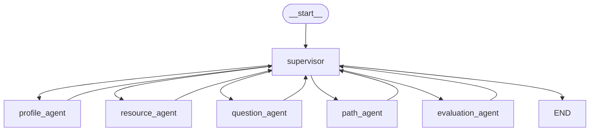

# A3 项目完整解释 —— 学习文档

> 本文档逐文件解释项目中的所有内容，包括作用、定位、延伸知识和名词解释。
> 定位：**学习教材**——不只是告诉你"是什么"，更要让你理解"为什么"和"背后的原理"。
> 配套文档：`CLAUDE.md`（操作手册，告诉Claude怎么做）

---

## 目录

1. [项目全景](#一项目全景)
2. [根目录文件逐解析](#二根目录文件逐解析)
3. [后端文件逐解析](#三后端文件逐解析)
4. [前端文件逐解析](#四前端文件逐解析)
5. [名词解释大全](#五名词解释大全)
6. [延伸知识索引](#六延伸知识索引)
7. [FastAPI 深度学习](#七fastapi-深度学习)
8. [LangGraph 深度学习](#八langgraph-深度学习)
9. [Docker 深度学习](#九docker-深度学习)
10. [Python 核心知识点](#十python-核心知识点)
11. [LangGraph 前置知识完整版](#十一langgraph-前置知识完整版)
12. [LangGraph 设计方法论](#十二langgraph-设计方法论)
13. [从知识到代码：项目构建实战指南](#十三从知识到代码项目构建实战指南)

---

## 一、项目全景

### 1.1 这个项目在做什么

```
用户打开浏览器 → 登录 → 和AI对话 → AI分析用户的学习水平
→ AI生成个性化学习资料 → AI出题测试 → AI评估学习效果
→ 所有过程实时流式显示（像ChatGPT逐字输出）
```

### 1.2 技术架构一览

```
浏览器 (Vue3)
    │
    │ HTTP / SSE (流式)
    ▼
FastAPI 后端 (Python)
    │
    ├──→ LangGraph (多智能体编排)
    │       └──→ 讯飞星火API (大模型)
    │
    ├──→ MySQL (用户数据、学习记录)
    ├──→ Redis (会话缓存)
    ├──→ ChromaDB (知识库向量搜索)
    └──→ MinIO (资源文件存储)
```

### 1.3 文件总数

```
根目录:     4 个配置文件
后端:      13 个文件 (含9个__init__.py占位)
前端:      13 个文件 (含6个占位页面)
─────────────────────────────
总计:      30 个文件
```

---

## 二、根目录文件逐解析

---

### 2.1 `CLAUDE.md` —— 项目蓝图

**定位**：Claude Code 的"记忆文件"。Claude Code 每次启动新会话时自动读取此文件，从而理解项目全貌，无需用户重复解释。

**为什么叫 CLAUDE.md？**
这是 Claude Code 的约定：项目根目录下的 `CLAUDE.md` 会被自动加载到上下文。类似于 GitHub 的 `README.md` 会自动渲染在仓库首页，`CLAUDE.md` 会自动加载到 Claude 的"记忆"中。

**内容包含**：
- 项目当前状态（做到哪了）
- 技术栈总表
- 目录结构
- 数据库设计
- Agent 设计
- 实现路线图（勾选追踪进度）
- 给下一个Claude会话的恢复指令

**延伸知识——Claude Code 的上下文机制**：

```
Claude Code 会话启动
        │
        ├── 1. 加载系统提示词（内置）
        ├── 2. 加载 CLAUDE.md（如果存在）        ← 项目级记忆
        ├── 3. 加载 MEMORY.md 指向的所有文件       ← 用户级记忆
        └── 4. 开始对话
```

每次对话的上下文是有限的（约200K tokens），Claude Code 会自动压缩旧消息来腾出空间。CLAUDE.md 和 MEMORY.md 是少数"永久存在于上下文"的内容。

---

### 2.2 `README.md` —— 仓库门面

**定位**：GitHub 仓库首页自动渲染的文件。告诉来访者"这个仓库是什么"。

**当前状态**：只有16字节，占位文件。后续可以写项目简介、安装步骤、使用说明。

**延伸知识——Markdown 与 GitHub Flavored Markdown (GFM)**：

```
# 一级标题          → <h1>
## 二级标题         → <h2>
**粗体**            → <strong>
- 列表项            → <li>
[链接文字](URL)     → <a>
    → 
``` `| 表头1 | 表头2 |` → `<table>`

GFM 扩展了标准 Markdown，增加了表格、任务列表（`- [ ]`）、代码块语法高亮等。

---

### 2.3 `.gitignore` —— Git 忽略规则

**定位**：告诉 Git "这些文件/目录不要追踪"。

**为什么会存在？**
有些文件不应该上传到 GitHub：
- 包含密钥的 `.env` 文件
- 自动生成的 `node_modules/`（几万个文件，巨大）
- 编译产物 `dist/`
- 个人笔记（`A3项目规划.md`）

**语法规则**：

```gitignore
# 这是注释
*.log              # 忽略所有 .log 文件
node_modules/      # 忽略 node_modules 目录
.env               # 忽略 .env 文件
!important.env     # 但不忽略 important.env（!表示例外）
```

**延伸知识——Git 的三个区域**：

```
工作区 (Working Directory)     ← 你硬盘上的文件
    │  git add
    ▼
暂存区 (Staging Area)          ← 你选中要提交的文件
    │  git commit
    ▼
本地仓库 (Local Repository)    ← git log 里能看到的所有提交
    │  git push
    ▼
远程仓库 (Remote Repository)   ← GitHub 上的仓库
```

`.gitignore` 作用于工作区：如果文件匹配了忽略规则，git 会假装它不存在。

---

### 2.4 `项目解释.md` —— 本文档

**定位**：学习教材。与 CLAUDE.md 互补：
- `CLAUDE.md` → 给 Claude 看的操作手册
- `项目解释.md` → 给你看的学习教材

---

## 三、a3-learning-system 项目目录

---

### 3.1 `docker-compose.yml` —— 基础设施一键部署

**定位**：定义并启动4个数据库服务的配置文件。

**为什么用 Docker Compose？**
手工安装数据库很痛苦：下载 → 配置 → 改端口 → 设密码 → 自启。4个数据库 = 4份痛苦。Docker Compose 把配置写成文件，一条命令全搞定。

**内容解析**：

```yaml
version: "3.8"         # Docker Compose 文件格式版本
services:              # 定义多个"服务"（容器）
  mysql:               # 服务名
    image: mysql:8.0   # 用的Docker镜像
    ports:             # 端口映射 "宿主机:容器内"
      - "3306:3306"    # 你电脑的3306 → 容器里的3306
    environment:       # 环境变量（初始化用）
      MYSQL_ROOT_PASSWORD: root123
    volumes:           # 数据持久化
      - mysql_data:/var/lib/mysql  # 数据存宿主机，容器删了数据还在
```

**四个服务的作用**：

| 服务 | 镜像 | 端口 | 作用 |
|------|------|------|------|
| mysql | mysql:8.0 | 3306 | 存用户、画像、学习记录 |
| redis | redis:7-alpine | 6379 | 存会话、缓存、实时数据 |
| minio | minio/minio | 9000/9001 | 存资源文件（文档/图片） |
| chromadb | chromadb/chroma | 8000 | 存知识库向量 |

**常用命令**：

```bash
docker-compose up -d       # 启动所有服务（-d = 后台运行）
docker-compose down        # 停止并删除所有容器
docker-compose ps          # 查看服务状态
docker-compose logs mysql  # 查看某个服务的日志
```

**名词解释**：

| 名词 | 解释 |
|------|------|
| **Docker** | 容器引擎，把应用和它的依赖打包成一个"集装箱"，到哪都能跑 |
| **镜像 (Image)** | 容器的模板，类似于"安装包"（只读） |
| **容器 (Container)** | 镜像的运行实例，类似于"安装好的程序"（可读写） |
| **Docker Compose** | 管理多个容器的工具，一个命令启动所有服务 |
| **端口映射** | 把容器内的端口暴露到宿主机，让外部可以访问 |
| **Volume (卷)** | 持久化存储，容器删了数据还在 |
| **alpine** | 一个超轻量 Linux 发行版（5MB），Docker 镜像以此为基础 |

**延伸知识——为什么 Redis 用 alpine 版本？**

Redis:7-alpine 只有约30MB，标准版约100MB。alpine 用 musl libc 替代 glibc，用 busybox 替代 GNU 工具集，极度精简。生产环境要稳定用标准版，开发/学习用 alpine 就行。

---

### 3.2 `.env.example` —— 环境变量模板

**定位**：配置文件的"模板"，告诉开发者需要填哪些配置项。复制为 `.env` 后填入真实值。

**为什么 `.env` 不提交到 git？**
- 包含密钥（API Key、数据库密码）
- 提交到 GitHub = 全世界都能看到
- `.gitignore` 里有 `.env`，git 不会追踪它
- `.env.example` 没有真实值，可以安全提交

**内容解析**：

```env
# ===== 讯飞星火 API =====
SPARK_APP_ID=your_app_id          # 应用ID（在讯飞控制台创建）
SPARK_API_KEY=your_api_key        # API密钥
SPARK_API_SECRET=your_api_secret  # API密钥（用于签名，不同于API_KEY）

# ===== MySQL 数据库 =====
MYSQL_HOST=localhost              # 数据库地址（本机）
MYSQL_PORT=3306                   # 端口（MySQL默认3306）
MYSQL_USER=a3_user                # 用户名
MYSQL_PASSWORD=a3_pass            # 密码
MYSQL_DATABASE=a3_learning        # 数据库名

# ===== Redis =====
REDIS_URL=redis://localhost:6379/0  # 连接URL，/0表示用第0号数据库

# ===== JWT 认证 =====
JWT_SECRET_KEY=change_this...     # JWT签名密钥（必须改！）
JWT_ALGORITHM=HS256               # 签名算法
JWT_EXPIRE_MINUTES=1440           # 过期时间（1440分钟=24小时）
```

**名词解释**：

| 名词 | 解释 |
|------|------|
| **API Key** | 身份凭证，证明"我有权限调用这个API" |
| **API Secret** | 用于HMA C签名，证明"请求确实是我发的，没被篡改" |
| **JWT** | JSON Web Token，登录后发的令牌，后续请求带这个令牌证明身份 |
| **HS256** | HMAC-SHA256，一种签名算法 |

**延伸知识——API Key vs API Secret**：

```
API Key    = 你的"用户名"，告诉服务端"我是谁"
API Secret = 你的"密码"，用于对请求做签名

为什么需要签名？
→ 防止中间人篡改请求
→ 防止别人伪造你的请求
→ 服务端用同样的Secret重新算一遍签名，对得上就说明请求合法
```

---

### 3.3 `a3-learning-system/.gitignore` —— 项目级忽略规则

**定位**：项目内部的 `.gitignore`，忽略开发过程中自动生成的文件。

```gitignore
# Python
__pycache__/          # Python字节码缓存目录
*.py[cod]             # .pyc / .pyo / .pyd 编译文件
venv/                 # 虚拟环境（依赖包）
.env                  # 环境变量（含密钥！）

# Node
node_modules/         # npm安装的依赖（几万个文件）
dist/                 # 前端打包产物

# ChromaDB
chroma_data/          # 向量数据库的本地数据文件

# Docker
mysql_data/           # MySQL数据（Docker volume 映射）
minio_data/           # MinIO数据
```

**延伸知识——`__pycache__` 是什么？**

Python 执行 `.py` 文件时，会先编译成字节码（`.pyc`），放在 `__pycache__/` 里。下次执行同一个文件时，如果源代码没变，Python 直接加载 `.pyc`，跳过编译步骤，启动更快。这是 Python 的"编译缓存"。

---

### 3.4 `backend/requirements.txt` —— Python 依赖清单

**定位**：列出所有需要安装的 Python 包及版本。

**为什么需要它？**
没有它，你需要手动 `pip install` 十几个包，而且版本可能不对。有了它：

```bash
pip install -r requirements.txt   # 一条命令全装好
```

**内容分类讲解**：

```
# ===== 核心框架 =====
fastapi==0.115.0                # Web框架，处理HTTP请求
uvicorn[standard]==0.30.0       # ASGI服务器，运行FastAPI
pydantic==2.9.0                 # 数据校验，请求/响应格式校验
python-multipart==0.0.12        # 处理文件上传

# ===== AI / Agent =====
langgraph==0.2.0                # 多智能体编排框架
langchain==0.3.0                # LLM应用开发框架
langchain-community==0.3.0      # LangChain社区扩展
websocket-client==1.8.0         # 讯飞星火用WebSocket协议通信

# ===== 数据库 =====
sqlalchemy==2.0.35              # Python ORM框架（操作MySQL不用写SQL）
asyncmy==0.2.9                  # MySQL异步驱动
chromadb==0.5.20                # 向量数据库客户端
redis==5.1.0                    # Redis客户端

# ===== Embedding模型 =====
sentence-transformers==3.1.0    # 运行BGE模型，把文本转成向量
torch>=2.0.0                    # PyTorch深度学习框架（BGE依赖）

# ===== 认证 =====
python-jose[cryptography]==3.3.0  # JWT生成和验证
passlib[bcrypt]==1.7.4            # 密码哈希（bcrypt算法）

# ===== 工具 =====
httpx==0.27.0                   # 异步HTTP客户端
aiofiles==24.1.0                # 异步文件操作
```

**名词解释**：

| 名词 | 解释 |
|------|------|
| **pip** | Python 的包管理器，类似 Node 的 npm |
| **==版本号** | 锁定精确版本，避免版本不一致导致"在我电脑上能跑" |
| **ASGI** | 异步服务器网关接口，FastAPI 的运行时环境 |
| **ORM** | 对象关系映射，把数据库表映射成 Python 类，操作类 = 操作表 |
| **异步** | 不阻塞等待，等结果的同时可以处理其他请求 |

**延伸知识——同步 vs 异步（重要！）**：

```
同步（像排队买奶茶）：
  你点单 → 等3分钟 → 拿到奶茶 → 下一个人才开始点单
  这3分钟内店员不能服务其他人

异步（像餐厅点菜）：
  你点完菜 → 后厨做 → 你不用在柜台等 → 服务员去服务其他桌
  菜做好了通知你

在Web服务里：
  同步：一个请求调用大模型，等30秒返回，这30秒其他用户全在排队
  异步：一个请求调用大模型，CPU去处理其他请求，大模型返回了再切回来

FastAPI 是异步框架 → 同时处理几百个请求不会互相阻塞
```

---

### 3.5 `backend/app/main.py` —— FastAPI 应用入口

**定位**：整个后端的启动文件。定义了 App 实例、中间件、健康检查接口。

```python
from fastapi import FastAPI
from fastapi.middleware.cors import CORSMiddleware

# 创建 FastAPI 应用实例
app = FastAPI(
    title="A3 个性化学习系统",
    version="0.1.0",
)

# 添加 CORS 中间件
app.add_middleware(
    CORSMiddleware,
    allow_origins=["http://localhost:5173"],  # 允许的前端地址
    allow_credentials=True,                   # 允许携带Cookie/Authorization
    allow_methods=["*"],                      # 允许所有HTTP方法
    allow_headers=["*"],                      # 允许所有请求头
)

# 健康检查接口
@app.get("/api/health")
async def health_check():
    return {"status": "ok", "version": "0.1.0"}
```

**逐行讲解**：

**`FastAPI()`**：创建一个 Web 应用对象。参数是可选的，`title` 和 `version` 会显示在自动生成的 API 文档里。

**`CORSMiddleware`**：CORS = Cross-Origin Resource Sharing（跨域资源共享）。

**为什么会跨域？**

```
你的前端跑在:  http://localhost:5173
你的后端跑在:  http://localhost:8000

浏览器安全策略（同源策略）：
  → http://localhost:5173 不能请求 http://localhost:8000
  → 因为端口不同（5173 ≠ 8000），属于"跨域"

解决方案：
  → 后端加 CORS 中间件，告诉浏览器"我允许 5173 来访问我"
  → 浏览器收到这个响应头后就放行了
```

**`@app.get("/api/health")`**：装饰器语法。`@app.get` 表示"当有 GET 请求访问 `/api/health` 时，执行下面这个函数"。

**`async def`**：定义一个异步函数。`async` 表示这个函数可以"等待"而不阻塞其他请求。

**延伸知识——什么是中间件（Middleware）？**

```
请求 → [中间件1] → [中间件2] → [路由处理函数] → 响应
         ↑            ↑
    CORS处理      JWT验证
```

中间件是一个"过滤器链"，每个请求都要经过所有中间件，然后才到达你的处理函数。常见中间件：
- CORS 中间件：处理跨域
- 认证中间件：验证 JWT
- 日志中间件：记录每个请求
- 限流中间件：防止滥用

---

### 3.6 `backend/app/config.py` —— 配置管理

**定位**：集中管理所有配置项，从 `.env` 文件自动读取。

```python
from pydantic_settings import BaseSettings

class Settings(BaseSettings):
    spark_app_id: str = ""
    spark_api_key: str = ""
    # ...

    class Config:
        env_file = ".env"   # 关键：自动读取 .env 文件

settings = Settings()       # 全局单例
```

**为什么用 Pydantic BaseSettings？**

```
不用 BaseSettings（原始方式）：
  import os
  api_key = os.getenv("SPARK_API_KEY")  # 每个配置都要写一行
  port = int(os.getenv("PORT", "8000"))  # 还要手动转类型

用 BaseSettings（现代方式）：
  class Settings(BaseSettings):
      spark_api_key: str          # 自动从 .env 读取同名变量
      port: int = 8000            # 自动转类型，有默认值
```

**好处**：
1. 自动读取 `.env`，不用手写 `os.getenv()`
2. 类型安全：`port: int` 自动转整数，写错类型马上报错
3. 有默认值：即使 `.env` 没配全，系统也能启动
4. 全局单例：`from app.config import settings` 到处都能用

**名词解释**：

| 名词 | 解释 |
|------|------|
| **单例** | 整个程序只有一个实例，到处共用同一个对象 |
| **环境变量** | 操作系统级别的变量，通过 `.env` 文件设置 |
| **类型注解** | `port: int` 告诉 Python 这个变量是整数类型 |

---

### 3.7 `backend/requirements.txt` —— 前面已讲解

---

### 3.8 `__init__.py` 文件（9个） —— Python 包标识

**定位**：项目中有9个 `__init__.py` 文件，它们是 Python 的"包标识文件"。

```
backend/app/__init__.py
backend/app/api/__init__.py
backend/app/agents/__init__.py
backend/app/models/__init__.py
backend/app/schemas/__init__.py
backend/app/services/__init__.py
backend/app/core/__init__.py
backend/app/utils/__init__.py
backend/tests/__init__.py
```

**为什么需要它？**

```
没有 __init__.py：
  from app.api import chat   ❌ 报错，Python找不到api这个模块

有 __init__.py（即使文件是空的）：
  from app.api import chat   ✅ Python知道api是一个包
```

**延伸知识——Python 的模块系统**：

```
模块 (Module)  = 一个 .py 文件
包 (Package)   = 一个包含 __init__.py 的目录
库 (Library)   = 一个可以被 pip install 的包集合

例如：
  numpy 是库
  numpy.random 是包（有 __init__.py）
  numpy.random.mtrand 是模块（mtrand.py 文件）
```

Python 3.3+ 引入了"隐式命名空间包"，理论上不需要 `__init__.py`。但实际开发中仍然保留，因为：
1. 显式比隐式好（Python 之禅）
2. 可以在 `__init__.py` 里写初始化代码
3. 大多数 linter 和 IDE 依赖它来识别包

---

### 3.9 `backend/app/api/` —— API 路由层（待开发）

**定位**：存放所有 API 接口的处理函数。这是"控制器"层。

**待创建的文件**：

| 文件 | 对应功能 |
|------|------|
| `auth.py` | 登录、注册、JWT签发 |
| `chat.py` | 核心：SSE流式对话接口 |
| `profile.py` | 学习画像的增删改查 |
| `resource.py` | 学习资源管理 |
| `assessment.py` | 评估报告接口 |
| `learning_path.py` | 学习路径接口 |

**为什么把路由放在单独的目录？**
这是"关注点分离"原则。如果把所有路由写在 main.py 里，一个文件几千行，根本没法维护。按功能拆开，每个文件只管一件事。

**延伸知识——RESTful API 设计规范**：

```
GET    /api/resources          # 获取资源列表
GET    /api/resources/123      # 获取ID=123的资源
POST   /api/resources          # 创建新资源
PUT    /api/resources/123      # 更新ID=123的资源
DELETE /api/resources/123      # 删除ID=123的资源
```

RESTful 的核心思想：**URL 表示"资源"（名词），HTTP 方法表示"动作"（动词）**。

---

### 3.10 `backend/app/agents/` —— 智能体层（核心，待开发）

**定位**：整个系统的大脑。存放6个Agent的实现代码。

**待创建的文件**：

```
agents/
├── state.py              # AgentState 共享状态定义
├── supervisor.py         # 调度Agent —— 意图识别 + 任务分发
├── profile_agent.py      # 画像Agent —— 对话采集6维画像
├── resource_agent.py     # 资源Agent —— 生成5种学习资源
├── question_agent.py     # 出题Agent —— 自适应出题
├── path_agent.py         # 路径Agent —— DAG学习路径规划
└── evaluation_agent.py   # 评估Agent —— 多维评估报告
```

**什么是 Agent？**

```
Agent = 大模型 + 角色设定 + 工具 + 记忆

例如"画像Agent"：
  - 大模型：讯飞星火
  - 角色设定："你是一个学习画像采集专家..."
  - 工具：查MySQL获取历史数据
  - 记忆：对话历史（Redis）
```

**什么是 LangGraph？**

```
LangGraph = 用"图"的方式编排多个Agent

     ┌──────────┐
     │Supervisor│  ← 入口，做决策
     └────┬─────┘
          │ 条件路由
  ┌───────┼───────┬───────┐
  ▼       ▼       ▼       ▼
Agent1  Agent2  Agent3  Agent4
  │       │       │       │
  └───────┴───────┴───────┘
          │ 全部回到Supervisor
          ▼
     ┌──────────┐
     │Supervisor│  ← 继续分发？还是结束？
     └──────────┘
```

**LangGraph 核心概念**：

| 概念 | 解释 | 类比 |
|------|------|------|
| **StateGraph** | 状态图容器 | 整张地图 |
| **Node (节点)** | 一个 Agent 或处理函数 | 地图上的城市 |
| **Edge (边)** | 节点间的连线 | 城市间的道路 |
| **Conditional Edge** | 根据条件走不同路线 | 路口的红绿灯 |
| **State (状态)** | 在图节点间传递的数据 | 旅行者的背包 |
| **Checkpoint** | 每一步的快照存档 | 游戏存档 |

**延伸知识——为什么 LangGraph 适合这个项目？**

学习场景的特点是"分支多"：
- 学生水平不同 → 初始路径不同
- 回答正确率 → 后续难度不同
- 学习偏好不同 → 资源类型不同

LangGraph 的"条件边"天然支持这种复杂分支。如果用 if-else 硬写，代码会变成"意大利面条"。

---

### 3.11 `backend/app/models/` —— ORM 数据库模型（待开发）

**定位**：定义数据库表结构的 Python 类。一个类 = 一张表。

**什么是 ORM？**

```
不用 ORM（手写 SQL）：
  cursor.execute("SELECT * FROM users WHERE id = 1")
  user = cursor.fetchone()

用 ORM（操作 Python 对象）：
  user = await db.query(User).filter(User.id == 1).first()
```

ORM 把数据库表映射成 Python 类：
- 表 → 类
- 列 → 属性
- 行 → 实例

**好处**：
1. 不用写 SQL（减少拼写错误）
2. 类型安全（增删改查都有类型检查）
3. 切换数据库容易（从 MySQL 切到 PostgreSQL 基本不改代码）
4. 防 SQL 注入（参数自动转义）

**SQLAlchemy 示例**：

```python
from sqlalchemy import Column, Integer, String
from sqlalchemy.orm import DeclarativeBase

class Base(DeclarativeBase):
    pass

class User(Base):
    __tablename__ = "users"        # 对应数据库中的 users 表

    id = Column(Integer, primary_key=True)
    username = Column(String(50), unique=True, nullable=False)
    password_hash = Column(String(255), nullable=False)
```

**名词解释**：

| 名词 | 解释 |
|------|------|
| **ORM** | Object-Relational Mapping，对象关系映射 |
| **SQLAlchemy** | Python 最流行的 ORM 框架 |
| **DeclarativeBase** | SQLAlchemy 2.0 的新式基类 |
| **primary_key** | 主键，唯一标识一行 |
| **nullable=False** | 不允许为空 |

---

### 3.12 `backend/app/schemas/` —— 数据校验层（待开发）

**定位**：用 Pydantic 定义"请求长什么样、响应长什么样"。

**为什么需要 schemas？**

```
没有 schema：
  def create_user(data: dict):
      name = data["name"]     # 如果用户没传name，这里就崩溃了

有 schema：
  class UserCreate(BaseModel):
      name: str               # 必填
      age: int = 18          # 可选，默认18

  def create_user(data: UserCreate):
      name = data.name        # 一定有值，一定是str类型
```

FastAPI + Pydantic 的自动校验流程：

```
请求到达 → Pydantic 校验数据格式 → 不通过？自动返回422错误
                                    → 通过了？进入你的处理函数
```

**示例**：

```python
from pydantic import BaseModel

class ChatRequest(BaseModel):
    content: str                    # 必填：用户输入的内容
    conversation_id: int | None = None  # 可选：对话ID

class ChatResponse(BaseModel):
    message: str
    agent: str
    resource_url: str | None = None
```

**名词解释**：

| 名词 | 解释 |
|------|------|
| **Pydantic** | Python 数据校验库，用类型注解定义数据格式 |
| **BaseModel** | Pydantic 的基类，所有 schema 继承它 |
| **类型注解** | `name: str` 声明变量类型 |
| **Optional** | `str \| None` 表示这个字段可以是字符串也可以是 None |

---

### 3.13 `backend/app/services/` —— 业务逻辑层

**定位**：实现具体的业务能力。API 层负责"接待"，services 层负责"干活"。

**待创建的文件**：

| 文件 | 职责 |
|------|------|
| `spark_client.py` | 封装讯飞星火API调用（WebSocket连接、签名、流式解析） |
| `embedding_service.py` | BGE模型加载 + 文本→向量转换 |
| `rag_service.py` | RAG检索 + 防幻觉校验 |
| `resource_service.py` | 资源生成/存储/检索的业务逻辑 |

**为什么需要 services 层？**

```
api/chat.py          ← "服务员"：接收请求，返回响应
    ↓ 调用
services/spark_client.py  ← "厨师"：实际干活
    ↓ 调用
星火API
```

如果直接把 API 调用代码写在 `chat.py` 里，那 `resource.py` 也要用星火API时就重复了。抽到 services 层，到处复用。

---

#### 3.13.1 `spark_client.py` 完整实现指南 ⭐⭐⭐

**这是整个项目最底层的模块**。所有 Agent 都通过它调用讯飞星火。你已经有了 `test_spark.py`（验证连通性的测试脚本），现在把它重构成一个可复用的类。

**test_spark.py 里有用的部分**（你已有的）：

```python
# test_spark.py 中已验证通过的核心逻辑：
# 1. get_auth_url() → HMAC-SHA256 签名生成鉴权 URL
# 2. websocket.create_connection(url) → 建立 WebSocket 连接
# 3. ws.send(json.dumps(request_data)) → 发送请求
# 4. ws.recv() → 循环接收流式响应
# 5. 解析 response["payload"]["choices"]["text"][0]["content"] → 提取 token
```

**第一步：提取签名逻辑**

```python
# backend/app/services/spark_client.py

import json
import ssl
import time
import hmac
import hashlib
import base64
from datetime import datetime
from urllib.parse import urlencode
from typing import Generator
import websocket  # pip install websocket-client


class SparkClient:
    """讯飞星火大模型 WebSocket 客户端

    封装了 WebSocket 连接、HMAC 签名、流式响应解析。
    对外暴露 chat_stream() 和 chat_sync()，上层 Agent 不感知 WebSocket。
    """

    # 讯飞星火 API 地址和模型版本
    SPARK_URL = "wss://spark-api.xf-yun.com/v4.0/chat"
    DOMAIN = "4.0Ultra"  # 模型版本，根据控制台开通的版本调整

    def __init__(self, app_id: str, api_key: str, api_secret: str):
        """
        参数来自 .env：
          SPARK_APP_ID, SPARK_API_KEY, SPARK_API_SECRET

        这三个值的含义（11.5 类比）：
          app_id    = 你的讯飞应用编号
          api_key   = "我是谁"（身份标识）
          api_secret = "证明是我"（签名密钥，不能泄露）
        """
        self.app_id = app_id
        self.api_key = api_key
        self.api_secret = api_secret
```

**第二步：HMAC 签名 —— 为什么需要它**

```
普通 API Key 认证（不安全）：
  请求里带上 ?api_key=abc123
  → 谁截获了这个请求都能冒充你

HMAC 签名认证（安全）：
  1. 把"host + 时间戳 + 请求路径"拼成一个字符串
  2. 用 api_secret 对这个字符串做 HMAC-SHA256 哈希 → 得到签名
  3. 把签名和 api_key 拼成 authorization 字符串
  4. 服务器收到后用同样的方式算签名，对比是否一致

攻击者截获了请求也没用：时间戳变了 → 签名就变了
```

```python
    def _get_auth_url(self) -> str:
        """生成带鉴权签名的 WebSocket URL

        每次调用都重新生成，因为签名包含时间戳（防重放攻击）
        """
        host = "spark-api.xf-yun.com"
        path = "/v4.0/chat"

        # 步骤1：构造签名原材料
        now = datetime.utcnow().strftime("%a, %d %b %Y %H:%M:%S GMT")
        signature_origin = f"host: {host}\ndate: {now}\nGET {path} HTTP/1.1"

        # 步骤2：HMAC-SHA256 签名
        signature = base64.b64encode(
            hmac.new(
                self.api_secret.encode(),       # 密钥
                signature_origin.encode(),      # 要签名的内容
                hashlib.sha256                  # 哈希算法
            ).digest()
        ).decode()

        # 步骤3：构造 authorization 字符串
        authorization_origin = (
            f'api_key="{self.api_key}", '
            f'algorithm="hmac-sha256", '
            f'headers="host date request-line", '
            f'signature="{signature}"'
        )
        authorization = base64.b64encode(
            authorization_origin.encode()
        ).decode()

        # 步骤4：拼到 URL 参数里
        params = {
            "authorization": authorization,
            "date": now,
            "host": host,
        }
        return f"{self.SPARK_URL}?{urlencode(params)}"
```

**第三步：流式对话 —— 本项目最关键的生成器函数**

```python
    def chat_stream(
        self,
        messages: list[dict],
        temperature: float = 0.7,
        max_tokens: int = 4096,
    ) -> Generator[str, None, None]:
        """
        流式对话 —— 逐 token 返回

        参数:
          messages: [{"role": "user", "content": "..."}, ...]
          temperature: 0.0 = 固定输出, 1.0 = 更多随机性
          max_tokens: 最大生成 token 数

        返回:
          Generator[str] —— 逐 token yield 内容片段

        【第十一章关联】
          这是 11.3 讲的 yield 实战。
          不是 return 全部结果，而是每收到一个 token 就 yield 一个。
          上层 FastAPI 可以 for chunk in spark.chat_stream(messages):
          每收到一个 chunk 就通过 SSE 推给前端。
        """
        # 1. 建立 WebSocket 连接
        url = self._get_auth_url()
        ws = websocket.create_connection(
            url,
            sslopt={"cert_reqs": ssl.CERT_NONE}  # 跳过证书验证（内网环境）
        )

        # 2. 构造请求体（讯飞星火的固定格式）
        request_data = {
            "header": {
                "app_id": self.app_id,
                "uid": "user_xxx",  # 用户标识，实际使用时会传真实 user_id
            },
            "parameter": {
                "chat": {
                    "domain": self.DOMAIN,
                    "temperature": temperature,
                    "max_tokens": max_tokens,
                }
            },
            "payload": {
                "message": {
                    "text": messages  # [{"role":"user","content":"你好"}]
                }
            },
        }

        # 3. 发送请求
        ws.send(json.dumps(request_data))

        # 4. 循环接收流式响应
        while True:
            response = json.loads(ws.recv())  # 阻塞等下一个消息

            # 检查错误
            code = response["header"]["code"]
            if code != 0:
                ws.close()
                raise Exception(
                    f"讯飞API错误 code={code}: {response['header']['message']}"
                )

            # 提取文本内容
            choices = response["payload"]["choices"]
            status = choices["status"]  # 0=开始, 1=进行中, 2=结束
            content = choices["text"][0]["content"]

            yield content  # ← 11.3：暂停在这里，把 token 交给调用者

            if status == 2:  # 2 表示这是最后一段
                break

        ws.close()
```

**第四步：非流式版本（Agent 意图分类用）**

```python
    def chat_sync(
        self,
        messages: list[dict],
        temperature: float = 0.7,
    ) -> str:
        """
        同步对话 —— 等全部生成完毕一次性返回

        用于 Supervisor 的意图分类（需要完整 JSON 才能解析），
        不用于聊天界面（聊天用 chat_stream 实现 SSE 打字效果）
        """
        full_response = ""
        for chunk in self.chat_stream(messages, temperature):
            full_response += chunk
        return full_response
```

**第五步：工厂函数 —— 给 FastAPI 依赖注入用**

```python
# 通常在 backend/app/dependencies.py 中

from app.config import settings
from app.services.spark_client import SparkClient

# 全局单例（模块加载时创建，整个进程复用）
_spark_client: SparkClient | None = None

def get_spark_client() -> SparkClient:
    """FastAPI 依赖注入：提供 SparkClient 实例"""
    global _spark_client
    if _spark_client is None:
        _spark_client = SparkClient(
            app_id=settings.spark_app_id,
            api_key=settings.spark_api_key,
            api_secret=settings.spark_api_secret,
        )
    return _spark_client
```

**为什么用全局单例**：WebSocket 连接每次调用时新建、用完关闭。但 HMAC 签名逻辑和配置不需要每次重新初始化。`SparkClient` 对象本身很轻（只存三个字符串），全局共享即可。

> **第十一章关联总结**：这个类的设计直接体现了 11.6（ChatModel 统一接口）的思想。`chat_stream()` 和 `chat_sync()` 两个方法构成了项目的 LLM 调用抽象——上层 Agent 只看到这两个方法，不关心底层是 WebSocket 还是 HTTP。

---

### 3.14 `backend/app/core/` —— 基础设施层（待开发）

**定位**：数据库连接、Redis连接、JWT工具等"底层设施"。

**待创建的文件**：

| 文件 | 职责 |
|------|------|
| `database.py` | MySQL 连接池（SQLAlchemy异步引擎） |
| `redis_client.py` | Redis 连接 |
| `chroma_client.py` | ChromaDB 客户端 |
| `minio_client.py` | MinIO 文件存储客户端 |
| `security.py` | JWT 生成/验证 + 密码哈希 |

**延伸知识——数据库连接池**：

```
没有连接池：
  每次请求 → 新建TCP连接 → 查数据库 → 关闭连接
  高并发时：几百个连接同时建立，数据库扛不住

有连接池：
  启动时预建10个连接 → 请求来了拿一个用 → 用完还回去
  高效复用，不会爆炸
```

SQLAlchemy 自带连接池，你只需要配置 `pool_size=10`。

---

### 3.15 `backend/app/utils/` —— 工具函数（待开发）

**定位**：放一些不好归类的小工具函数。

---

### 3.16 `backend/tests/` —— 测试目录（待开发）

**定位**：存放后端测试代码。`conftest.py` 是 pytest 的全局配置文件。

**为什么测试很重要？**

```
没有测试：改一行代码 → 手动启动服务 → 手动点页面 → 发现某个功能坏了 → 排查半天
有测试：  改一行代码 → 运行测试 → 0.5秒后告诉你哪个功能坏了 → 立刻修复
```

比赛项目虽然不一定写完整测试，但核心 Agent 的逻辑一定要有测试，不然答辩时出 bug 就尴尬了。

---

## 四、前端文件逐解析

---

### 4.1 `frontend/package.json` —— Node 依赖清单

**定位**：前端的"requirements.txt"，告诉 npm 要装哪些包。

```json
{
  "scripts": {
    "dev": "vite",              // npm run dev → 启动开发服务器
    "build": "vue-tsc && vite build",  // npm run build → 编译生产包
    "preview": "vite preview"   // npm run preview → 预览生产包
  },
  "dependencies": {             // 运行时的依赖（打包到最终JS里）
    "vue": "^3.4.0",
    "element-plus": "^2.8.0",
    // ...
  },
  "devDependencies": {          // 开发时的依赖（不打包到最终JS里）
    "typescript": "^5.5.0",
    "vite": "^5.4.0",
    // ...
  }
}
```

**`^` 符号的含义（语义化版本）**：

```
版本号格式：主版本.次版本.修订号 （Major.Minor.Patch）
  例如：3.4.2 → Major=3, Minor=4, Patch=2

^3.4.0  表示：>=3.4.0 且 <4.0.0（允许Minor和Patch升级）
~3.4.0  表示：>=3.4.0 且 <3.5.0（只允许Patch升级）
3.4.0   表示：精确锁定这个版本
```

**dependencies vs devDependencies**：

```
dependencies:     用户访问你的网站时需要的包（vue, element-plus）
devDependencies:  只有开发时需要（typescript, vite）
```

最终打包时 devDependencies 不会进去，包体积更小。

---

### 4.2 `frontend/vite.config.ts` —— Vite 构建配置

**定位**：配置 Vite（前端构建工具）的行为。

```typescript
export default defineConfig({
  plugins: [vue()],             // 启用Vue3插件
  server: {
    port: 5173,                 // 开发服务器端口
    proxy: {
      '/api': {                 // 代理配置（核心！）
        target: 'http://localhost:8000',  // 转发到后端
        changeOrigin: true,
      },
    },
  },
})
```

**代理（Proxy）的作用**：

```
没有代理时（跨域问题）：
  浏览器 → http://localhost:5173 (前端)
  浏览器 → http://localhost:8000/api/xxx (后端)  ← 跨域！被浏览器拦截

有代理时（Vite中间人）：
  浏览器 → http://localhost:5173/api/xxx (请求发给Vite)
  Vite → http://localhost:8000/api/xxx (Vite转发给后端，服务端通信无跨域)
  Vite → 浏览器 (返回结果)
```

代理只在**开发模式**生效。生产环境用 Nginx 做反向代理。

**名词解释**：

| 名词 | 解释 |
|------|------|
| **Vite** | 新一代前端构建工具，启动快（秒级）、热更新快 |
| **Webpack** | 老一代构建工具，Vite 的前身，大型项目启动要几十秒 |
| **ESBuild** | Go 写的超快打包器，Vite 底层用它 |

---

### 4.3 `frontend/tsconfig.json` —— TypeScript 配置

**定位**：配置 TypeScript 编译器的行为。

```json
{
  "compilerOptions": {
    "target": "ES2020",          // 编译目标：ES2020标准
    "module": "ESNext",          // 模块系统：最新ES标准
    "strict": true,              // 严格模式（关键！）
    "jsx": "preserve",           // JSX保留不转换（给Vite处理）
    "paths": {
      "@/*": ["./src/*"]         // 路径别名：@/views → ./src/views
    }
  }
}
```

**`strict: true` 是什么？**
开启 TypeScript 所有严格检查：
- 变量必须声明类型（或能自动推断）
- 不允许 `null` / `undefined` 赋值给非空类型
- 函数参数必须明确类型

**`paths` 路径别名**：
```typescript
// 不用别名（相对路径地狱）：
import ChatView from '../../../views/ChatView.vue'

// 用别名（清晰直观）：
import ChatView from '@/views/ChatView.vue'
```

---

### 4.4 `frontend/env.d.ts` —— TypeScript 类型声明

**定位**：告诉 TypeScript "`.vue` 文件是一个 Vue 组件类型"。

```typescript
declare module '*.vue' {
  import type { DefineComponent } from 'vue'
  const component: DefineComponent<{}, {}, any>
  export default component
}
```

**为什么需要它？**
TypeScript 不认识 `.vue` 文件（它不是 JS/TS 文件）。没有这个声明文件，所有 `import xxx from 'xxx.vue'` 都会报红。这个文件告诉 TS："把 `.vue` 文件当成 Vue 组件处理"。

---

### 4.5 `frontend/index.html` —— HTML 入口

**定位**：浏览器加载的第一个文件。Vite 从这里出发，找到所有 JS/CSS。

```html
<div id="app"></div>                  ← Vue 挂载点，所有内容渲染到这里
<script type="module" src="/src/main.ts"></script>  ← JS 入口
```

**名词解释**：

| 名词 | 解释 |
|------|------|
| **SPA** | Single Page Application，整个网站只有一个HTML文件，页面切换通过JS实现 |
| **挂载点** | Vue 接管这个 DOM 元素，所有渲染它说了算 |
| **`type="module"`** | 告诉浏览器这个脚本是ES模块，可以用 `import`/`export` |

---

### 4.6 `frontend/src/main.ts` —— Vue 应用入口

**定位**：Vue 应用的"启动文件"，初始化所有插件和配置。

```typescript
import { createApp } from 'vue'
import { createPinia } from 'pinia'
import ElementPlus from 'element-plus'
import 'element-plus/dist/index.css'
import App from './App.vue'
import router from './router'

const app = createApp(App)    // 创建Vue应用实例
app.use(createPinia())        // 安装Pinia（状态管理）
app.use(router)               // 安装Vue Router（路由）
app.use(ElementPlus)          // 安装Element Plus（UI组件库）
app.mount('#app')             // 挂载到<div id="app">
```

**执行流程**：

```
index.html 加载
    → 执行 main.ts
        → 创建 Vue App
        → 安装 Pinia（状态管理）
        → 安装 Router（路由）
        → 安装 ElementPlus（UI库）
        → 挂载到 <div id="app">
            → App.vue 渲染
                → <router-view/> 根据URL显示对应页面
```

**名词解释**：

| 名词 | 解释 |
|------|------|
| **createApp** | Vue3 的工厂函数，创建一个新的 Vue 应用 |
| **use()** | Vue 的插件安装方法 |
| **mount()** | 把 Vue 应用挂载到真实的 DOM 元素上 |

---

### 4.7 `frontend/src/App.vue` —— 根组件

**定位**：Vue 组件树的根。目前只包含 `<router-view/>`。

```vue
<template>
  <router-view />     ← 根据当前URL动态显示不同页面
</template>
```

**`<router-view />` 的工作原理**：

```
用户访问 /dashboard → router-view 渲染 Dashboard.vue
用户访问 /chat      → router-view 渲染 ChatView.vue
用户访问 /profile   → router-view 渲染 ProfileView.vue
```

它是 Vue Router 的"占位符"，URL 变，它显示的内容就变。

---

### 4.8 `frontend/src/router/index.ts` —— 路由配置

**定位**：定义 URL 和页面的映射关系。

```typescript
const router = createRouter({
  history: createWebHistory(),   // 使用HTML5 History模式
  routes: [
    { path: '/', redirect: '/dashboard' },           // 根路径 → 重定向到仪表盘
    { path: '/dashboard', component: () => import('@/views/Dashboard.vue') },
    { path: '/chat', component: () => import('@/views/ChatView.vue') },
    // ...
  ],
})
```

**`() => import(...)` —— 懒加载**：

```
不用懒加载（全部打包到首页JS）：
  首页加载 2MB → 白屏5秒 → 用户跑了

用懒加载（按需加载）：
  首页只加载 Dashboard 的代码：200KB → 秒开
  点"对话"时才加载 ChatView 的代码：300KB
```

Vite 会自动把每个 `import()` 拆成独立的 JS 文件，这叫 **代码分割**。

**`createWebHistory()` vs `createWebHashHistory()`**：

```
WebHistory（HTML5模式）：
  https://example.com/dashboard     ← 干净URL
  需要服务器配合（所有路径返回index.html）

HashHistory（Hash模式）：
  https://example.com/#/dashboard    ← 带#号
  不需要服务器配合，#后面的内容不发给服务器
```

**名词解释**：

| 名词 | 解释 |
|------|------|
| **路由** | URL 到页面的映射规则 |
| **懒加载** | 用到时才加载，而不是一次性全部加载 |
| **代码分割** | 把一个大JS拆成多个小JS，按需加载 |
| **Vue Router** | Vue 官方的路由管理库 |

---

### 4.9 `frontend/src/api/index.ts` —— axios 封装

**定位**：对 axios（HTTP客户端）做统一配置，所有API调用都通过它。

```typescript
const api = axios.create({
  baseURL: '/api',         // 所有请求自动加 /api 前缀
  timeout: 30000,          // 30秒超时
})

// 请求拦截器：自动附加JWT
api.interceptors.request.use((config) => {
  const token = localStorage.getItem('token')
  if (token) {
    config.headers.Authorization = `Bearer ${token}`
  }
  return config
})

// 响应拦截器：401自动跳转登录
api.interceptors.response.use(
  (response) => response,
  (error) => {
    if (error.response?.status === 401) {
      localStorage.removeItem('token')
      window.location.href = '/login'
    }
    return Promise.reject(error)
  }
)
```

**拦截器的原理**：

```
正常调用：  api.get('/users') → 发请求 → 返回数据

有拦截器：
  请求拦截器：api.get('/users') → [自动加JWT] → 发请求
  响应拦截器：返回数据 → [检查是否401] → 返回数据（或跳转登录）
```

**`localStorage` 是什么？**
浏览器提供的本地存储，数据存在用户电脑上，关闭浏览器也不会丢。

| 存储方式 | 容量 | 有效期 | 典型用途 |
|------|------|------|------|
| **localStorage** | 5MB | 永久 | JWT Token、用户偏好 |
| **sessionStorage** | 5MB | 关闭标签页 | 临时表单数据 |
| **Cookie** | 4KB | 可设 | 会话ID |

**名词解释**：

| 名词 | 解释 |
|------|------|
| **axios** | 基于 Promise 的 HTTP 客户端，比 fetch 更方便 |
| **拦截器** | 在请求发出前/响应返回前执行的钩子函数 |
| **JWT** | JSON Web Token，登录凭证 |
| **Bearer Token** | 一种认证方式，在请求头里带 `Authorization: Bearer xxx` |
| **401** | HTTP状态码，表示"未授权"（JWT过期或无效） |

---

### 4.10 `frontend/src/api/chat.ts` —— SSE 流式对话客户端

**定位**：封装了与后端 `/api/chat/send` 的 SSE 流式通信。

```typescript
// frontend/src/api/chat.ts

export function sendMessageStream(
  message: string,
  conversationId: number | null,
  onChunk: (data: ChatEvent) => void,   // 回调：每收到一段数据
  onDone: (meta: DoneEvent) => void,    // 回调：传输结束
  onError: (err: Error) => void         // 回调：出错
): AbortController {
  const controller = new AbortController()

  fetch('/api/chat/send', {
    method: 'POST',
    headers: {
      'Content-Type': 'application/json',
      Authorization: `Bearer ${localStorage.getItem('token')}`,
    },
    body: JSON.stringify({
      content: message,
      conversation_id: conversationId,
    }),
    signal: controller.signal,      // 关键：可以取消请求
  })
    .then(async (response) => {
      // ===== 核心：ReadableStream 逐块读取 =====
      // response.body 是一个 ReadableStream<Uint8Array>
      // getReader() 返回一个 reader，可以逐个 chunk 读取
      const reader = response.body!.getReader()
      const decoder = new TextDecoder()   // 把 Uint8Array → 字符串
      let buffer = ''                      // SSE 消息缓冲区

      // 循环读取，直到流结束
      while (true) {
        const { done, value } = await reader.read()
        // done = true 表示后端关闭了连接
        // value = 这一批收到的字节（Uint8Array）

        if (done) break

        // 把收到的字节解码成字符串，追加到缓冲区
        buffer += decoder.decode(value, { stream: true })
        // stream: true = 不把不完整的 UTF-8 多字节字符当错误

        // ===== 解析 SSE 格式 =====
        // SSE 文本格式：
        //   event: message\n
        //   data: {"type":"text","content":"你好"}\n
        //   \n                          ← 空行 = 一条消息结束
        //
        // 因为网络分包，buffer 里可能有多条消息或半条消息

        const lines = buffer.split('\n')  // 按行拆分
        // 最后一行可能不完整（还没收到 \n）→ 保留到下次处理
        buffer = lines.pop() || ''

        let currentEvent = ''   // 当前消息的 event 类型
        let currentData = ''    // 当前消息的 data 内容

        for (const line of lines) {
          if (line.startsWith('event: ')) {
            // event: message  → 记录事件类型
            currentEvent = line.slice(7)
          } else if (line.startsWith('data: ')) {
            // data: {"type":"text","content":"你好"}  → 记录数据
            currentData = line.slice(6)
          } else if (line === '') {
            // 空行 → 一条消息结束，触发回调
            if (currentData) {
              const parsed = JSON.parse(currentData)
              if (currentEvent === 'done') {
                onDone(parsed as DoneEvent)     // 流结束
              } else {
                onChunk(parsed as ChatEvent)    // 普通消息
              }
            }
            // 重置，准备解析下一条消息
            currentEvent = ''
            currentData = ''
          }
        }
      }
    })
    .catch(onError)

  return controller  // 返回控制器，外部可以调用 controller.abort() 取消
}
```

**逐行解释这段代码做了什么**：

```
1. new AbortController() → 创建"取消令牌"，用户点停止时用它中断请求

2. fetch(..., { signal: controller.signal })
   → 发起 POST，传了 signal 让 fetch 能被取消

3. response.body.getReader()
   → 不读整个响应体，而是拿到一个"流式读取器"
   → C++ 类比：不用 fread 一口气读整个文件，而是循环 fgetc

4. while (true) { const { done, value } = await reader.read() }
   → 循环读，每次拿到一小块字节（可能只有几十字节）
   → done=true 时后端不再发数据了
   → await = 等网络数据到达（11.4 的 async/await）

5. decoder.decode(value, { stream: true })
   → Uint8Array 字节 → JavaScript 字符串
   → stream:true = 容忍不完整的 UTF-8 字符（可能被网络分包截断）

6. buffer 的作用
   → 网络分包是不可预测的——可能一次收到半条 SSE 消息
   → buffer 存未处理完的文本，等下次收到更多数据再拼起来

7. 解析 SSE 格式
   → 按 \n 拆行 → 收集 event: 和 data: 行 → 遇到空行触发回调
```

**为什么用 fetch 而不是 axios？**

axios 基于 XMLHttpRequest（XHR），**XHR 不支持流式读取**——它必须等响应全部返回才能读 `responseText`。`fetch` + `ReadableStream` + `getReader()` 才能逐字节读取，实现打字机效果。

**AbortController 的作用**：

```
用户点"停止生成" → controller.abort() → fetch 立即中断 → 后端停止推理
如果没有它：用户关了页面，请求还在后端跑，浪费讯飞 API 额度
```

---

### 4.11 `frontend/src/views/` —— 页面组件（待开发）

**定位**：6个 Vue 页面组件，对应6个路由。目前全是占位壳子。

| 文件 | 路由 | 功能 |
|------|------|------|
| `Dashboard.vue` | `/dashboard` | 学习仪表盘首页 |
| `ChatView.vue` | `/chat` | 核心：Agent对话界面 |
| `ProfileView.vue` | `/profile` | 学习画像展示 |
| `ResourceView.vue` | `/resources` | 资源库浏览 |
| `AssessmentView.vue` | `/assessment` | 评估报告 |
| `LearningPathView.vue` | `/learning-path` | 学习路径可视化 |

**Vue 单文件组件的结构**：

```vue
<template>
  <!-- HTML模板：页面结构 -->
</template>

<script setup lang="ts">
// TypeScript逻辑：数据、方法
</script>

<style scoped>
/* CSS样式：scoped表示只作用于当前组件 */
</style>
```

**`<script setup>` 是什么？**
Vue3 的"语法糖"，比传统 Options API 更简洁：

```typescript
// Options API（Vue2风格）
export default {
  data() { return { count: 0 } },
  methods: { increment() { this.count++ } }
}

// Composition API + <script setup>（Vue3风格）
const count = ref(0)
const increment = () => count.value++
```

**`scoped` 的作用**：
加了 `scoped` 的 CSS 只作用于当前组件。Vue 编译时会自动给每个元素加一个唯一属性（如 `data-v-xxxx`），实现样式隔离。

**待创建的组件**：

```
components/
├── chat/
│   ├── ChatMessage.vue      消息气泡（Markdown渲染 + 代码高亮）
│   ├── ChatInput.vue        输入框（Enter发送、Shift+Enter换行）
│   └── StreamingText.vue    SSE流式打字效果
├── resource/
│   ├── ResourceCard.vue     资源卡片
│   └── MindMap.vue          markmap思维导图组件
├── assessment/
│   ├── RadarChart.vue       ECharts雷达图
│   └── ScoreBoard.vue       成绩面板
└── common/
    └── AppLayout.vue         通用布局（侧边栏 + 顶栏）
```

---

## 五、名词解释大全

### 5.1 后端相关

| 名词 | 解释 |
|------|------|
| **API** | Application Programming Interface，程序之间的接口。后端API = 前端可以调用的功能清单 |
| **RESTful** | 一种API设计风格：URL表示资源，HTTP方法表示动作 |
| **SSE** | Server-Sent Events，服务器主动向浏览器推送数据的协议。单向（服务器→浏览器） |
| **WebSocket** | 全双工通信协议。双向（浏览器↔服务器），用于讯飞星火API调用 |
| **FastAPI** | Python异步Web框架，自带API文档，性能接近Go/Node |
| **Pydantic** | Python数据校验库，FastAPI的配套工具 |
| **ORM** | Object-Relational Mapping，把数据库表映射成Python对象 |
| **JWT** | JSON Web Token，一种无状态的认证令牌 |
| **CORS** | Cross-Origin Resource Sharing，浏览器的跨域安全机制 |
| **中间件** | 在请求处理管道中插入的处理逻辑（如认证、日志） |
| **依赖注入** | 函数声明需要什么，框架自动提供什么 |

### 5.2 AI/Agent 相关

| 名词 | 解释 |
|------|------|
| **LLM** | Large Language Model，大语言模型（如GPT、讯飞星火） |
| **Agent** | 智能体 = LLM + 角色设定 + 工具 + 记忆 |
| **LangGraph** | LangChain团队的多Agent编排框架，用图结构组织Agent |
| **LangChain** | LLM应用开发框架，LangGraph的基础 |
| **RAG** | Retrieval-Augmented Generation，检索增强生成。先搜索相关文档 → 把文档内容塞进Prompt → 大模型基于真实文档回答，减少幻觉 |
| **Prompt** | 提示词，你发给大模型的指令 |
| **Embedding** | 把文本转成一串数字（向量），语义相近的文本向量也相近 |
| **向量数据库** | 专门存向量、做相似度搜索的数据库（ChromaDB、Milvus） |
| **Token** | 文本被切分后的最小单位。中文约1.5字=1 token |
| **幻觉** | 大模型"一本正经地胡说八道"。RAG就是用来缓解这个的 |

### 5.3 数据库相关

| 名词 | 解释 |
|------|------|
| **关系型数据库** | 用表存储数据，表之间可以有关系（MySQL, PostgreSQL） |
| **NoSQL** | 非关系型数据库（Redis, MongoDB, ChromaDB） |
| **Redis** | 内存数据库，读写极快，常用于缓存和会话 |
| **向量数据库** | 存"向量"的数据库，支持相似度搜索 |
| **连接池** | 预建一组数据库连接，请求来了直接复用 |
| **ACID** | 事务的四个特性：原子性、一致性、隔离性、持久性 |
| **索引** | 数据库的"目录"，加速查询 |

### 5.4 前端相关

| 名词 | 解释 |
|------|------|
| **SPA** | Single Page Application，整个网站只有一个HTML，页面切换靠JS |
| **响应式** | 数据变了，页面自动更新，不用手动操作DOM |
| **虚拟DOM** | 在内存里模拟真实DOM，算出最小变更，再一次性更新页面 |
| **组件** | 可复用的UI单元（按钮、卡片、输入框...） |
| **Pinia** | Vue3的状态管理库，管理跨组件共享的数据 |
| **Vue Router** | Vue官方的路由库，管理URL和页面的映射 |
| **Vite** | 新一代前端构建工具，开发和打包都很快 |
| **ESBuild** | Go写的超快打包器，Vite底层依赖 |
| **HMR** | Hot Module Replacement，修改代码后页面自动更新，不丢失状态 |

### 5.5 Docker/部署相关

| 名词 | 解释 |
|------|------|
| **Docker** | 容器引擎，把应用和环境打包成镜像 |
| **镜像** | 容器的模板（只读），类似于"安装包" |
| **容器** | 镜像的运行实例（可读写），类似于"安装好的程序" |
| **Docker Compose** | 管理多个容器的工具 |
| **Volume** | 持久化存储，容器删了数据还在 |
| **端口映射** | 容器端口 ↔ 宿主机端口 |
| **环境变量** | 操作系统级的配置变量 |

### 5.6 Git 相关

| 名词 | 解释 |
|------|------|
| **工作区** | 你硬盘上的文件 |
| **暂存区** | `git add` 后的文件，下一次 commit 的内容 |
| **本地仓库** | `git commit` 后的文件，存在 `.git/` 里 |
| **远程仓库** | GitHub 上的仓库 |
| **commit** | 一次提交，包含所有变更的快照 |
| **push** | 把本地仓库的提交推送到远程 |
| **pull** | 把远程仓库的提交拉到本地 |
| **branch** | 分支，一条独立的开发线 |
| **merge** | 合并，把两个分支合到一起 |

---

## 六、延伸知识索引

### 6.1 需要深入学习的技术（按优先级）

| 优先级 | 技术 | 预计时间 | 对应项目模块 |
|:--:|------|:--:|------|
| ⭐⭐⭐ | 讯飞星火API调用 | 1天 | `services/spark_client.py` |
| ⭐⭐⭐ | LangGraph Supervisor模式 | 3天 | `agents/supervisor.py` |
| ⭐⭐⭐ | Prompt Engineering（提示词工程） | 持续 | 所有Agent |
| ⭐⭐ | FastAPI StreamingResponse | 半天 | `api/chat.py` |
| ⭐⭐ | SQLAlchemy异步ORM | 1天 | `models/` `core/database.py` |
| ⭐⭐ | ChromaDB向量检索 | 1天 | `core/chroma_client.py` |
| ⭐ | Docker Compose | 半天 | `docker-compose.yml` |
| ⭐ | Vue3 Composition API | 持续 | 所有 `.vue` 文件 |
| ⭐ | ECharts雷达图 | 半天 | `components/assessment/RadarChart.vue` |

### 6.2 推荐学习资源

| 资源 | 链接 |
|------|------|
| 讯飞星火API文档 | https://www.xfyun.cn/doc/spark/Web.html |
| LangGraph Supervisor教程 | https://langchain-ai.github.io/langgraph/tutorials/multi_agent/agent_supervisor/ |
| FastAPI官方教程 | https://fastapi.tiangolo.com/zh/tutorial/ |
| ChromaDB文档 | https://docs.trychroma.com/ |
| Vue3官方文档 | https://cn.vuejs.org/guide/ |
| Docker入门 | https://docs.docker.com/get-started/ |
| BGE模型 | https://huggingface.co/BAAI/bge-large-zh-v1.5 |

---

---

## 七、FastAPI 深度学习

> 本章是完整的 FastAPI 教程，覆盖从零基础到本项目所有用到的功能。
> 读完本章，你不仅会写本项目的后端代码，还能自己独立开发 Web API。

---

### 7.1 什么是 FastAPI？

**一句话**：FastAPI 是一个 Python Web 框架，让你用最少的代码写出高性能的 HTTP API。

**和其他框架的关系**：

```
┌─────────────────────────────────────────┐
│              FastAPI                     │
│  ┌──────────────┐  ┌──────────────────┐ │
│  │   Starlette   │  │     Pydantic     │ │
│  │  (HTTP服务器)  │  │   (数据校验)      │ │
│  └──────────────┘  └──────────────────┘ │
│  ┌──────────────────────────────────────┐ │
│  │          Uvicorn (ASGI 服务器)        │ │
│  └──────────────────────────────────────┘ │
└─────────────────────────────────────────┘
```

| 层 | 库 | 职责 |
|------|------|------|
| **FastAPI** | 你写的代码 | 路由、依赖注入、API文档生成 |
| **Starlette** | FastAPI 底层 | HTTP 协议处理、中间件、WebSocket |
| **Pydantic** | FastAPI 底层 | 请求数据校验、响应数据序列化 |
| **Uvicorn** | 独立服务器 | 接收网络请求，转发给 FastAPI |

**FastAPI 凭什么快？**

```
Python Web 框架速度排行（每秒处理请求数）：

Uvicorn + FastAPI   ████████████████████  约 30,000 req/s
Flask + gunicorn    ████████              约 8,000 req/s
Django              ██████                约 5,000 req/s

原因：
1. 异步非阻塞（async/await）
2. Starlette 用 C 写的 HTTP 解析器（uvloop）
3. Pydantic V2 用 Rust 重写核心校验逻辑
```

**自动生成 API 文档**：FastAPI 会自动生成两种格式的文档：
- **Swagger UI**：`http://localhost:8000/docs` —— 交互式，可以直接在网页上测试 API
- **ReDoc**：`http://localhost:8000/redoc` —— 只读，更美观的文档

这是 FastAPI 最大的卖点之一：你写代码时自动产生文档，不用额外维护。

---

### 7.2 第一个 FastAPI 应用

```bash
# 安装
pip install fastapi uvicorn[standard]
```

```python
# main.py
from fastapi import FastAPI

app = FastAPI(title="我的第一个API", version="1.0.0")

@app.get("/")
async def root():
    return {"message": "Hello World"}

@app.get("/hello/{name}")
async def say_hello(name: str, age: int = 18):
    return {"name": name, "age": age, "greeting": f"你好{name}，你{age}岁了"}
```

```bash
# 启动
uvicorn main:app --reload --port 8000
#          ↑    ↑       ↑        ↑
#     main.py app实例  热重载   端口
```

访问 `http://localhost:8000/docs` 就能看到自动生成的 Swagger 文档。

**运行机制详解**：

```
1. uvicorn 启动，监听 8000 端口
2. 浏览器发 GET http://localhost:8000/hello/小明?age=20
3. uvicorn 收到请求，解析 HTTP 协议
4. 转给 FastAPI：method=GET, path=/hello/小明, query={"age": "20"}
5. FastAPI 匹配路由：/hello/{name} 匹配 /hello/小明
6. FastAPI 提取参数：name="小明", age=20 (类型自动转换!)
7. 调用你的 say_hello 函数
8. 把返回值 {"name": "小明", ...} 自动序列化为 JSON
9. uvicorn 把 JSON 作为 HTTP 响应发出
```

**关键知识点——`--reload` 热重载**：

```
没有 --reload：
  改代码 → 手动 Ctrl+C 停服务 → 重新启动 → 看效果

有 --reload：
  改代码 → 保存 → 自动重启 → 刷新浏览器 → 看效果

原理：uvicorn 监控 .py 文件的变化，检测到变更就自动重启进程
```

---

### 7.3 路由 (Path Operations) —— HTTP 请求怎么找到你的函数

FastAPI 使用**装饰器**把 URL 路径和 Python 函数绑定。

#### 7.3.1 HTTP 方法装饰器

```python
@app.get("/items")           # 查询
@app.post("/items")          # 创建
@app.put("/items/{id}")      # 更新（完整替换）
@app.patch("/items/{id}")    # 更新（部分字段）
@app.delete("/items/{id}")   # 删除
```

**HTTP 方法语义**：

| 方法 | 含义 | 幂等性 | 本项目使用场景 |
|------|------|:--:|------|
| GET | 读取数据 | ✅ | 获取资源列表、用户画像 |
| POST | 创建新数据 | ❌ | 登录、注册、发送聊天消息 |
| PUT | 完整替换 | ✅ | 更新用户画像（全量） |
| PATCH | 部分更新 | ❌ | 更新画像某几个字段 |
| DELETE | 删除 | ✅ | 删除对话历史 |

> **幂等性**：同样的请求发 1 次和发 10 次，结果一样。GET 查 10 次数据库不改变什么；POST 创建 10 次就多了 10 条记录。

#### 7.3.2 路径参数 (Path Parameter)

```python
# 路径参数：写在URL路径里的变量
@app.get("/users/{user_id}")
async def get_user(user_id: int):
    # GET /users/123  → user_id = 123 (整数)
    # GET /users/abc  → 自动返回422错误，因为"abc"不是int
    return {"user_id": user_id}
```

**类型自动转换 + 校验**：

```python
@app.get("/files/{file_path:path}")
async def read_file(file_path: str):
    # GET /files/home/user/doc.txt  → file_path = "home/user/doc.txt"
    # :path 告诉 FastAPI 这个参数可以包含斜线
    return {"path": file_path}
```

#### 7.3.3 查询参数 (Query Parameter)

```python
# 查询参数：URL ? 后面的 key=value
@app.get("/items")
async def list_items(
    page: int = 1,          # GET /items?page=3
    size: int = 10,         # GET /items?size=20
    keyword: str | None = None,  # GET /items?keyword=Python
):
    # GET /items?page=2&size=20&keyword=Python
    return {
        "page": page,        # 2
        "size": size,        # 20
        "keyword": keyword,  # "Python"
        "items": [...]
    }
```

**路径参数 vs 查询参数的区分规则**：

```
路径参数：URL 路径里用 {} 包裹 → @app.get("/users/{user_id}")
  用于："这是必需的身份标识"（哪个用户？哪个资源？）

查询参数：URL 路径里没有，函数参数带默认值 → page: int = 1
  用于："这是可选的筛选条件"（翻页？搜索？排序？）

规则：路径参数 = "哪个"；查询参数 = "怎么筛选"
```

#### 7.3.4 请求体 (Request Body)

```python
from pydantic import BaseModel

class ItemCreate(BaseModel):
    name: str
    price: float
    description: str | None = None

@app.post("/items")
async def create_item(item: ItemCreate):
    # FastAPI 自动：
    # 1. 从 HTTP Body 读取 JSON
    # 2. 校验字段类型（name必须是str，price必须是float）
    # 3. 转成 ItemCreate 对象
    return {"id": 123, "name": item.name, "price": item.price}
```

**FastAPI 区分三种参数来源的规则**：

```
参数出现在 URL 路径里 ({param})    → 路径参数
参数出现在函数签名里，是 Pydantic 类  → 请求体
其他所有参数（有默认值）             → 查询参数
```

---

### 7.4 Pydantic 数据模型 —— 你与前端之间的"合同"

Pydantic 是 FastAPI 的数据校验引擎。定义一次模型，FastAPI 自动做：输入校验、类型转换、文档生成。

#### 7.4.1 BaseModel 基础

```python
from pydantic import BaseModel, Field
from datetime import datetime

class UserCreate(BaseModel):
    username: str = Field(..., min_length=3, max_length=50)
    password: str = Field(..., min_length=6)
    email: str | None = None
    age: int = Field(default=18, ge=0, le=150)

# 前端发来：
# {"username": "ab", "password": "123456"}
# FastAPI 自动返回 422：
# {"detail": [{"loc": ["body", "username"], "msg": "ensure this value has at least 3 characters"}]}
```

**Field 常用校验参数**：

| 参数 | 含义 | 示例 |
|------|------|------|
| `...` | 必填（Ellipsis） | `name: str = Field(...)` |
| `default` | 默认值 | `age: int = Field(default=18)` |
| `min_length` / `max_length` | 字符串长度 | `name: str = Field(..., min_length=3)` |
| `ge` / `le` | 大于等于 / 小于等于 | `age: int = Field(..., ge=0, le=150)` |
| `gt` / `lt` | 大于 / 小于 | `score: float = Field(..., gt=0)` |
| `pattern` | 正则匹配 | `phone: str = Field(..., pattern=r"^1[3-9]\d{9}$")` |
| `description` | 字段说明（出现在API文档） | `name: str = Field(..., description="用户名")` |

#### 7.4.2 嵌套模型

```python
class Address(BaseModel):
    city: str
    street: str

class User(BaseModel):
    name: str
    address: Address  # 嵌套模型
    tags: list[str] = []  # 字符串列表

# 前端JSON：
# {
#   "name": "小明",
#   "address": {"city": "北京", "street": "长安街"},
#   "tags": ["Python", "React"]
# }
```

#### 7.4.3 本项目会用到的模型

```python
from enum import Enum

# --- 枚举类型：限制只能是这几个值 ---
class AgentType(str, Enum):
    SUPERVISOR = "supervisor"
    PROFILE = "profile"
    RESOURCE = "resource"
    QUESTION = "question"
    PATH = "path"
    EVALUATION = "evaluation"

class ResourceType(str, Enum):
    DOCUMENT = "document"
    MINDMAP = "mindmap"
    QUESTION_SET = "question_set"
    VIDEO_SCRIPT = "video_script"
    CODE_EXAMPLE = "code_example"

# --- 请求模型 ---
class ChatRequest(BaseModel):
    content: str = Field(..., min_length=1, max_length=5000)
    conversation_id: int | None = None  # None表示新对话

# --- 响应模型 ---
class ChatResponse(BaseModel):
    id: int
    content: str
    role: str
    agent_type: AgentType
    created_at: datetime

# --- ORM 模式：让 Pydantic 兼容 SQLAlchemy ---
class UserOut(BaseModel):
    id: int
    username: str
    nickname: str | None
    created_at: datetime

    model_config = {"from_attributes": True}  # 让 Pydantic 从 ORM 对象读取属性
```

**`model_config = {"from_attributes": True}` 是干什么的？**

```
没有这个：Pydantic 只接受 dict 格式的数据
  UserOut({"id": 1, "username": "xiaoming"}) → 可以
  UserOut(user_orm_object) → 报错

有这个：Pydantic 也能接受 ORM 对象（SQLAlchemy model）
  UserOut(user_orm_object) → 可以！自动从对象属性读取
```

---

### 7.5 响应模型 (Response Model) —— 控制返回什么给前端

#### 7.5.1 `response_model` 参数

```python
@app.post("/users", response_model=UserOut)
async def create_user(data: UserCreate):
    user = await db.create(data)  # 返回 ORM 对象
    return user
    # FastAPI 自动：
    # 1. 用 UserOut 定义的字段过滤（不会把 password_hash 泄露出去）
    # 2. 序列化为 JSON
    # 3. 出现在 API 文档的响应示例里
```

**为什么重要？** 数据库里存了 `password_hash`，你绝对不想在 API 响应里暴露它。`response_model` 是最后一道安全防线。

#### 7.5.2 列表响应

```python
@app.get("/users", response_model=list[UserOut])
async def list_users():
    users = await db.query(User).all()
    return users
```

#### 7.5.3 状态码

```python
from fastapi import status

@app.post("/users", status_code=status.HTTP_201_CREATED)
async def create_user(data: UserCreate):
    return await db.create(data)

# 常用状态码：
# 200 OK               GET 成功
# 201 Created          POST 创建成功
# 204 No Content       DELETE 成功，无返回内容
# 400 Bad Request      客户端请求有误
# 401 Unauthorized     未登录
# 403 Forbidden        登录了但没权限
# 404 Not Found        资源不存在
# 422 Unprocessable    校验不通过（FastAPI 自动返回）
# 500 Internal Server  服务器内部错误
```

---

### 7.6 依赖注入 (Dependency Injection) —— FastAPI 的灵魂功能

**依赖注入是什么？** 函数声明"我需要什么"，FastAPI 自动"把需要的东西传进去"。

#### 7.6.1 最简单的依赖

```python
from fastapi import Depends

# 这个函数就是一个"依赖"
def get_api_version():
    return "1.0.0"

@app.get("/version")
async def version(api_version: str = Depends(get_api_version)):
    # FastAPI 自动调用 get_api_version()，把返回值传给 api_version
    return {"version": api_version}

# 请求流程：
# 1. GET /version
# 2. FastAPI 看到 Depends(get_api_version)
# 3. 调用 get_api_version() → 返回 "1.0.0"
# 4. 把 "1.0.0" 作为 api_version 参数传给 version 函数
# 5. 返回 {"version": "1.0.0"}
```

#### 7.6.2 子依赖（依赖的依赖）

```python
from fastapi import Header

def get_token(authorization: str = Header(...)):
    # Header() 也是一个依赖：从 HTTP Header 里取值
    return authorization.replace("Bearer ", "")

def get_current_user(token: str = Depends(get_token)):
    # get_current_user 依赖 get_token
    # get_token 返回值自动传给 token 参数
    user = verify_jwt(token)  # 验证并解析 JWT
    return user

@app.get("/me")
async def me(user = Depends(get_current_user)):
    # me 依赖 get_current_user
    # get_current_user 依赖 get_token
    # 依赖链自动解析：Header → get_token → get_current_user → me
    return {"user": user}
```

**依赖链可视化**：

```
GET /me
  │
  ▼
me(user=Depends(get_current_user))
  │
  ▼
get_current_user(token=Depends(get_token))
  │
  ▼
get_token(authorization=Header("Authorization"))
  │
  ▼
从 HTTP Header 取出 "Bearer eyJhbGci..."  → 去掉 "Bearer "  → 验证JWT → 返回用户对象
  │
  ▼
一路往上传：用户对象 → get_current_user → me → 返回给前端
```

#### 7.6.3 `yield` 依赖（需要清理的依赖）

```python
async def get_db():
    db = AsyncSession()      # 打开数据库连接
    try:
        yield db              # 把 db 传给路由函数
    finally:
        await db.close()      # 请求结束后自动关闭连接

@app.get("/users")
async def list_users(db = Depends(get_db)):
    users = await db.execute(select(User))
    return users
    # 函数返回后，finally 块自动执行，关闭数据库连接
```

**执行顺序**：

```
请求进入 → 调用 get_db() → yield db → 路由函数执行 → 返回响应 → finally 关闭连接
```

#### 7.6.4 本项目会用到的所有依赖

```python
# backend/app/dependencies.py

from fastapi import Depends, Header, HTTPException, status
from sqlalchemy.ext.asyncio import AsyncSession

# 1. 数据库会话（每次请求自动获取、自动关闭）
async def get_db() -> AsyncSession:
    ...

# 2. 当前用户（从 JWT 解析）
async def get_current_user(
    token: str = Depends(get_token),
    db: AsyncSession = Depends(get_db),
) -> User:
    ...

# 3. Redis 客户端
async def get_redis() -> Redis:
    ...

# 4. 讯飞星火客户端
def get_spark_client() -> SparkClient:
    ...

# 路由中使用：
@app.post("/api/chat/send")
async def chat(
    request: ChatRequest,
    current_user: User = Depends(get_current_user),  # 自动验证登录
    spark: SparkClient = Depends(get_spark_client),  # 自动提供API客户端
    db: AsyncSession = Depends(get_db),               # 自动提供数据库
):
    ...
```

---

### 7.7 APIRouter —— 模块化路由

项目有 6 个 API 模块，如果全部写在 `main.py`，会是一个几千行的怪物文件。`APIRouter` 让你按功能拆分。

#### 7.7.1 基本用法

```python
# backend/app/api/auth.py

from fastapi import APIRouter

router = APIRouter(prefix="/api/auth", tags=["认证"])

@router.post("/register")
async def register(data: UserCreate, db = Depends(get_db)):
    ...

@router.post("/login")
async def login(form_data: OAuth2PasswordRequestForm = Depends(), db = Depends(get_db)):
    ...
```

```python
# backend/app/api/chat.py

router = APIRouter(prefix="/api/chat", tags=["对话"])

@router.post("/send")
async def send_message(...):
    ...

@router.get("/history")
async def get_history(...):
    ...
```

```python
# backend/app/main.py —— 把所有路由组装起来

from app.api import auth, chat, profile, resource, assessment, learning_path

app = FastAPI()

app.include_router(auth.router)
app.include_router(chat.router)
app.include_router(profile.router)
app.include_router(resource.router)
app.include_router(assessment.router)
app.include_router(learning_path.router)
```

**最终生成的完整 API**：

```
POST   /api/auth/register
POST   /api/auth/login
POST   /api/chat/send
GET    /api/chat/history
GET    /api/profile/me
PUT    /api/profile/me
GET    /api/resources
POST   /api/resources/generate
POST   /api/assessment/start
...
```

`prefix` 相当于给所有路由自动加前缀，`tags` 让 API 文档按标签分组。

---

### 7.8 StreamingResponse（SSE 流式响应）—— 本项目最核心的后端功能

这是整个项目最关键的技术点。你需要让大模型的回复**逐字出现在前端页面上**，就像 ChatGPT 那样。

#### 7.8.1 普通响应 vs 流式响应

```
普通响应（一次性返回）：
  服务器：等大模型30秒 → 攒齐全部内容 → 一次性发给前端
  前端页面：空白了30秒 → 突然出现一大段文字
  用户体验：❌ 以为系统卡死了

流式响应（逐字返回）：
  服务器：大模型吐一个字 → 立刻发给前端 → 大模型再吐一个字 → 立刻发给前端
  前端页面：逐字打字效果
  用户体验：✅ 知道系统在工作
```

#### 7.8.2 生成器函数 (Generator)

在学 StreamingResponse 之前，必须先理解 Python 的**生成器**：

```python
# 普通函数：一次性返回全部
def get_all():
    return [1, 2, 3, 4, 5]

# 生成器函数：每次只返回一个，用 yield 而不是 return
def get_one_by_one():
    yield 1  # 暂停，把1给调用者
    yield 2  # 暂停，把2给调用者
    yield 3  # 暂停，把3给调用者

# 使用生成器：
for num in get_one_by_one():
    print(num)
# 输出：
# 1  ← 拿到1之后get_one_by_one才继续执行到下一个yield
# 2
# 3
```

**yield 的本质**：

```
yield 把一个函数变成了"可以暂停和恢复的机器"：
  → 执行到 yield → 返回一个值 → 暂停
  → 调用者索要下一个值 → 从暂停处恢复 → 执行到下一个 yield → 返回 → 暂停
  → ...直到函数结束（没有更多 yield 了）
```

#### 7.8.3 StreamingResponse 基础

```python
from fastapi.responses import StreamingResponse

def data_generator():
    """模拟大模型逐字输出"""
    yield "我"
    yield "是"
    yield "一"
    yield "个"
    yield "A"
    yield "I"

@app.get("/stream")
async def stream():
    return StreamingResponse(
        data_generator(),
        media_type="text/event-stream",  # 告诉浏览器这是 SSE 流
    )
```

浏览器访问 `/stream`，会逐字收到：`我` → `是` → `一` → `个` → `A` → `I`。

#### 7.8.4 SSE 协议格式（关键！）

SSE (Server-Sent Events) 有固定的文本格式：

```
event: message
data: {"type": "text", "content": "你好"}

event: message
data: {"type": "text", "content": "，世界"}

event: done
data: {"total_tokens": 100}

```

**格式规则**：

```
1. 每条消息由 event 行 + data 行组成
2. event: 后面是事件类型（前端据此决定怎么处理）
3. data: 后面是 JSON 数据
4. 每条消息以空行结尾（\n\n）
```

#### 7.8.5 本项目 chat 接口的完整实现

```python
# backend/app/api/chat.py

import json
import asyncio
from fastapi import APIRouter, Depends
from fastapi.responses import StreamingResponse
from app.dependencies import get_current_user, get_spark_client, get_db
from app.schemas.chat import ChatRequest
from app.models.user import User

router = APIRouter(prefix="/api/chat", tags=["对话"])


async def chat_event_generator(
    content: str,
    user: User,
    spark_client,
    db,
):
    """核心：生成 SSE 事件的异步生成器"""

    # 1. 先通知前端：调度Agent开始工作
    yield {
        "event": "agent_switch",
        "data": json.dumps({
            "from": "",
            "to": "supervisor",
            "reason": "分析用户意图"
        }, ensure_ascii=False)
    }

    # 2. 调用讯飞星火（WebSocket 流式）
    messages = [{"role": "user", "content": content}]
    full_reply = ""

    for chunk in spark_client.chat_stream(messages):
        # chunk 是星火返回的一小段文字（可能只有1-2个字）
        full_reply += chunk

        yield {
            "event": "message",
            "data": json.dumps({
                "type": "text",
                "content": chunk,
                "agent": "supervisor"
            }, ensure_ascii=False)
        }

    # 3. 通知前端：结束
    yield {
        "event": "done",
        "data": json.dumps({
            "total_tokens": len(full_reply),
            "agents_used": ["supervisor"]
        }, ensure_ascii=False)
    }

    # 4. 保存对话记录到数据库
    await db.execute(...)


def sse_format(generator):
    """把生成器的 dict 转成 SSE 字符串格式"""
    for item in generator:
        if isinstance(item, dict):
            yield f"event: {item['event']}\n"
            yield f"data: {item['data']}\n"
            yield "\n"  # 空行表示消息结束
        else:
            yield item


@router.post("/send")
async def send_message(
    request: ChatRequest,
    user: User = Depends(get_current_user),
    spark = Depends(get_spark_client),
    db = Depends(get_db),
):
    """发送消息并返回 SSE 流"""
    generator = chat_event_generator(
        content=request.content,
        user=user,
        spark_client=spark,
        db=db,
    )

    return StreamingResponse(
        sse_format(generator),
        media_type="text/event-stream",
        headers={
            "Cache-Control": "no-cache",       # 禁止浏览器缓存
            "Connection": "keep-alive",        # 保持连接
            "X-Accel-Buffering": "no",         # 禁止 Nginx 缓冲（如果用了Nginx）
        }
    )
```

**数据流全貌**：

```
讯飞星火API (WebSocket)
  │ 逐 token 返回
  ▼
spark_client.chat_stream()  [生成器 yield 每个 token]
  │
  ▼
chat_event_generator()  [组装成 SSE 事件 dict]
  │
  ▼
sse_format()  [转成 SSE 文本格式]
  │
  ▼
StreamingResponse  [HTTP 流式传输]
  │
  ▼
前端浏览器  [EventSource / fetch 读取]
  │
  ▼
逐字渲染到页面
```

#### 7.8.6 为什么 `StreamingResponse` 不能用 `async def` 直接 yield？

```python
# ❌ 这样写会报错
@app.post("/send")
async def send_message():
    yield "hello"  # async def 不能直接 yield
    return StreamingResponse(...)

# ✅ 正确写法：把生成逻辑放到一个独立的异步生成器里
async def my_generator():
    yield {"event": "message", "data": "hello"}
    await asyncio.sleep(0.1)  # 异步等待（比如等星火API返回）
    yield {"event": "done", "data": "{}"}

@app.post("/send")
async def send_message():
    return StreamingResponse(
        sse_format(my_generator()),
        media_type="text/event-stream",
    )
```

---

### 7.9 CORS 中间件 —— 让前端能访问后端

```python
from fastapi.middleware.cors import CORSMiddleware

app.add_middleware(
    CORSMiddleware,
    allow_origins=[
        "http://localhost:5173",   # Vue 开发服务器
        "http://localhost:3000",   # 备用
    ],
    allow_credentials=True,        # 允许携带 Cookie/Authorization Header
    allow_methods=["*"],           # 允许所有 HTTP 方法
    allow_headers=["*"],           # 允许所有请求头
)
```

**CORS 的底层原理**：

```
浏览器发出跨域请求时：

1. 浏览器先发一个 OPTIONS "预检请求"（Preflight）
   问服务器："localhost:5173 可以调你吗？能用 POST 吗？能带 Authorization 吗？"

2. 服务器通过 CORS 中间件回答：
   Access-Control-Allow-Origin: http://localhost:5173    ← 允许
   Access-Control-Allow-Methods: POST, GET, ...          ← 允许
   Access-Control-Allow-Headers: Authorization, ...      ← 允许

3. 浏览器收到响应头，确认允许，才发出真正的请求

4. 如果没有 CORS 中间件 → 服务器不回答 → 浏览器拦截 → 前端报错：
   "blocked by CORS policy: No 'Access-Control-Allow-Origin' header"
```

---

### 7.10 JWT 认证 —— 保护你的 API

#### 7.10.1 认证流程

```
1. 用户登录：
   POST /api/auth/login  {"username": "xiaoming", "password": "123456"}
   
2. 服务器验证密码 → 签发 JWT：
   {
     "sub": "42",           ← 用户ID
     "username": "xiaoming",
     "exp": 1718000000      ← 过期时间
   }
   用 JWT_SECRET_KEY 签名 → 返回给前端

3. 前端存 JWT：
   localStorage.setItem("token", "eyJhbGci...")

4. 后续请求自动带 JWT：
   Authorization: Bearer eyJhbGci...

5. 服务器验证 JWT：
   解析 Bearer Token → 验证签名 → 检查是否过期 → 提取用户ID → 查数据库
```

#### 7.10.2 完整认证代码

```python
# backend/app/core/security.py

from datetime import datetime, timedelta
from jose import JWTError, jwt
from passlib.context import CryptContext

pwd_context = CryptContext(schemes=["bcrypt"], deprecated="auto")

def hash_password(password: str) -> str:
    """把明文密码变成不可逆的哈希值"""
    return pwd_context.hash(password)
    # "123456" → "$2b$12$LJ3m...一长串乱码"

def verify_password(plain: str, hashed: str) -> bool:
    """验证密码是否正确"""
    return pwd_context.verify(plain, hashed)
    # 拿 "123456" 去和 "$2b$12$..." 比对，返回 True/False

def create_access_token(data: dict, expires_delta: timedelta | None = None) -> str:
    """签发 JWT"""
    to_encode = data.copy()
    expire = datetime.utcnow() + (expires_delta or timedelta(minutes=15))
    to_encode.update({"exp": expire})
    return jwt.encode(to_encode, settings.JWT_SECRET_KEY, algorithm=settings.JWT_ALGORITHM)

def decode_access_token(token: str) -> dict | None:
    """解析 JWT，返回用户数据或 None"""
    try:
        payload = jwt.decode(token, settings.JWT_SECRET_KEY, algorithms=[settings.JWT_ALGORITHM])
        return payload
    except JWTError:
        return None
```

```python
# backend/app/api/auth.py

from fastapi import APIRouter, Depends, HTTPException, status
from fastapi.security import OAuth2PasswordBearer, OAuth2PasswordRequestForm

router = APIRouter(prefix="/api/auth", tags=["认证"])

oauth2_scheme = OAuth2PasswordBearer(tokenUrl="/api/auth/login")

@router.post("/login")
async def login(
    form_data: OAuth2PasswordRequestForm = Depends(),
    db = Depends(get_db),
):
    """登录接口"""
    # OAuth2PasswordRequestForm 自动解析表单字段 username 和 password
    user = await db.query(User).filter_by(username=form_data.username).first()
    if not user or not verify_password(form_data.password, user.password_hash):
        raise HTTPException(
            status_code=status.HTTP_401_UNAUTHORIZED,
            detail="用户名或密码错误",
        )

    token = create_access_token(
        data={"sub": str(user.id), "username": user.username},
        expires_delta=timedelta(minutes=settings.JWT_EXPIRE_MINUTES),
    )
    return {"access_token": token, "token_type": "bearer"}
```

```python
# backend/app/dependencies.py —— 获取当前用户的依赖

async def get_current_user(
    token: str = Depends(oauth2_scheme),
    db = Depends(get_db),
) -> User:
    """从 JWT 解析当前用户，在所有需要登录的接口里复用"""
    payload = decode_access_token(token)
    if payload is None:
        raise HTTPException(status_code=401, detail="登录已过期")

    user_id = payload.get("sub")
    user = await db.query(User).get(int(user_id))
    if user is None:
        raise HTTPException(status_code=401, detail="用户不存在")

    return user
```

**bcrypt 密码哈希详解**：

```
为什么不能明文存密码？
  数据库泄露 → 黑客拿到所有用户的密码 → 用户在其他网站的账号全完蛋

bcrypt 做了什么：
  "123456" + 随机盐值 → bcrypt 哈希 → "$2b$12$LJ3mOy8..."

特点：
  1. 不可逆：从哈希值无法反推原密码
  2. 同样的密码两次哈希结果不同（随机盐值）
  3. 故意慢：暴力破解时要花大量时间（cost factor = 12 = 2^12 = 4096轮计算）

验证密码时：
  bcrypt.verify("123456", "$2b$12$...")
  → bcrypt 从哈希里提取盐值 → 对"123456"用同样的盐值再哈希一次 → 比对结果
```

---

### 7.11 异步数据库操作 (SQLAlchemy async)

#### 7.11.1 为什么用异步？

```
同步（Flask 风格）：
  await db.execute(select(User))  ← 等数据库返回（10ms）
  → 这10ms里Python什么都不能干，干等
  → 100个并发请求 = 排队

异步（FastAPI 风格）：
  await db.execute(select(User))  ← 等数据库返回（10ms）
  → Python 去处理其他请求了
  → 10ms后回来继续
  → 100个并发请求 = 几乎同时处理
```

#### 7.11.2 连接配置

```python
# backend/app/core/database.py

from sqlalchemy.ext.asyncio import create_async_engine, AsyncSession, async_sessionmaker
from app.config import settings

# 异步引擎（注意驱动是 asyncmy，不是 pymysql）
engine = create_async_engine(
    f"mysql+asyncmy://{settings.MYSQL_USER}:{settings.MYSQL_PASSWORD}"
    f"@{settings.MYSQL_HOST}:{settings.MYSQL_PORT}/{settings.MYSQL_DATABASE}",
    echo=False,         # True = 打印所有SQL（调试用）
    pool_size=10,       # 连接池大小
    max_overflow=20,    # 超出pool_size后最多再开20个
)

# 会话工厂
AsyncSessionLocal = async_sessionmaker(
    engine,
    class_=AsyncSession,
    expire_on_commit=False,  # 提交后不使对象过期
)
```

```python
# backend/app/dependencies.py

async def get_db():
    async with AsyncSessionLocal() as session:
        yield session
        # 请求结束后自动关闭session
```

#### 7.11.3 增删改查

```python
from sqlalchemy import select, update, delete, func

# 查：获取一个用户
async def get_user(db: AsyncSession, user_id: int) -> User | None:
    result = await db.execute(select(User).where(User.id == user_id))
    return result.scalar_one_or_none()

# 查：获取列表（带分页）
async def list_users(db: AsyncSession, page: int = 1, size: int = 20) -> list[User]:
    result = await db.execute(
        select(User).offset((page - 1) * size).limit(size)
    )
    return result.scalars().all()

# 增：创建用户
async def create_user(db: AsyncSession, data: UserCreate) -> User:
    user = User(
        username=data.username,
        password_hash=hash_password(data.password),
    )
    db.add(user)
    await db.commit()    # 提交事务
    await db.refresh(user)  # 刷新对象（拿到数据库生成的 id）
    return user

# 改：更新用户
async def update_user(db: AsyncSession, user_id: int, data: dict) -> User:
    await db.execute(
        update(User).where(User.id == user_id).values(**data)
    )
    await db.commit()

# 删：删除用户
async def delete_user(db: AsyncSession, user_id: int):
    await db.execute(delete(User).where(User.id == user_id))
    await db.commit()
```

**`scalar_one_or_none()` 的含义**：

```
result = await db.execute(select(User).where(User.id == 999))
# 999 不存在

result.all()              → []           （空列表）
result.first()            → None         （None）
result.scalars().first()  → None
result.scalar_one_or_none() → None       （推荐：有就返回，无就 None）
result.scalar_one()       → 抛异常！     （期望一定有，没有就报错）
```

---

### 7.12 异常处理

```python
from fastapi import HTTPException
from fastapi.responses import JSONResponse

# 1. 直接抛出 HTTPException（FastAPI 自动处理）
@app.get("/users/{user_id}")
async def get_user(user_id: int):
    user = await db_get_user(user_id)
    if user is None:
        raise HTTPException(
            status_code=404,
            detail="用户不存在",
            headers={"X-Error-Code": "USER_NOT_FOUND"},
        )
    return user

# 2. 自定义异常处理器（全局捕获）
@app.exception_handler(HTTPException)
async def http_exception_handler(request, exc: HTTPException):
    return JSONResponse(
        status_code=exc.status_code,
        content={
            "error": exc.detail,
            "status_code": exc.status_code,
        },
    )

# 3. 全局捕获未处理的异常（兜底）
@app.exception_handler(Exception)
async def global_exception_handler(request, exc: Exception):
    return JSONResponse(
        status_code=500,
        content={"error": "服务器内部错误", "detail": str(exc)},
    )
```

---

### 7.13 生命周期事件 (Lifespan Events)

应用启动/关闭时执行的操作：

```python
from contextlib import asynccontextmanager

@asynccontextmanager
async def lifespan(app: FastAPI):
    # ===== 启动时执行 =====
    print("🚀 应用启动中...")
    # 加载 BGE 模型到内存
    # 预连接数据库连接池
    # 预热 Redis 连接
    print("✅ 应用启动完成")

    yield  # ← 应用运行中

    # ===== 关闭时执行 =====
    print("🛑 应用关闭中...")
    # 关闭数据库连接
    # 关闭 Redis 连接
    print("✅ 应用已关闭")

app = FastAPI(lifespan=lifespan)
```

**本项目会用到的启动操作**：

```python
@asynccontextmanager
async def lifespan(app: FastAPI):
    # 启动时加载 BGE Embedding 模型（这个很重，启动时加载一次）
    from app.services.embedding_service import load_embedding_model
    app.state.embedding_model = load_embedding_model()

    yield

    # 关闭时释放模型内存
    del app.state.embedding_model
```

---

### 7.14 文件上传 —— 资源管理模块

```python
from fastapi import UploadFile, File

@router.post("/resources/upload")
async def upload_file(
    file: UploadFile = File(...),
    user = Depends(get_current_user),
):
    # UploadFile 的属性：
    # file.filename     → "学习笔记.pdf"
    # file.content_type → "application/pdf"
    # file.size         → 1024000（字节）

    # 读文件内容
    contents = await file.read()

    # 上传到 MinIO
    minio_client.put_object(
        bucket="resources",
        object_name=f"{user.id}/{file.filename}",
        data=io.BytesIO(contents),
        length=len(contents),
    )

    return {"filename": file.filename, "size": len(contents)}

# 多文件上传
@router.post("/resources/upload-multiple")
async def upload_files(
    files: list[UploadFile] = File(...),
):
    for file in files:
        contents = await file.read()
        # 处理每个文件...
```

---

### 7.15 后台任务 (Background Tasks)

有些操作不需要等它完成才返回响应：

```python
from fastapi import BackgroundTasks

def send_welcome_email(user_id: int):
    """这个函数在后台慢慢跑，不阻塞HTTP响应"""
    time.sleep(5)  # 模拟发邮件
    print(f"已发送欢迎邮件给用户 {user_id}")

@router.post("/register")
async def register(
    data: UserCreate,
    background_tasks: BackgroundTasks,
    db = Depends(get_db),
):
    user = await create_user(db, data)

    # 添加到后台执行：不阻塞HTTP响应
    background_tasks.add_task(send_welcome_email, user.id)

    return {"message": "注册成功"}  # 立刻返回，不等待邮件发送
```

---

### 7.16 WebSocket 端点（仅了解，本项目用中间层处理）

FastAPI 原生支持 WebSocket，但本项目**不直接用**。讯飞的 WebSocket 连接在 `services/spark_client.py` 里手动处理：

```python
# FastAPI 原生 WebSocket（备用知识）
@app.websocket("/ws/chat")
async def websocket_chat(websocket: WebSocket):
    await websocket.accept()
    while True:
        data = await websocket.receive_text()
        await websocket.send_text(f"收到: {data}")
```

---

### 7.17 本项目完整请求流程（串联所有知识）

以用户发一条聊天消息为例，展示所有 FastAPI 知识点如何协作：

```
1. 用户打开浏览器，输入消息 "我想学Python基础"
   按了发送按钮

2. 前端 fetch 请求：
   POST http://localhost:5173/api/chat/send  (Vite Proxy)
   → Vite 转发到 http://localhost:8000/api/chat/send
   Headers: Authorization: Bearer eyJhbGci...
   Body: {"content": "我想学Python基础", "conversation_id": null}

3. CORS 中间件
   → 检查 Origin: http://localhost:5173
   → 在 allow_origins 列表中 → 放行

4. FastAPI 路由匹配
   → POST /api/chat/send → chat.router 里的 send_message 函数

5. 依赖注入链解析：
   Depends(get_current_user):
     → Depends(oauth2_scheme): 从 Header 提取 "Bearer eyJ..."
     → decode_access_token(): 验证签名 → 解析出 user_id=42
     → 查数据库：User(id=42, username="xiaoming")
     → 返回 User 对象
   Depends(get_spark_client):
     → 返回 SparkClient 实例
   Depends(get_db):
     → 创建 AsyncSession → yield → 给路由函数

6. 路由函数执行：
   request.content = "我想学Python基础"
   current_user = User(id=42, ...)
   → 调用 chat_event_generator()

7. LangGraph 图执行（12.2 Supervisor 模式）：
   → build_agent_graph(checkpointer)       # 构建带记忆的图
   → graph.astream(input_state, config)    # 异步流式执行（11.4 async for）
     → supervisor 节点分析意图 → 决定路由
     → 工作 Agent 内部调 spark_client.chat_stream()（3.13.1）
     → 每收到一个 token → 更新 State → yield 给上层
     → 工作 Agent 完毕 → 回 supervisor → 再次决策或结束

8. SSE 流式生成（7.8 + 8.8 串联）：
   → for agent_name, output in chunk.items():
       → 把 Agent 产出的新消息包装成 SSE event
       → yield {"event": "message", ...}
   → yield {"event": "done", ...}

9. StreamingResponse 把异步生成器变成 HTTP SSE 流

10. 响应头：
    Content-Type: text/event-stream
    Cache-Control: no-cache

11. 前端 fetch + ReadableStream（4.10 完整代码）逐块读取
    → 每收到一个 SSE event → JSON.parse → 更新页面
    → 用户看到打字效果 + Agent 切换提示

12. 请求结束
    → get_db 的 finally 块执行 → 关闭数据库连接
    → LangGraph checkpoint 自动保存（12.4）
    → 完整的请求生命周期结束
```

#### 7.17.1 完整实现：FastAPI + LangGraph + SSE 串联代码

上面第 6~8 步的完整实现。这是整个项目最核心的端点代码：

```python
# backend/app/api/chat.py

import json
from fastapi import APIRouter, Depends
from fastapi.responses import StreamingResponse
from app.dependencies import get_current_user, get_db, get_spark_client
from app.agents.supervisor import build_agent_graph
from app.agents.state import AgentState
from app.schemas.chat import ChatRequest
from app.models.user import User
from langchain_core.messages import HumanMessage
from sqlalchemy.ext.asyncio import AsyncSession

router = APIRouter(prefix="/api/chat", tags=["对话"])


@router.post("/send")
async def chat_send(
    request: ChatRequest,
    current_user: User = Depends(get_current_user),
    db: AsyncSession = Depends(get_db),
    spark = Depends(get_spark_client),
):
    """核心对话接口 —— SSE 流式返回

    数据流（每个箭头对应 7.17 的步骤编号）：
      前端 fetch(4.10)
        → [步骤4] FastAPI 路由匹配
        → [步骤5] Depends 链注入 current_user + db + spark
        → [步骤7] LangGraph graph.astream()
            → supervisor 节点调 spark.chat_sync() 做意图分类
            → 工作 Agent 节点调 spark.chat_stream() 生成内容
        → [步骤8] 本函数 async for 接收 State 更新
        → [步骤9] StreamingResponse → SSE 文本格式
        → [步骤11] 前端 ReadableStream 逐块显示
    """

    async def event_generator():
        """异步生成器：每个 yield 推一个 SSE 事件到前端

        【11.3】生成器 = 可暂停的函数。每次 yield 后暂停，
        前端收到数据，然后回来继续执行下一个循环。
        """

        # 构建图（每次都编译，带上 checkpointer 提供记忆）
        # 【12.2】Supervisor 模式：一个调度节点 + 5 个工作节点
        app = build_agent_graph()

        # 准备初始 State（【11.2】TypedDict 定义的 AgentState）
        input_state: AgentState = {
            "messages": [HumanMessage(content=request.content)],  # 11.5
            "user_id": current_user.id,
            "current_agent": "supervisor",
            "next_agent": None,
            "user_profile": await load_user_profile(db, current_user.id),
            "context": {},
            "agent_outputs": {},
            "stream_buffer": "",
        }

        # thread_id 区分不同用户/会话（【12.4】）
        config = {
            "configurable": {
                "thread_id": request.conversation_id
                              or f"user_{current_user.id}"
            }
        }

        try:
            # 【11.4】async for：遍历异步生成器
            # 每次迭代 = 图中的一个节点执行完毕
            async for chunk in app.astream(input_state, config):
                # chunk 格式：{"supervisor": {"next_agent": "resource", ...}}
                #      或：{"resource_agent": {"messages": [AIMessage(...)], ...}}

                for agent_name, agent_output in chunk.items():
                    # Agent 产出了新消息 → 包装成 SSE 推给前端
                    if "messages" in agent_output:
                        for msg in agent_output["messages"]:
                            yield {
                                "event": "message",
                                "data": json.dumps({
                                    "type": "text",
                                    "content": msg.content,
                                    "agent": agent_name,
                                }, ensure_ascii=False)
                            }

                    # Supervisor 做了路由决策 → 通知前端切换 Agent 显示
                    if "next_agent" in agent_output:
                        yield {
                            "event": "agent_switch",
                            "data": json.dumps({
                                "from": agent_name,
                                "to": agent_output["next_agent"],
                            }, ensure_ascii=False)
                        }

            # 图执行完毕
            yield {
                "event": "done",
                "data": json.dumps({"status": "complete"})
            }

        except Exception as e:
            # 【12.5 模式一】节点内异常 → 降级为错误消息
            yield {
                "event": "error",
                "data": json.dumps({"message": str(e)})
            }

    # 把 dict 生成器转成 SSE 文本格式（【7.8.4】SSE 协议）
    return StreamingResponse(
        sse_format(event_generator()),
        media_type="text/event-stream",
        headers={
            "Cache-Control": "no-cache",
            "X-Accel-Buffering": "no",  # 禁用 nginx 缓冲
        }
    )


def sse_format(generator):
    """dict 生成器 → SSE 文本格式

    SSE 协议（【7.8.4】）：
      event: <事件类型>\n
      data: <JSON 数据>\n
      \n          ← 空行表示一条消息结束
    """
    for item in generator:
        if isinstance(item, dict):
            yield f"event: {item['event']}\n"
            yield f"data: {item['data']}\n"
            yield "\n"
```

**读这段代码时的对照表**（每个关键技术点对应前面的章节）：

| 代码中的写法 | 知识出处 | 一句话解释 |
|-------------|---------|-----------|
| `@router.post("/send")` | 7.3 路由 | POST 请求走这个函数 |
| `Depends(get_current_user)` | 7.6 依赖注入 | 自动从 JWT 解析用户 |
| `Depends(get_spark_client)` | 3.13.1 工厂函数 | 全局单例，复用配置 |
| `async def event_generator()` | 11.4 async | 协程函数，里面可 await |
| `yield {...}` | 11.3 生成器 | 暂停函数，把数据交出去就停 |
| `HumanMessage(content=...)` | 11.5 消息类型 | 用户输入包装成标准消息 |
| `Annotated[list, add_messages]` | 11.2 Annotated | 消息列表自动追加不覆盖 |
| `graph.astream(input, config)` | 11.4 async for + 12.2 图执行 | 流式执行图，每节点完成 yield |
| `config["thread_id"]` | 12.4 Checkpoint | 对话记忆隔离，不同用户不串 |
| `sse_format()` | 7.8.4 SSE 协议 | dict → `event:\ndata:\n\n` |
| `StreamingResponse(...)` | 7.8.3 | FastAPI 把生成器转 HTTP 流 |
| `try/except Exception` | 12.5 错误处理 | 图执行失败不崩，返回错误消息 |

---

### 7.18 FastAPI 文件组织最佳实践

本项目遵循的目录结构（也是 FastAPI 官方推荐的大项目结构）：

```
backend/app/
├── main.py         ← FastAPI 实例 + 路由注册 + 中间件 + lifespan
├── config.py       ← 配置（BaseSettings）
├── dependencies.py ← 所有 Depends 依赖函数
│
├── api/            ← 路由层（只负责"接待"）
│   ├── auth.py         ← /api/auth/*
│   ├── chat.py         ← /api/chat/*  (核心SSE流式)
│   ├── profile.py      ← /api/profile/*
│   ├── resource.py     ← /api/resources/*
│   ├── assessment.py   ← /api/assessment/*
│   └── learning_path.py← /api/path/*
│
├── schemas/        ← Pydantic 数据模型（"合同"）
│   ├── chat.py         ← ChatRequest, ChatResponse
│   ├── profile.py      ← ProfileIn, ProfileOut
│   └── ...
│
├── models/         ← SQLAlchemy ORM 模型（"数据库表"）
│   ├── user.py
│   ├── profile.py
│   └── ...
│
├── services/       ← 业务逻辑层（"干活"）
│   ├── spark_client.py     ← 讯飞星火封装
│   ├── embedding_service.py← BGE 模型
│   ├── rag_service.py      ← RAG 检索
│   └── resource_service.py ← 资源管理
│
├── agents/         ← LangGraph Agent 层
│   ├── supervisor.py
│   ├── state.py
│   └── ...
│
├── core/           ← 基础设施
│   ├── database.py     ← MySQL 引擎
│   ├── redis_client.py ← Redis 连接
│   ├── chroma_client.py← ChromaDB 客户端
│   ├── minio_client.py ← MinIO 客户端
│   └── security.py     ← JWT + 密码哈希
│
└── utils/          ← 小工具函数
    └── markdown_utils.py
```

**分层职责**：

```
api/      → "接待员"：验证请求格式，调用 services，返回响应
schemas/  → "合同"：定义输入输出格式
models/   → "数据表蓝图"：定义数据库结构
services/ → "工人"：实现具体的业务能力
agents/   → "大脑"：AI 智能体的逻辑
core/     → "水电煤"：数据库连接、认证等基础设施
```

---

## 八、LangGraph 深度学习

> ⚠️ **阅读顺序警告**：本章默认你已经掌握了以下前置知识。如果你从第十章一路读过来（10 → 11 → 12 → 8），应该没问题。**如果是跳读直接看本章，请先回第十一、十二章补课**，否则会遇到[术语看不懂]的问题。
>
> | 本章用到的概念 | 出处 | 一句话 |
> |-------------|------|--------|
> | `TypedDict`, `Annotated[list, add]` | 11.2 | State 的结构和合并规则 |
> | `yield`, 生成器 | 11.3 | 流式输出的原理 |
> | `async/await`, `async for` | 11.4 | 图和 SSE 的异步执行 |
> | `HumanMessage`, `AIMessage`, `SystemMessage` | 11.5 | 对话消息的标准类型 |
> | `BaseChatModel.invoke/stream` | 11.6 | 大模型调用的统一接口 |
> | `StateGraph` + 节点 + 边 | 12.2 | 图的设计思维 |
> | `Annotated[list, add_messages]` vs 普通字段 | 12.3 | State 设计原则 |
> | `thread_id`, checkpoint 记忆 | 12.4 | 多轮对话怎么记住上文 |
> | 节点内 try-except, 降级 | 12.5 | Agent 挂了怎么办 |
>
> 本章专注于 LangGraph 的**API 用法**和**代码实现**。"为什么这样设计"的思考在第十一、十二章已经讲过了。
>
> 这是**答辩得分的关键**——状态图可视化是评委最看重的技术创新点。

---

### 8.1 什么是 LangGraph？

**一句话**：LangGraph 是用"图"（Graph）的方式编排多个 LLM 调用和工具调用的框架。

**为什么需要 LangGraph？**

```
没有 LangGraph（硬编码 if-else）：
  用户输入 → if "想学" in msg → 调资源Agent
           → elif "做题" in msg → 调出题Agent
           → elif "评估" in msg → 调评估Agent
           → else → 闲聊

  问题：
  ❌ 规则越写越多，代码变成"意大利面条"
  ❌ 无法处理多轮对话（"帮我出题 → 太简单了 → 再难一点"）
  ❌ 没有记忆（每次对话都是全新的）
  ❌ 流程不可视化（答辩时你怎么展示逻辑？）

有 LangGraph：
  定义图结构 → 自动路由 → 自动记忆 → 自动可视化
  ✅ 图结构清晰，修改只需加一个节点
  ✅ 内置 Checkpoint（记忆机制）
  ✅ 条件边自动处理复杂分支
  ✅ 图可以导出为图片（答辩PPT直接放！）
```

**LangGraph 的定位**：

```
LangChain 生态体系：

  LangChain       ← LLM 应用开发框架（Prompt模板、链式调用）
    └── LangGraph  ← 多步骤 Agent 编排（状态机 + 图结构）
    └── LangSmith   ← 调试/监控/评估平台（云端服务）
    └── LangServe   ← 把 LangChain 应用部署成 API
```

**核心编程模型——图（Graph）**：

```
              ┌──────────┐
    入口 ───→ │ 节点 A   │  ← 一个处理步骤（函数）
              └────┬─────┘
                   │ 边（Edge）
              ┌────▼─────┐
              │ 节点 B   │
              └────┬─────┘
                   │ 条件边（Conditional Edge）
              ┌────▼─────┐
         ┌─── │ 路由判断  │ ───┐
         │    └──────────┘    │
    ┌────▼───┐           ┌───▼────┐
    │ 节点 C  │           │ 节点 D  │
    └────┬───┘           └───┬────┘
         │                   │
         └──────┬────────────┘
                ▼
              结束
```

**LangGraph vs 传统 Agent 框架**：

| 特性 | LangGraph | AutoGPT | CrewAI |
|------|:--:|:--:|:--:|
| 控制粒度 | 精细（手动定义每一步） | 粗（自动规划） | 中等 |
| 流程可视化 | ✅ 导出图 | ❌ | ❌ |
| 条件分支 | ✅ 原生支持 | ❌ | 部分 |
| 记忆/状态 | ✅ Checkpoint | ❌ | ❌ |
| 学习曲线 | 中等 | 低 | 低 |
| 适合场景 | 复杂多步骤任务 | 简单自主任务 | 多角色对话 |

**本项目选 LangGraph 的理由**：
1. 学习系统有 6 个 Agent，需要精确控制路由逻辑
2. Checkpoint 机制天然支持"断点续学"（用户关掉页面再回来，学习进度还在）
3. 图结构可以导出为图片，答辩 PPT 直接放，直观展示架构
4. 出题方是科大讯飞，LangGraph 是 LangChain 官方项目，技术认可度高

---

### 8.2 核心概念速览

| 概念 | 解释 | 类比 |
|------|------|------|
| **StateGraph** | 状态图容器，承载所有节点和边 | 整张地铁线路图 |
| **Node** (节点) | 一个处理函数，接收 State，返回 State 更新 | 地铁站 |
| **Edge** (边) | 节点之间的固定连线 | 固定线路 |
| **Conditional Edge** (条件边) | 根据 State 的值决定走哪条路 | 岔路口的指示牌 |
| **State** (状态) | 在节点间传递的共享数据 | 乘客的行李（每个站都能存取） |
| **Checkpoint** (检查点) | 每一步的状态快照存档 | 游戏存档点 |
| **Reducer** (归并器) | 定义"多个更新如何合并"的规则 | 合并冲突时的规则 |
| **Thread** (线程) | 一次独立对话的标识 | 不同的存档槽位 |

---

### 8.3 第一个 LangGraph 应用 —— 简单对话机器人

先从最简单的例子开始，理解 State、Node、Edge 三个核心概念。

```bash
pip install langgraph langchain langchain-core
```

```python
from typing import TypedDict, Annotated
from langgraph.graph import StateGraph, END
from langgraph.graph.message import add_messages
from langchain_core.messages import HumanMessage, AIMessage

# ===== 第1步：定义 State（共享状态）=====
class ChatState(TypedDict):
    """
    State 是所有节点共享的数据结构。
    TypedDict 是 Python 3.8+ 的类型提示字典。
    """
    # messages 的类型是 Annotated[list, add_messages]
    # add_messages 是一个 reducer：新消息会追加到旧消息列表，而不是覆盖
    messages: Annotated[list, add_messages]
    # 普通字段：没有 Annotated，新值会直接覆盖旧值
    turn_count: int


# ===== 第2步：定义 Node（处理节点）=====
def chatbot_node(state: ChatState) -> dict:
    """
    节点函数签名：
      输入：当前的 State（完整的共享状态）
      输出：dict，只包含需要更新的字段（不是整个 State！）
    
    LangGraph 会自动把你返回的 dict 合并到 State 里。
    """
    print(f"当前轮次: {state['turn_count']}")
    print(f"用户说: {state['messages'][-1].content}")

    # 模拟AI回复（实际项目中这里调用讯飞星火API）
    ai_reply = AIMessage(content=f"你好！这是第{state['turn_count']}轮对话")

    # 返回要更新的字段
    return {
        "messages": [ai_reply],       # add_messages 自动追加到列表
        "turn_count": state["turn_count"] + 1,  # 直接覆盖
    }


# ===== 第3步：构建图 =====
def build_simple_chat():
    # 创建 StateGraph，传入 State 类型
    workflow = StateGraph(ChatState)

    # 添加节点："chatbot" 是节点名，chatbot_node 是处理函数
    workflow.add_node("chatbot", chatbot_node)

    # 设置入口：请求从哪个节点开始
    workflow.set_entry_point("chatbot")

    # 添加边：chatbot 执行完后 → END（结束）
    workflow.add_edge("chatbot", END)

    # 编译图，返回可执行的应用
    return workflow.compile()


# ===== 第4步：运行 =====
app = build_simple_chat()

# 第一次调用
result = app.invoke({
    "messages": [HumanMessage(content="你好")],
    "turn_count": 1,
})
print(f"回复: {result['messages'][-1].content}")
print(f"轮次: {result['turn_count']}")

# 第二次调用（同一个对话继续）
result = app.invoke({
    "messages": [HumanMessage(content="今天天气不错")],
    "turn_count": result["turn_count"],  # 继续上一轮的计数
})
print(f"回复: {result['messages'][-1].content}")
```

**执行流程详解**：

```
app.invoke({"messages": [...], "turn_count": 1})
  │
  ▼
StateGraph 把输入包装成 ChatState
  messages: [HumanMessage("你好")]
  turn_count: 1
  │
  ▼
从入口节点 "chatbot" 开始执行
  │
  ▼
调用 chatbot_node(state)
  → 读取 state["turn_count"] → 1
  → 读取 state["messages"][-1] → HumanMessage("你好")
  → 返回 {"messages": [AIMessage("你好！这是第1轮对话")], "turn_count": 2}
  │
  ▼
LangGraph 把返回值合并到 State：
  → messages: add_messages(原来的, 新的) = [...HumanMessage, ...AIMessage]
  → turn_count: 直接覆盖 = 2
  │
  ▼
沿 edge 走到 END → 返回最终 State
  {
    "messages": [HumanMessage("你好"), AIMessage("你好！这是第1轮对话")],
    "turn_count": 2
  }
```

---

### 8.4 State 详解 —— LangGraph 的心脏

State 是 LangGraph 最重要的概念。所有节点通过 State 共享数据，LangGraph 通过 State 知道"现在是什么情况"。

#### 8.4.1 State 的三种定义方式

```python
# 方式一：TypedDict（最常用，本项目使用）
from typing import TypedDict, Annotated

class MyState(TypedDict):
    name: str                         # 普通字段：新值覆盖旧值
    messages: Annotated[list, add_messages]  # 带 Reducer：追加而非覆盖
    count: Annotated[int, lambda x, y: x + y]  # 自定义 Reducer：累加


# 方式二：Pydantic BaseModel（需要复杂校验时用）
from pydantic import BaseModel

class MyState(BaseModel):
    name: str
    messages: list = []


# 方式三：dataclass（简单场景）
from dataclasses import dataclass

@dataclass
class MyState:
    name: str = ""
    messages: list = None
```

#### 8.4.2 Reducer 机制（关键！）

**Reducer 决定"节点返回的更新怎么合并到 State 里"**。

```python
# 场景演示：

# 1. 普通字段（无 Reducer）：直接覆盖
class State(TypedDict):
    score: int   # 没有 Annotated = 默认 reducer = 覆盖

# 节点A返回 {"score": 80}
# 节点B返回 {"score": 90}
# 最终 State: score = 90  ← B 的值覆盖了 A 的值


# 2. add_messages Reducer：追加消息
from langgraph.graph.message import add_messages

class State(TypedDict):
    messages: Annotated[list, add_messages]

# 节点A返回 {"messages": [AIMessage("你好")]}
# 节点B返回 {"messages": [AIMessage("再见")]}
# 最终 State: messages = [AIMessage("你好"), AIMessage("再见")]  ← 追加！


# 3. 自定义 Reducer：累加
def add_numbers(existing: int, new: int) -> int:
    return existing + new

class State(TypedDict):
    total: Annotated[int, add_numbers]

# 节点A返回 {"total": 10}
# 节点B返回 {"total": 5}
# 最终 State: total = 15  ← add_numbers(10, 5) = 15
```

**为什么 messages 需要 `add_messages`？**

```
假设没有 add_messages：
  节点A 返回 {"messages": [msg1]}
  节点B 返回 {"messages": [msg2]}
  最终 messages = [msg2]  ← msg1 丢了！

有 add_messages：
  节点A 返回 {"messages": [msg1]}
  节点B 返回 {"messages": [msg2]}
  最终 messages = [msg1, msg2]  ← 两条都在，完整的对话历史
```

#### 8.4.3 State 的读写规则

```python
def my_node(state: ChatState) -> dict:
    # ===== 读 State：state 是完整的当前状态 =====
    user_msg = state["messages"][-1]      # 读最后一条消息
    score = state.get("score", 0)          # 安全读取（字段可能不存在）

    # ===== 返回更新：只返回需要改变的字段 =====
    return {
        "messages": [AIMessage("回复")],   # 这个字段会按 Reducer 合并
        "score": 10,                        # 这个字段直接覆盖
        # 不返回的字段保持原值不变
    }

    # ⚠️ 不要直接修改 state：
    # state["score"] = 10  ← 这样改无效！必须通过返回值更新
```

---

### 8.5 条件边 (Conditional Edges) —— 让图有了"大脑"

条件边是 LangGraph 最强大的功能：**根据 State 的值决定下一个节点是什么**。

#### 8.5.1 基础条件路由

```python
from langgraph.graph import StateGraph, END

class RouterState(TypedDict):
    messages: Annotated[list, add_messages]
    intent: str    # ← 这个字段决定路由方向


def classifier_node(state: RouterState) -> dict:
    """分类节点：判断用户意图，设置 intent 字段"""
    last_msg = state["messages"][-1].content

    if "学" in last_msg or "教" in last_msg:
        return {"intent": "learn", "messages": []}
    elif "题" in last_msg or "测试" in last_msg:
        return {"intent": "quiz", "messages": []}
    elif "评估" in last_msg or "报告" in last_msg:
        return {"intent": "evaluate", "messages": []}
    else:
        return {"intent": "chat", "messages": []}


def router_function(state: RouterState) -> str:
    """
    路由函数：返回下一个节点的名字（字符串）
    这是条件边的核心——根据 State 决定去哪
    """
    intent = state["intent"]

    route_map = {
        "learn": "resource_agent",
        "quiz": "question_agent",
        "evaluate": "evaluation_agent",
        "chat": "supervisor_chat",
    }
    return route_map.get(intent, "supervisor_chat")


# 构建带条件边的图
def build_router_graph():
    workflow = StateGraph(RouterState)

    workflow.add_node("classifier", classifier_node)
    workflow.add_node("resource_agent", resource_node)
    workflow.add_node("question_agent", question_node)
    workflow.add_node("evaluation_agent", evaluation_node)
    workflow.add_node("supervisor_chat", chat_node)

    workflow.set_entry_point("classifier")

    # 条件边：classifier 执行完后 → 调用 router_function → 根据返回值路由
    workflow.add_conditional_edges(
        "classifier",            # 从哪个节点出发
        router_function,         # 路由函数（返回目标节点名）
        {                        # 路由映射表（把所有可能的目标都列出来）
            "resource_agent": "resource_agent",
            "question_agent": "question_agent",
            "evaluation_agent": "evaluation_agent",
            "supervisor_chat": "supervisor_chat",
        }
    )

    # 所有执行节点完成后 → END
    workflow.add_edge("resource_agent", END)
    workflow.add_edge("question_agent", END)
    workflow.add_edge("evaluation_agent", END)
    workflow.add_edge("supervisor_chat", END)

    return workflow.compile()
```

**条件边的工作流程**：

```
classifier_node 执行完毕
  │
  ▼
State 现在是：{"intent": "learn", "messages": [...]}
  │
  ▼
调用 router_function(state) → 读到 state["intent"] = "learn"
  │
  ▼
返回 "resource_agent"
  │
  ▼
在映射表中查找 "resource_agent" → 对应节点 resource_agent
  │
  ▼
执行 resource_agent 节点
  │
  ▼
走到 END
```

#### 8.5.2 本项目用到的循环路由（Supervisor 模式）

Supervisor 模式的核心特征是**循环**：每个 Agent 执行完后**回到 Supervisor**，Supervisor 再次决定下一步。

```python
def supervisor_router(state: AgentState) -> str:
    """Supervisor 的路由函数：决定调用哪个 Agent，还是结束"""
    next_agent = state.get("next_agent", "")

    if next_agent == "END":
        return "END"
    elif next_agent in ["profile_agent", "resource_agent",
                        "question_agent", "path_agent",
                        "evaluation_agent"]:
        return next_agent
    else:
        return "supervisor"  # 默认回到 supervisor 自己


# 构建 Supervisor 循环图
workflow = StateGraph(AgentState)

# 添加所有节点
for name, func in [("supervisor", supervisor_node),
                   ("profile_agent", profile_node),
                   ("resource_agent", resource_node),
                   ("question_agent", question_node),
                   ("path_agent", path_node),
                   ("evaluation_agent", evaluation_node)]:
    workflow.add_node(name, func)

workflow.set_entry_point("supervisor")

# 关键：Supervisor 使用条件边
workflow.add_conditional_edges(
    "supervisor",
    supervisor_router,
    {
        "profile_agent": "profile_agent",
        "resource_agent": "resource_agent",
        "question_agent": "question_agent",
        "path_agent": "path_agent",
        "evaluation_agent": "evaluation_agent",
        "END": END,
    }
)

# 关键：所有工作 Agent 执行完后，回到 Supervisor（不是 END！）
workflow.add_edge("profile_agent", "supervisor")
workflow.add_edge("resource_agent", "supervisor")
workflow.add_edge("question_agent", "supervisor")
workflow.add_edge("path_agent", "supervisor")
workflow.add_edge("evaluation_agent", "supervisor")
```

**循环执行流程**：

```
用户输入
  │
  ▼
┌──────────┐
│Supervisor│ ←── 入口 + 中央调度 ──────────────┐
└────┬─────┘                                   │
     │ 条件边：判断意图                           │
     │                                          │
     ├── profile_agent ──────→ 执行完毕 ────────┤
     ├── resource_agent ─────→ 执行完毕 ────────┤
     ├── question_agent ─────→ 执行完毕 ────────┤
     ├── path_agent ─────────→ 执行完毕 ────────┤
     └── evaluation_agent ──→ 执行完毕 ────────┘
                                   │
                                   ▼
                            回到 Supervisor
                            再次判断 next_agent
                            如果 next_agent="END" → 结束
```

---

### 8.6 Checkpoint（检查点/记忆）—— 多轮对话的基石

#### 8.6.1 没有 Checkpoint 的问题

```
没有 Checkpoint：
  第1次调用 app.invoke({"messages": [HumanMessage("我想学Python")]})
    → AI: "好的，Python基础包括..."
  
  第2次调用 app.invoke({"messages": [HumanMessage("继续讲")]})
    → AI: "继续讲什么？请提供更多信息"  ❌ 不记得刚才说了什么！
  
  原因：每次 invoke 都是全新的，State 从零开始

有 Checkpoint：
  第1次调用 app.invoke(..., config={"configurable": {"thread_id": "user_42"}})
    → AI: "好的，Python基础包括..."
    → 自动存档：State 存到 MemorySaver

  第2次调用 app.invoke(..., config={"configurable": {"thread_id": "user_42"}})
    → MemorySaver 找到 thread_id="user_42" 的存档
    → 恢复上一轮的 State（包含完整的对话历史）
    → AI: "好的，我们继续。刚才讲了变量和数据类型，接下来讲控制流..."
    ✅ 记得上下文！
```

#### 8.6.2 完整代码

```python
from langgraph.checkpoint.memory import MemorySaver

# 创建 MemorySaver（内存版存储）
checkpointer = MemorySaver()

# 编译时传入 checkpointer
app = workflow.compile(checkpointer=checkpointer)

# ===== 使用：通过 thread_id 区分不同用户/对话 =====

# 用户42的对话
config_42 = {"configurable": {"thread_id": "user_42"}}

# 第一轮
result1 = app.invoke(
    {"messages": [HumanMessage("我想学Python")]},
    config=config_42,
)
print(result1["messages"][-1])  # AI: "好的，Python基础包括..."

# 第二轮（同一个 thread_id，自动恢复上下文）
result2 = app.invoke(
    {"messages": [HumanMessage("继续讲")]},
    config=config_42,
)
print(result2["messages"][-1])  # AI: 记得之前说了什么，继续讲

# 用户99的对话（不同 thread_id，完全隔离）
config_99 = {"configurable": {"thread_id": "user_99"}}
result3 = app.invoke(
    {"messages": [HumanMessage("你好")]},
    config=config_99,
)
# result3 和 result1/result2 完全隔离，互不影响
```

#### 8.6.3 Checkpoint 的存储选项

```python
# 1. MemorySaver：存内存（开发/测试用，重启丢失）
from langgraph.checkpoint.memory import MemorySaver
checkpointer = MemorySaver()

# 2. SqliteSaver：存本地文件（轻量持久化）
from langgraph.checkpoint.sqlite import SqliteSaver
checkpointer = SqliteSaver.from_conn_string("checkpoints.db")

# 3. RedisSaver：存 Redis（本项目推荐！高性能 + 持久化）
# 需要安装 langgraph-checkpoint-redis
from langgraph.checkpoint.redis import RedisSaver
import redis
client = redis.Redis.from_url("redis://localhost:6379/0")
checkpointer = RedisSaver(client)
```

**本项目的 Checkpoint 策略**：

```
配置：RedisSaver
thread_id = f"user_{user_id}"  → 每个用户一个独立的对话线程
TTL = 24小时                    → 24小时后自动过期

为什么选 Redis？
1. 高性能（内存读写）
2. 支持过期（自动清理旧对话）
3. 重启不丢失（持久化到磁盘）
4. 和项目的 Redis 缓存复用同一个实例
```

#### 8.6.4 Checkpoint 的底层原理

```
每次节点执行完后，LangGraph 自动做一次 Checkpoint：

Checkpoint 包含：
{
  "state": 当前完整的 State（messages、user_profile、agent_outputs...）
  "node":  当前执行到的节点名
  "step":  第几步
  "timestamp": 时间戳
  "parent_checkpoint": 上一个 Checkpoint 的 ID（形成链）
}

所有 Checkpoint 按 thread_id 分组：
  thread_id="user_42" → [checkpoint_1, checkpoint_2, checkpoint_3, ...]
  thread_id="user_99" → [checkpoint_1, checkpoint_2, ...]

下次带 thread_id="user_42" 调用时：
  → 找到该 thread 的最新 checkpoint
  → 加载 State
  → 在最新的 State 基础上继续执行
```

---

### 8.7 多智能体 Supervisor 模式详解（本项目核心架构）

这是本项目使用的核心模式。Supervisor = 调度中心，Worker Agent = 执行者。

#### 8.7.1 架构图

```
                    ┌──────────────────┐
      用户输入 ───→ │   Supervisor     │ ← 入口 + 中央调度
                    │  (调度Agent)     │
                    └───────┬──────────┘
                            │
            ┌───────────────┼───────────────┐
            │               │               │
     ┌──────▼──────┐ ┌─────▼──────┐ ┌─────▼──────┐
     │ intent=     │ │ intent=    │ │ intent=    │
     │ "profile"   │ │ "resource" │ │ "question" │
     └──────┬──────┘ └─────┬──────┘ └─────┬──────┘
            │               │               │
     ┌──────▼──────┐ ┌─────▼──────┐ ┌─────▼──────┐
     │  画像Agent  │ │ 资源Agent  │ │ 出题Agent  │
     │  (采集6维)  │ │ (生成资源) │ │ (自适应)   │
     └──────┬──────┘ └─────┬──────┘ └─────┬──────┘
            │               │               │
            └───────────────┼───────────────┘
                            │
            ┌───────────────┼───────────────┐
            │               │               │
     ┌──────▼──────┐ ┌─────▼──────┐
     │ intent=     │ │ intent=    │
     │ "path"      │ │ "evaluate" │
     └──────┬──────┘ └─────┬──────┘
            │               │
     ┌──────▼──────┐ ┌─────▼──────┐
     │ 路径Agent  │ │ 评估Agent  │
     │ (DAG规划)  │ │ (多维评估) │
     └──────┬──────┘ └─────┬──────┘
            │               │
            └───────────────┘
                    │
                    ▼
            ┌──────────────┐
            │ 回到Supervisor│ ← 循环！再次决策
            └──────────────┘
                    │
               next_agent="END"?
                    │
                    ▼
                  结束
```

#### 8.7.2 完整代码实现

```python
# backend/app/agents/state.py

from typing import TypedDict, Annotated, Optional, List
from langgraph.graph.message import add_messages
from langchain_core.messages import BaseMessage


class AgentState(TypedDict):
    """多智能体共享状态"""

    # ---- 对话历史 ----
    messages: Annotated[List[BaseMessage], add_messages]

    # ---- 路由控制 ----
    current_agent: str          # 当前活跃的 Agent 名称
    next_agent: Optional[str]   # Supervisor 决定的下一个 Agent

    # ---- 用户画像（从 MySQL 加载，各 Agent 更新）----
    user_profile: Optional[dict]  # {"knowledge_base": {...}, "cognitive_style": "visual", ...}

    # ---- 当前任务上下文 ----
    context: dict               # {"topic": "Python基础", "task": "生成资源", ...}

    # ---- 各 Agent 的输出缓存（避免重复生成）----
    agent_outputs: dict         # {"profile_agent": {...}, "resource_agent": {...}}

    # ---- 流式输出缓冲区（逐 token 推给 SSE）----
    stream_buffer: str

    # ---- 用户标识 ----
    user_id: int
```

```python
# backend/app/agents/supervisor.py

import json
from langchain_core.messages import HumanMessage, AIMessage
from app.agents.state import AgentState

# Supervisor 的 Prompt（意图分类）
SUPERVISOR_PROMPT = """你是一个学习系统的调度中枢。根据对话历史和用户最新输入，判断意图并路由到合适的 Agent。

意图类型及路由规则：
1. "profile" - 用户介绍学习背景、目标、时间安排、偏好 → 路由到画像Agent
2. "resource" - 用户想学某个知识点、需要学习资料 → 路由到资源Agent
3. "question" - 用户想做题、测试、评估当前水平 → 路由到出题Agent
4. "path" - 用户想了解学习路线、下一步计划 → 路由到路径Agent
5. "evaluation" - 用户想查看学习报告、评估结果 → 路由到评估Agent
6. "chat" - 普通闲聊（不需要路由，Supervisor自己回复）
7. "END" - 所有Agent都已完成任务，对话可以结束

返回 JSON 格式：
{"intent": "resource", "params": {"topic": "Python", "level": "beginner"}, "reason": "用户想学Python"}
"""


async def supervisor_node(state: AgentState) -> dict:
    """
    调度节点：分析意图 → 决定路由 → 或自己直接回复

    这是整个图的入口和中枢。每次被执行时：
    1. 看用户最新说了什么
    2. 判断意图（调用星火API做意图分类）
    3. 决定下一个调用谁（设置 next_agent）
    """
    last_msg = state["messages"][-1]

    # 如果是从工作 Agent 返回的，分析 Agent 的输出
    if state.get("current_agent") != "supervisor":
        # 工作 Agent 刚执行完，检查是否需要继续
        agent_name = state["current_agent"]
        agent_output = state["agent_outputs"].get(agent_name, {})

        # 判断任务是否完成，是否需要调用更多 Agent
        if agent_output.get("status") == "completed":
            return {
                "next_agent": "END",
                "current_agent": "supervisor",
            }

    # 调用讯飞星火做意图分类
    spark = get_spark_client()  # 从依赖注入获取

    prompt = SUPERVISOR_PROMPT + f"\n\n当前对话历史：\n{state['messages']}"
    response = await spark.chat([{"role": "user", "content": prompt}])

    # 解析星火返回的 JSON
    try:
        decision = json.loads(response)
    except json.JSONDecodeError:
        # 解析失败，默认 Supervisor 自己回复
        decision = {"intent": "chat", "params": {}, "reason": "无法解析意图"}

    intent = decision["intent"]
    params = decision.get("params", {})

    # 更新 context
    new_context = {**state.get("context", {}), **params}

    if intent == "chat" or intent == "END":
        # Supervisor 自己回复，不路由
        return {
            "current_agent": "supervisor",
            "next_agent": "END",
            "context": new_context,
            "messages": [AIMessage(content=f"[Supervisor] 我理解了：{decision['reason']}")],
        }
    else:
        # 路由到工作 Agent
        return {
            "current_agent": intent + "_agent",
            "next_agent": intent + "_agent",
            "context": new_context,
            "stream_buffer": f"正在调用 {intent} Agent...",
        }


def supervisor_router(state: AgentState) -> str:
    """路由决策函数：返回下一个节点名"""
    next_agent = state.get("next_agent", "")
    if next_agent in ["profile_agent", "resource_agent", "question_agent",
                       "path_agent", "evaluation_agent", "END"]:
        return next_agent
    return "supervisor"
```

```python
# backend/app/agents/resource_agent.py  （以资源Agent为例）

RESOURCE_PROMPT = """你是一个学习资源生成专家。根据学生的学习画像和当前知识点，生成个性化学习资源。

学生画像：
{profile}

当前任务：{context}

资源类型：
1. 知识文档 - 结构化的学习笔记，Markdown 格式
2. 思维导图 - Markdown 标题层级结构（前端用 markmap 渲染）
3. 练习题 - 3~5 道选择题/填空题，包含答案和解析
4. 视频脚本 - 5 分钟讲解脚本，分镜头描述
5. 代码案例 - 可执行的 Python 代码，包含注释

要求：
- 难度匹配学生的知识基础
- 风格匹配学生的认知风格
- 生成后自动存入资源库
"""


async def resource_agent_node(state: AgentState) -> dict:
    """资源生成 Agent：根据画像和任务生成学习资源"""

    # 从 State 获取上下文
    profile = state.get("user_profile", {})
    context = state.get("context", {})
    topic = context.get("topic", "未指定")

    # 根据画像决定资源类型和难度
    cognitive_style = profile.get("cognitive_style", "reading")
    knowledge_level = profile.get("knowledge_base", {}).get(topic, 50)

    # 认知风格 → 优先资源类型
    style_resource_map = {
        "visual": ["mindmap", "video_script"],
        "auditory": ["video_script", "document"],
        "kinesthetic": ["code_example", "question_set"],
        "reading": ["document", "mindmap"],
    }
    preferred_types = style_resource_map.get(cognitive_style, ["document"])

    # 知识水平 → 难度等级
    if knowledge_level < 30:
        difficulty = 1
    elif knowledge_level < 60:
        difficulty = 3
    else:
        difficulty = 5

    # 调用星火生成资源
    spark = get_spark_client()
    prompt_text = RESOURCE_PROMPT.format(
        profile=json.dumps(profile, ensure_ascii=False),
        context=json.dumps(context, ensure_ascii=False),
    )

    response = await spark.chat([{"role": "user", "content": prompt_text}])

    # 解析生成的资源
    resource = {
        "title": f"{topic} 学习资料",
        "type": preferred_types[0],
        "content": response,
        "difficulty_level": difficulty,
    }

    # 更新 State
    return {
        "current_agent": "resource_agent",
        "agent_outputs": {
            **state.get("agent_outputs", {}),
            "resource_agent": {"status": "completed", "resource": resource},
        },
        "messages": [AIMessage(content=f"已生成 {topic} 的{preferred_types[0]}学习资料")],
    }
```

```python
# backend/app/agents/__init__.py —— 图构建

from langgraph.graph import StateGraph, END
from langgraph.checkpoint.redis import RedisSaver
from app.agents.state import AgentState
from app.agents.supervisor import supervisor_node, supervisor_router
from app.agents.profile_agent import profile_agent_node
from app.agents.resource_agent import resource_agent_node
from app.agents.question_agent import question_agent_node
from app.agents.path_agent import path_agent_node
from app.agents.evaluation_agent import evaluation_agent_node


def build_agent_graph(checkpointer=None):
    """构建多智能体图"""

    workflow = StateGraph(AgentState)

    # ===== 添加所有节点 =====
    workflow.add_node("supervisor", supervisor_node)
    workflow.add_node("profile_agent", profile_agent_node)
    workflow.add_node("resource_agent", resource_agent_node)
    workflow.add_node("question_agent", question_agent_node)
    workflow.add_node("path_agent", path_agent_node)
    workflow.add_node("evaluation_agent", evaluation_agent_node)

    # ===== 入口 =====
    workflow.set_entry_point("supervisor")

    # ===== Supervisor 的条件边（核心路由）=====
    workflow.add_conditional_edges(
        "supervisor",
        supervisor_router,
        {
            "profile_agent": "profile_agent",
            "resource_agent": "resource_agent",
            "question_agent": "question_agent",
            "path_agent": "path_agent",
            "evaluation_agent": "evaluation_agent",
            "END": END,
        }
    )

    # ===== 所有工作 Agent 执行完回到 Supervisor =====
    workflow.add_edge("profile_agent", "supervisor")
    workflow.add_edge("resource_agent", "supervisor")
    workflow.add_edge("question_agent", "supervisor")
    workflow.add_edge("path_agent", "supervisor")
    workflow.add_edge("evaluation_agent", "supervisor")

    # ===== 编译 =====
    return workflow.compile(checkpointer=checkpointer)
```

#### 8.7.3 一次完整的多 Agent 协作流程

```
用户: "我想学Python基础，然后帮我出几道题测试一下"
  │
  ▼
┌──────────────────────────────────────────────────────────┐
│ 第1次进入 Supervisor                                      │
│   → 意图分类：intent="resource"                           │
│   → next_agent = "resource_agent"                        │
│   → context = {"topic": "Python基础"}                     │
└──────────────────────────────────────────────────────────┘
  │
  ▼
┌──────────────────────────────────────────────────────────┐
│ Resource Agent 执行                                        │
│   → 读取 user_profile（知识水平、认知风格）                    │
│   → 生成 Python基础 学习资料（文档+思维导图）                   │
│   → agent_outputs["resource_agent"] = {status: "completed"}│
│   → 返回 AI message: "已生成Python基础学习资料"               │
└──────────────────────────────────────────────────────────┘
  │
  ▼  (边: resource_agent → supervisor)
  │
┌──────────────────────────────────────────────────────────┐
│ 第2次进入 Supervisor                                      │
│   → 分析对话历史：用户说"然后帮我出几道题"                      │
│   → 意图分类：intent="question"                            │
│   → next_agent = "question_agent"                         │
│   → context = {"topic": "Python基础", "previous_agent": "resource"}│
└──────────────────────────────────────────────────────────┘
  │
  ▼
┌──────────────────────────────────────────────────────────┐
│ Question Agent 执行                                        │
│   → 读取刚生成的资源内容（出相关题目）                         │
│   → 生成3道选择题 + 2道代码题（难度匹配用户水平）               │
│   → agent_outputs["question_agent"] = {status: "completed"}│
│   → 返回题目列表                                            │
└──────────────────────────────────────────────────────────┘
  │
  ▼  (边: question_agent → supervisor)
  │
┌──────────────────────────────────────────────────────────┐
│ 第3次进入 Supervisor                                      │
│   → 分析：用户的两个任务都完成了                              │
│   → next_agent = "END"                                   │
│   → 返回给用户：总结已生成的内容                              │
└──────────────────────────────────────────────────────────┘
  │
  ▼
  END
```

---

### 8.8 流式输出 (Streaming with LangGraph)

LangGraph 支持多种流式模式。本项目用 `astream_events` 实现逐 token 推送。

#### 8.8.1 三种流式模式

```python
# 模式1：stream（节点级流式）
# 每个节点执行完才返回一次
async for chunk in app.astream(input, config):
    # chunk = {节点名: 该节点的输出}
    # 例如：{"supervisor": {"next_agent": "resource_agent", ...}}
    print(chunk)

# 模式2：astream_events（事件级流式，本项目用这个！）
# 可以捕获到每个 LLM token
async for event in app.astream_events(input, config, version="v2"):
    kind = event["event"]
    if kind == "on_chat_model_stream":
        # LLM 每生成一个 token，这里就触发一次
        token = event["data"]["chunk"].content
        yield token  # 推送给 SSE
    elif kind == "on_chain_end":
        # 一个节点执行完毕
        print(f"节点 {event['name']} 执行完毕")

# 模式3：astream_log（调试用，输出太详细）
async for chunk in app.astream_log(input, config):
    print(chunk)  # 包含所有内部日志
```

#### 8.8.2 自定义流式（本项目实际方案）

由于讯飞星火 API 是自定义的 WebSocket（不走 LangChain 标准 LLM），我们用**自定义流式**：

```python
# backend/app/api/chat.py —— 结合 LangGraph + 自定义流式

import json
import asyncio
from fastapi import APIRouter, Depends
from fastapi.responses import StreamingResponse
from app.agents import build_agent_graph
from app.agents.state import AgentState
from app.dependencies import get_current_user, get_db
from langchain_core.messages import HumanMessage

router = APIRouter(prefix="/api/chat", tags=["对话"])


async def chat_stream_generator(
    user_input: str,
    user_id: int,
    thread_id: str,
    checkpointer,
    db,
):
    """SSE 流式生成器：LangGraph + 自定义流式"""

    # 构建图
    app = build_agent_graph(checkpointer=checkpointer)

    # 准备输入
    input_state = {
        "messages": [HumanMessage(content=user_input)],
        "user_id": user_id,
        "current_agent": "supervisor",
        "next_agent": None,
        "user_profile": await load_user_profile(db, user_id),
        "context": {},
        "agent_outputs": {},
        "stream_buffer": "",
    }

    config = {"configurable": {"thread_id": thread_id}}

    # 用 astream 逐节点执行
    # 每个 yield 是一个节点执行完毕后的完整 State
    async for chunk in app.astream(input_state, config):
        # chunk 格式：{"supervisor": {"next_agent": "resource_agent", ...}}
        #        或：{"resource_agent": {"agent_outputs": {...}, ...}}

        for node_name, node_output in chunk.items():
            # 1. 通知前端：Agent 切换
            yield {
                "event": "agent_switch",
                "data": json.dumps({
                    "from": "",
                    "to": node_name,
                    "reason": f"执行 {node_name}",
                }, ensure_ascii=False),
            }

            # 2. 如果 stream_buffer 有内容，逐字推送
            stream_content = node_output.get("stream_buffer", "")
            if stream_content:
                for char in stream_content:
                    yield {
                        "event": "message",
                        "data": json.dumps({
                            "type": "text",
                            "content": char,
                            "agent": node_name,
                        }, ensure_ascii=False),
                    }
                    await asyncio.sleep(0.02)  # 模拟打字速度

            # 3. 推送该节点的消息
            messages = node_output.get("messages", [])
            for msg in messages:
                if hasattr(msg, "content") and msg.content:
                    yield {
                        "event": "message",
                        "data": json.dumps({
                            "type": "text",
                            "content": msg.content,
                            "agent": node_name,
                        }, ensure_ascii=False),
                    }

    # 4. 结束
    yield {
        "event": "done",
        "data": json.dumps({"agents_used": list(chunk.keys())}),
    }


@router.post("/send")
async def send_message(
    request: ChatRequest,
    user = Depends(get_current_user),
    db = Depends(get_db),
):
    """核心聊天接口"""
    from app.core.redis_client import get_redis_checkpointer
    checkpointer = get_redis_checkpointer()

    generator = chat_stream_generator(
        user_input=request.content,
        user_id=user.id,
        thread_id=f"user_{user.id}",
        checkpointer=checkpointer,
        db=db,
    )

    return StreamingResponse(
        sse_format(generator),
        media_type="text/event-stream",
    )
```

---

### 8.9 工具调用 (Tool Calling) —— 让 Agent 能"做事"

Agent 不只是"说话"，还能"执行操作"：查数据库、调 API、生成文件。

#### 8.9.1 工具定义

```python
from langchain_core.tools import tool

@tool
def search_knowledge_base(query: str) -> str:
    """在知识库中搜索相关内容。输入搜索关键词，返回相关文档片段。"""
    # 实际调用 ChromaDB 做向量检索
    results = chroma_client.similarity_search(query, k=5)
    return "\n---\n".join([r.page_content for r in results])

@tool
def save_resource(user_id: int, title: str, content: str, resource_type: str) -> str:
    """保存生成的学习资源到数据库。返回资源ID。"""
    resource_id = db.add_resource(user_id, title, content, resource_type)
    return f"资源已保存，ID: {resource_id}"

@tool
def calculate_score(answers: list[dict]) -> dict:
    """计算答题分数。输入答题记录列表，返回得分统计。"""
    correct = sum(1 for a in answers if a.get("is_correct"))
    total = len(answers)
    return {
        "correct": correct,
        "total": total,
        "score": round(correct / total * 100, 1),
    }
```

#### 8.9.2 工具绑定到 Agent

```python
from langgraph.prebuilt import ToolNode

# 把工具列表转为 ToolNode
tools = [search_knowledge_base, save_resource, calculate_score]
tool_node = ToolNode(tools)

# 修改图结构：加入工具节点
workflow.add_node("resource_agent", resource_agent_node)
workflow.add_node("tools", tool_node)  # ← 工具节点

# 工具调用后的循环：
# resource_agent → 调用工具 → 等待工具返回 → resource_agent 继续处理
workflow.add_conditional_edges(
    "resource_agent",
    should_use_tools,  # 检查 Agent 是否需要调工具
    {"tools": "tools", "supervisor": "supervisor"},
)
workflow.add_edge("tools", "resource_agent")  # 工具结果返回给 Agent
```

**工具调用流程**：

```
Resource Agent 决定："我需要查知识库"
  │
  ▼
Agent 的输出不是文本，而是 tool_call：
  {"tool": "search_knowledge_base", "args": {"query": "Python基础语法"}}
  │
  ▼
条件边: should_use_tools → 检测到 tool_call → 路由到 "tools"
  │
  ▼
ToolNode 执行 search_knowledge_base("Python基础语法")
  → 调 ChromaDB
  → 返回检索结果
  │
  ▼
结果包装成 ToolMessage 追加到 messages
  │
  ▼
回到 resource_agent
  → Agent 基于工具返回的知识库内容
  → 生成更准确的学习资料
```

---

### 8.10 LangGraph 图可视化（答辩亮点！）

LangGraph 可以把图导出为可视化图片，直接放到答辩 PPT 里。

```python
# 生成 Mermaid 图（可在 Markdown 中渲染）
from langgraph.graph import StateGraph

graph = build_agent_graph()
mermaid_code = graph.get_graph().draw_mermaid()
print(mermaid_code)

# 生成 PNG 图片（需要安装 pygraphviz）
graph.get_graph().draw_png("agent_architecture.png")

# 生成 ASCII 图（终端查看）
graph.get_graph().draw_ascii()
```

**Mermaid 输出的效果**（在答辩 PPT / GitHub README 中渲染）：



---

### 8.11 LangGraph 错误处理

```python
# 1. 节点级重试
from langgraph.graph import StateGraph

workflow.add_node(
    "unreliable_agent",
    unreliable_node,
    retry=3,  # ← 失败后自动重试3次
)

# 2. 超时控制
result = await app.ainvoke(
    input_state,
    config={"configurable": {"thread_id": "user_42"}, "timeout": 30},  # 30秒超时
)

# 3. 图级错误处理节点
def error_handler(state: AgentState) -> dict:
    """捕获错误的节点"""
    error_msg = state.get("error", "未知错误")
    return {
        "messages": [AIMessage(content=f"抱歉，处理出错：{error_msg}")],
        "next_agent": "END",
    }

workflow.add_node("error_handler", error_handler)
```

---

### 8.12 本项目 LangGraph 配置总览

| 配置项 | 选择 | 原因 |
|------|------|------|
| State 定义 | TypedDict + Annotated | 类型安全，兼容 IDE 提示 |
| 消息 Reducer | `add_messages` | 自动追加历史消息 |
| Checkpoint 存储 | RedisSaver | 高性能 + 持久化 + 自动过期 |
| Thread ID | `user_{user_id}` | 每个用户独立对话线程 |
| 图模式 | Supervisor 循环 | 多 Agent 协作 + 动态路由 |
| 流式方式 | `astream` + 自定义 SSE | 兼容讯飞星火非标准 API |
| 可视化 | Mermaid / PNG | 答辩 PPT 展示 |

---

### 8.13 常见问题排查

**Q: 图不执行，invoke 没反应？**
A: 检查：
1. 是否正确设置了 `set_entry_point()`
2. 条件边的路由映射是否覆盖了所有可能返回值
3. 所有节点是否都用 `add_node()` 注册

**Q: State 更新了但下一个节点读不到？**
A: 检查：
1. 节点函数是否**返回了 dict**（不是修改 state 参数）
2. 如果用了 `add_messages`，确认消息类型正确

**Q: Checkpoint 不工作（对话历史丢失）？**
A: 检查：
1. `compile(checkpointer=checkpointer)` 是否传入
2. 每次 `invoke` 是否用同一个 `thread_id`
3. Redis 连接是否正常

**Q: 条件边一直走到同一个节点？**
A: 路由函数返回的字符串必须**精确匹配**映射表中的 key，大小写也会导致不匹配。

---

## 九、Docker 深度学习

> 本章是完整的 Docker 教程，覆盖从零基础到本项目所有用到的内容。
> 读完本章，你能独立操作容器、编写 Compose 文件、排查常见问题。
> 不需要看任何外部课程——本章就是你的 Docker 课程。

---

### 9.1 什么是 Docker？

**一句话**：Docker 把应用和它的依赖打包成一个"集装箱"，到任何机器上都能跑，不用重新配置环境。

**现实问题（没有 Docker）**：

```
你在 Windows 上开发，需要 MySQL 8.0
  → 下载 MySQL 安装包 → 下一步下一步 → 配置端口 → 设密码 → 服务启动失败
  → 查博客 → 改注册表 → 重启 → 终于好了

你的队友在 macOS 上开发，也需要 MySQL
  → 下载方式不同 → 配置路径不同 → 出问题排查方式不同

服务器是 Linux，又要安装一次
  → 又一种安装方式 → 又不同的配置文件位置


有了 Docker：
  所有平台：docker run mysql:8.0
  → 下载镜像 → 启动 → 好了
  → Windows / macOS / Linux 完全一样
```

**Docker 不是虚拟机**

```
虚拟机 (VM)：
  ┌──────────────────────────┐
  │  App A    │  App B       │
  │  Guest OS │  Guest OS    │  ← 每个 VM 有独立操作系统（几GB）
  │  Hypervisor (VirtualBox) │
  │  Host OS (Windows)       │
  │  硬件                    │
  └──────────────────────────┘
  缺点：每个 VM 占几 GB 磁盘，启动要几十秒，资源开销大

容器 (Container)：
  ┌──────────────────────────┐
  │  App A  │  App B  │ App C│
  │  Docker Engine           │  ← 共享同一个内核
  │  Host OS (Windows)       │
  │  硬件                    │
  └──────────────────────────┘
  优点：轻量（MB级别），秒级启动，几乎无性能损耗
```

---

### 9.2 核心概念

| 概念 | 解释 | 类比 | 本项目实例 |
|------|------|------|------|
| **镜像 (Image)** | 应用的"安装包"，只读模板 | `.exe` 安装程序 | `mysql:8.0`、`redis:7-alpine` |
| **容器 (Container)** | 镜像的运行实例，可读写 | 安装好运行中的程序 | 正在运行的 MySQL 实例 |
| **Dockerfile** | 构建镜像的"配方" | 菜谱 | 自定义 Python 环境 |
| **Docker Compose** | 管理多个容器的工具 | 批处理脚本 | `docker-compose.yml` |
| **Volume (卷)** | 持久化存储，容器删了数据还在 | 外接硬盘 | `mysql_data`、`minio_data` |
| **Network (网络)** | 容器间通信的虚拟网络 | 局域网 | 各容器互相访问 |
| **Registry** | 镜像仓库，存镜像的地方 | 软件下载站 | Docker Hub、阿里云镜像仓库 |
| **Port Mapping** | 宿主机端口 ↔ 容器端口 | 电话分机 | `3306:3306` |

---

### 9.3 镜像 (Image) 详解

#### 9.3.1 镜像是什么？

镜像是一个**只读的层级文件系统**，每一层都是增量修改。

```
mysql:8.0 镜像的构建过程：

Layer 1: FROM debian:bookworm-slim    ← 基础 Linux（约 50MB）
Layer 2: RUN apt install dependencies ← 装依赖库（约 20MB）
Layer 3: COPY mysql-server /usr/bin  ← 复制 MySQL 程序（约 200MB）
Layer 4: RUN mysql_install_db        ← 初始化数据库（约 30MB）
Layer 5: CMD ["mysqld"]              ← 启动命令（几乎为 0）
         ─────────────────────
         总大小约 300MB

每次改 Dockerfile 一行，只重建变化的那一层，其他层用缓存。
这就是 Docker 构建快的秘密。
```

#### 9.3.2 获取镜像

```bash
# 从 Docker Hub 拉取镜像
docker pull mysql:8.0
#         ↑        ↑
#      镜像名    标签（版本）

# 常见标签：
# mysql:8.0      → 精确版本（推荐）
# mysql:latest   → 最新版（开发用，生产别用！）
# redis:7-alpine → 基于 Alpine Linux 的精简版
```

#### 9.3.3 镜像管理命令

```bash
docker images              # 列出本地所有镜像
docker rmi mysql:8.0       # 删除镜像
docker pull redis:7-alpine # 拉取/更新镜像
docker image prune         # 删除没用到的镜像（清垃圾）
docker inspect mysql:8.0   # 查看镜像详细信息（JSON）
docker history mysql:8.0   # 查看镜像构建历史（每层多大）
```

---

### 9.4 容器 (Container) 详解

#### 9.4.1 容器的生命周期

```
创建 → 启动 → 运行中 → 暂停 → 恢复 → 停止 → 删除
  │                        │               │
  └── docker create        └── docker pause└── docker rm
  └── docker start         └── docker stop
  └── docker run（创建+启动一步到位）
```

#### 9.4.2 核心命令

```bash
# ===== 启动容器 =====

# 最简单启动
docker run mysql:8.0
# 问题：终端被占用（前台运行），Ctrl+C 就停了

# 后台运行
docker run -d mysql:8.0
# -d = detached（后台）

# 完整命令（映射端口 + 设置环境变量 + 挂载数据卷）
docker run -d \
  --name a3-mysql \              # 指定容器名（否则自动生成随机名）
  -p 3306:3306 \                 # 端口映射 宿主机:容器内
  -e MYSQL_ROOT_PASSWORD=root123 \  # 设置环境变量
  -v mysql_data:/var/lib/mysql \ # 挂载数据卷 卷名:容器内路径
  mysql:8.0                      # 镜像名

# ===== 查看容器 =====

docker ps              # 查看运行中的容器
docker ps -a           # 查看所有容器（包括已停止的）
docker stats           # 实时查看 CPU/内存/网络使用

# ===== 操作容器 =====

docker stop a3-mysql         # 停止容器（优雅关闭，SIGTERM）
docker kill a3-mysql         # 强制杀死（SIGKILL，数据可能丢失）
docker start a3-mysql        # 启动已停止的容器
docker restart a3-mysql      # 重启容器
docker rm a3-mysql           # 删除容器（先 stop 才能 rm）
docker rm -f a3-mysql        # 强制删除（运行中也删）

# ===== 调试容器 =====

docker logs a3-mysql         # 查看日志（全部）
docker logs -f a3-mysql      # 实时跟踪日志（Ctrl+C 退出）
docker logs --tail 50 a3-mysql  # 只看最后 50 行
docker exec -it a3-mysql bash   # 进入容器内部（开一个 shell）
  # exec = 在运行中的容器里执行命令
  # -i   = 交互模式（保持 STDIN 打开）
  # -t   = 分配伪终端（给你一个 shell 界面）

# 进入容器后你可以：
root@container:/# ls /var/lib/mysql   # 查看 MySQL 数据文件
root@container:/# mysql -u root -p    # 连 MySQL
root@container:/# exit                # 退出容器
```

#### 9.4.3 `docker run` 做了什么？

```bash
docker run -d --name test -p 8080:80 nginx:alpine
```

```
1. 检查本地有没有 nginx:alpine 镜像
   → 没有？自动 docker pull nginx:alpine
   
2. 创建新容器（docker create）：
   → 分配文件系统
   → 设置网络
   → 应用配置（-p, -e, -v 等参数）

3. 启动容器（docker start）：
   → 执行镜像里定义的启动命令（CMD）
   
4. 容器在后台运行（-d），监听 80 端口
   宿主机 8080 → 容器 80
```

---

### 9.5 常用 Docker 命令速查

```bash
# ===== 基础 =====
docker version                    # Docker 版本信息
docker info                       # 系统级信息（镜像数、容器数、存储驱动）

# ===== 镜像 =====
docker images                     # 列出本地镜像
docker pull <image>:<tag>         # 拉取镜像
docker rmi <image>:<tag>          # 删除镜像
docker image prune -a             # 删除所有未使用的镜像

# ===== 容器 =====
docker ps                         # 运行中的容器
docker ps -a                      # 所有容器
docker run -d <image>             # 创建并启动
docker stop <container>           # 停止
docker start <container>          # 启动
docker restart <container>        # 重启
docker rm <container>             # 删除
docker rm -f <container>          # 强制删除

# ===== 日志和调试 =====
docker logs <container>           # 查看日志
docker logs -f <container>        # 实时日志
docker exec -it <container> bash  # 进入容器
docker inspect <container>        # 容器详细信息（JSON 格式）

# ===== 清理 =====
docker system prune               # 清理停止的容器、未用的网络、悬空镜像
docker system prune -a            # 更彻底的清理（包括未用的镜像）
docker system df                  # 查看磁盘使用情况
```

---

### 9.6 Docker Compose 详解

#### 9.6.1 为什么需要 Compose？

```bash
# 没有 Compose：手工启动 4 个容器
docker run -d --name mysql -p 3306:3306 \
  -v mysql_data:/var/lib/mysql \
  -e MYSQL_ROOT_PASSWORD=root123 mysql:8.0

docker run -d --name redis -p 6379:6379 redis:7-alpine

docker run -d --name minio -p 9000:9000 -p 9001:9001 \
  -v minio_data:/data \
  -e MINIO_ROOT_USER=admin -e MINIO_ROOT_PASSWORD=admin \
  minio/minio server /data --console-address ":9001"

docker run -d --name chromadb -p 8000:8000 \
  -v chroma_data:/chroma/chroma chromadb/chroma
# 4 个容器，每次都要打这么多命令，而且容易忘参数

# 有 Compose：一个文件 + 一条命令
docker-compose up -d   # ← 搞定！
docker-compose down    # ← 全停！
```

#### 9.6.2 Compose 文件结构

```yaml
# docker-compose.yml

version: "3.8"              # Compose 文件格式版本（3.8 支持最新特性）

services:                   # 定义多个"服务"
  mysql:                    # 服务名（可自定义）
    image: mysql:8.0        # 使用的镜像
    container_name: a3-mysql  # 容器名（可选）
    restart: unless-stopped # 重启策略
    environment:            # 环境变量
      MYSQL_ROOT_PASSWORD: root123
      MYSQL_DATABASE: a3_learning
    ports:                  # 端口映射
      - "3306:3306"        # 宿主机:容器
    volumes:                # 数据卷挂载
      - mysql_data:/var/lib/mysql  # 卷名:容器内路径
    networks:               # 加入的网络
      - a3-network

  redis:
    image: redis:7-alpine
    container_name: a3-redis
    restart: unless-stopped
    ports:
      - "6379:6379"
    networks:
      - a3-network

volumes:                    # 声明所有数据卷
  mysql_data:               # Docker 自动创建并管理
  redis_data:

networks:                   # 声明网络
  a3-network:               # 容器间通过服务名互相访问
    driver: bridge          # bridge = 桥接模式（最常用）
```

**`restart` 策略**：

| 值 | 行为 |
|------|------|
| `"no"` (默认) | 不自动重启 |
| `always` | 任何情况下退出都重启 |
| `on-failure` | 非正常退出才重启（退出码非0） |
| `unless-stopped` | **推荐！** 除非你手动 stop，否则都重启 |

#### 9.6.3 Compose 命令

```bash
# ===== 启动 =====
docker-compose up -d              # 启动所有服务（-d 后台）
docker-compose up -d mysql        # 只启动 mysql 服务
docker-compose up -d --build      # 重新构建镜像 + 启动

# ===== 查看 =====
docker-compose ps                 # 查看所有服务状态
docker-compose logs               # 查看所有服务日志
docker-compose logs -f mysql      # 实时查看 mysql 日志
docker-compose top                # 查看各服务的进程

# ===== 停止/删除 =====
docker-compose stop               # 停止所有服务（不删除容器）
docker-compose down               # 停止 + 删除容器（保留 volume）
docker-compose down -v            # 停止 + 删除容器 + 删除数据卷（⚠️ 数据会丢！）
docker-compose rm                 # 删除已停止的容器

# ===== 其他 =====
docker-compose restart mysql      # 重启某个服务
docker-compose exec mysql bash    # 进入 mysql 容器的 shell
docker-compose config             # 检查 compose 文件是否正确
```

```bash
# Docker Compose V2（新版，命令不同）：
docker compose up -d              # 新版：docker compose（中间没横线）
docker compose ps
# 两种写法都兼容
```

---

### 9.7 Docker Hub 与镜像加速

#### 9.7.1 Docker Hub

Docker Hub 是官方的公共镜像仓库，类似于 GitHub 之于代码。

```
docker pull mysql:8.0

实际发生了什么：
1. Docker 解析镜像名：mysql
2. 拼出完整 URL：registry-1.docker.io/library/mysql:8.0
   ↑ registry-1.docker.io = Docker Hub 默认地址
   ↑ library = 官方镜像命名空间
3. 下载镜像层（并行下载多层）
4. 解压并存储到本地
```

#### 9.7.2 国内镜像加速（必须配置！）

Docker Hub 在国内访问极慢或被墙。需要配置镜像加速器：

```json
// Docker Desktop → Settings → Docker Engine → 修改为：
{
  "registry-mirrors": [
    "https://docker.1ms.run",
    "https://docker.xuanyuan.me"
  ]
}
```

**配置后 `docker pull` 的流程**：

```
docker pull mysql:8.0

1. 先试镜像加速器 docker.1ms.run
   → 有缓存？秒下
   → 没有？回源到 Docker Hub，缓存到加速器，再返回

2. 加速器国内 CDN，下载速度从 1MB/s → 50MB/s+
```

---

### 9.8 Dockerfile —— 构建自己的镜像

本项目不需要写 Dockerfile（后端直接用 Python 跑，不过 Docker 化），但了解它是必要的。

```dockerfile
# 语法：INSTRUCTION argument

# FROM：指定基础镜像
FROM python:3.12-slim
# slim = 精简版（去掉文档、编译工具等），比完整版小 70%

# LABEL：元数据
LABEL maintainer="a3-team"
LABEL description="A3 Learning System Backend"

# WORKDIR：设置工作目录（不存在会自动创建）
WORKDIR /app
# 后续所有 RUN/COPY/CMD 都在 /app 下执行

# COPY：从宿主机复制文件到镜像
COPY requirements.txt .
# 第一个参数 = 宿主机路径（相对于构建上下文）
# 第二个参数 = 镜像内路径（.  = 当前 WORKDIR，即 /app）

# RUN：在构建时执行命令
RUN pip install --no-cache-dir -r requirements.txt
# --no-cache-dir = 删掉 pip 缓存（减小镜像体积）

# COPY 应用代码（分开写利用缓存）
COPY . .
# 把 requirements.txt 和 . 分开 COPY：
# → 只有 requirements.txt 变了才重装依赖
# → 应用代码变了只重新 COPY，不用重装依赖

# ENV：设置环境变量
ENV PYTHONUNBUFFERED=1
# PYTHONUNBUFFERED=1 → Python 输出不缓冲，日志实时可见

# EXPOSE：声明端口（文档性质，不会真正打开端口）
EXPOSE 8000

# CMD：容器启动时执行的命令（只能有一个）
CMD ["uvicorn", "app.main:app", "--host", "0.0.0.0", "--port", "8000"]
# JSON 数组格式（推荐）：直接执行
# Shell 格式：CMD uvicorn app.main:app  → 会套一层 /bin/sh -c
```

**构建和运行**：

```bash
# 构建镜像
docker build -t a3-backend:latest .
#             ↑                ↑
#          镜像名:标签         构建上下文（当前目录）

# 运行容器
docker run -d -p 8000:8000 a3-backend:latest
```

**Dockerfile 的最佳实践——利用层缓存**：

```dockerfile
# ❌ 差：所有东西一次性 COPY
COPY . .
RUN pip install -r requirements.txt
# 问题：改一行代码 → COPY 层失效 → RUN 层也失效 → 重新 pip install（慢）

# ✅ 好：先 COPY 依赖文件，再 COPY 代码
COPY requirements.txt .
RUN pip install -r requirements.txt  # 依赖很少变 → 缓存命中
COPY . .                             # 代码常变 → 只有这层重建
# 构建从 2 分钟 → 3 秒
```

---

### 9.9 Volume（数据卷）详解

#### 9.9.1 为什么需要 Volume？

```
没有 Volume：
  docker run mysql:8.0
  → MySQL 数据存在容器内部 /var/lib/mysql
  → docker rm mysql
  → 所有数据消失！（💀 灾难）

有 Volume：
  docker run -v mysql_data:/var/lib/mysql mysql:8.0
  → MySQL 数据存在宿主机 Docker 管理的卷里
  → docker rm mysql
  → 数据还在！新容器可以挂载同一个卷
  → 数据还活着！
```

#### 9.9.2 Volume 的三种类型

```bash
# 1. 命名卷（Named Volume）—— 项目用这种
docker run -v mysql_data:/var/lib/mysql mysql:8.0
# Docker 管理存储位置（通常 /var/lib/docker/volumes/）
# 推荐！可移植，方便备份

# 2. 绑定挂载（Bind Mount）—— 开发用
docker run -v /home/user/code:/app python:3.12
# 挂载宿主机具体路径
# 开发时改代码立刻生效（不用重建镜像）

# 3. 匿名卷（Anonymous Volume）
docker run -v /var/lib/mysql mysql:8.0
# 不指定卷名，Docker 生成随机名
# 不推荐（容器删了可能遗留垃圾）
```

#### 9.9.3 Volume 管理命令

```bash
docker volume ls                  # 列出所有卷
docker volume inspect mysql_data  # 查看卷详情（路径、挂载点）
docker volume rm mysql_data       # 删除卷（⚠️ 数据会丢）
docker volume prune               # 删除所有未使用的卷
```

---

### 9.10 Network（网络）详解

#### 9.10.1 为什么需要网络？

```
同一台机器上的容器默认不能互相通信。

容器A (MySQL)    ←──────────→  容器B (Redis)
  IP: 172.17.0.2                  IP: 172.17.0.3

它们不在同一个网络里 = 互相 ping 不通

Docker Compose 自动创建网络 → 所有服务加入同一网络
→ 容器间通过服务名访问：
  redis 容器访问 mysql：ping mysql  ✅ （服务名自动 DNS 解析！）
```

#### 9.10.2 网络模式

| 模式 | 说明 |
|------|------|
| **bridge** (默认) | 桥接模式，容器有独立 IP，通过宿主机端口映射访问 |
| **host** | 容器和宿主机共享网络（性能好但不隔离） |
| **none** | 无网络（隔离环境） |
| **overlay** | 跨宿主机网络（Swarm 模式用） |

**本项目用的 `bridge` 模式**：

```
宿主机 (Windows)
  │
  ├── 网络 bridge: a3-network (172.18.0.0/16)
  │     ├── 容器 mysql (172.18.0.2)
  │     ├── 容器 redis (172.18.0.3)
  │     ├── 容器 minio (172.18.0.4)
  │     └── 容器 chromadb (172.18.0.5)
  │
  └── 宿主机应用访问容器：
       localhost:3306 → 端口映射 → 172.18.0.2:3306 (MySQL)
       localhost:6379 → 端口映射 → 172.18.0.3:6379 (Redis)
```

---

### 9.11 本项目 docker-compose.yml 逐行解析

```yaml
version: "3.8"
# Compose 文件格式版本。3.8 支持 Docker 20.10+ 的所有特性。
# 本项目 Docker Desktop 最新版完全兼容。

services:
  # ==================== MySQL 8.0 ====================
  mysql:
    image: mysql:8.0
    # 官方 MySQL 镜像，基于 Oracle Linux
    container_name: a3-mysql
    # 固定容器名，方便 docker logs a3-mysql 查看
    
    environment:
      MYSQL_ROOT_PASSWORD: root123     # root 密码
      MYSQL_DATABASE: a3_learning      # 自动创建的数据库
      MYSQL_USER: a3_user              # 自动创建的普通用户
      MYSQL_PASSWORD: a3_pass          # 普通用户密码
      # 首次启动时，MySQL 镜像会自动：
      # 1. 创建 a3_learning 数据库
      # 2. 创建 a3_user 并授权 a3_learning 的全部权限
      # MYSQL_ROOT_PASSWORD 必须设置，否则容器启动失败
    
    ports:
      - "3306:3306"
      # 宿主机3306 → 容器3306
      # FastAPI 用 localhost:3306 连接 MySQL
    
    volumes:
      - mysql_data:/var/lib/mysql
      # 数据持久化！容器删了数据还在
      # /var/lib/mysql 是 MySQL 的数据目录
    
    restart: unless-stopped
    # 除非你手动 docker stop，否则自动重启
    
    healthcheck:
      test: ["CMD", "mysqladmin", "ping", "-h", "localhost"]
      interval: 10s
      timeout: 5s
      retries: 5
      # 健康检查：每 10 秒 ping 一次
      # 失败 5 次标记为 unhealthy
      # docker-compose ps 可以看到健康状态

  # ==================== Redis 7 ====================
  redis:
    image: redis:7-alpine
    # alpine 版本只有约 30MB（标准版约 100MB）
    container_name: a3-redis
    
    ports:
      - "6379:6379"
    
    volumes:
      - redis_data:/data
      # Redis 的 RDB/AOF 持久化数据
    
    restart: unless-stopped
    
    healthcheck:
      test: ["CMD", "redis-cli", "ping"]
      interval: 10s
      timeout: 5s
      retries: 5

  # ==================== MinIO ====================
  minio:
    image: minio/minio:latest
    container_name: a3-minio
    
    command: server /data --console-address ":9001"
    # 启动 MinIO 服务
    # /data 是数据存储目录
    # --console-address ":9001"  → Web 管理界面在 9001 端口
    
    environment:
      MINIO_ROOT_USER: minioadmin     # 管理员账号
      MINIO_ROOT_PASSWORD: minioadmin # 管理员密码
      # ⚠️ 生产环境必须改密码！
    
    ports:
      - "9000:9000"   # API 端口（后端调用）
      - "9001:9001"   # Web 控制台（浏览器访问）
    
    volumes:
      - minio_data:/data
      # 上传的文件存在这里
    
    restart: unless-stopped
    
    healthcheck:
      test: ["CMD", "mc", "ready", "local"]
      interval: 10s
      timeout: 5s
      retries: 5

  # ==================== ChromaDB ====================
  chromadb:
    image: chromadb/chroma:latest
    container_name: a3-chromadb
    
    ports:
      - "8000:8000"
      # ChromaDB 的 HTTP API 端口
      # 注意：后端 FastAPI 也默认用 8000，可能会冲突
      # 解决：FastAPI 改端口或 ChromaDB 改端口
    
    volumes:
      - chroma_data:/chroma/chroma
      # 向量数据和元数据持久化
    
    restart: unless-stopped
    
    environment:
      IS_PERSISTENT: "TRUE"
      # 启用持久化模式
      ANONYMIZED_TELEMETRY: "FALSE"
      # 关闭遥测
    
    healthcheck:
      test: ["CMD", "curl", "-f", "http://localhost:8000/api/v1/heartbeat"]
      interval: 10s
      timeout: 5s
      retries: 5

# ==================== Volume 声明 ====================
volumes:
  mysql_data:
    # Docker 自动创建，存储在：
    # Windows: \\wsl$\docker-desktop-data\data\docker\volumes\
  redis_data:
  minio_data:
  chroma_data:
```

---

### 9.12 本项目 Docker 操作完整流程

```bash
# ===== 第1步：启动所有基础设施 =====
cd a3-learning-system
docker compose up -d
# 输出：
# [+] Running 5/5
#  ✔ Network a3-learning-system_default  Created
#  ✔ Container a3-mysql                  Started
#  ✔ Container a3-redis                  Started
#  ✔ Container a3-minio                  Started
#  ✔ Container a3-chromadb               Started

# ===== 第2步：验证服务 =====
docker compose ps
# 确认 4 个服务都是 Up 状态 + healthy

# ===== 第3步：访问服务 =====
# MySQL:      localhost:3306  （用 MySQL 客户端连接）
# Redis:      localhost:6379  （用 redis-cli 连接）
# MinIO API:  localhost:9000  （后端 S3 API 调用）
# MinIO Web:  http://localhost:9001  （浏览器打开）
# ChromaDB:   http://localhost:8000/api/v1/heartbeat  （浏览器打开看心跳）

# ===== 第4步：启动后端 =====
cd backend
uvicorn app.main:app --reload --port 8001
# 注意：ChromaDB 用了 8000，后端用 8001

# ===== 第5步：启动前端 =====
cd frontend
npm run dev
# Vite 开发服务器在 localhost:5173

# ===== 停止 =====
# 开发结束后：
docker compose stop          # 停止但不删除
docker compose down          # 停止 + 删除容器（数据在）

# 完全清理（⚠️ 数据全丢）：
docker compose down -v
```

---

### 9.13 常用排错命令

```bash
# 问题1：容器启动失败
docker compose logs mysql      # 看日志（80%的问题在日志里）
docker inspect a3-mysql        # 看容器详细状态（ExitCode、错误信息）

# 问题2：端口冲突
netstat -ano | findstr 3306    # Windows 查谁占了 3306
# 如果是已安装的 MySQL 占的 → 停掉它，或改 docker-compose.yml 端口

# 问题3：容器内连不上
docker exec -it a3-mysql bash  # 进容器看看
# 在容器里：ping redis → 看能不能解析到 redis 容器

# 问题4：镜像拉不下来
docker pull mysql:8.0          # 超时报错
# → 检查 Docker Desktop → Settings → Docker Engine → registry-mirrors
# → 切换镜像加速器

# 问题5：磁盘满了
docker system df               # 查看磁盘占用
docker system prune -a         # 清理垃圾

# 问题6：完全重置
docker compose down -v         # 停止 + 删数据
docker system prune -a         # 清理垃圾
docker compose up -d           # 重新启动（全新状态）
```

---

### 9.14 Docker 最佳实践

```yaml
# ✅ 好的实践

# 1. 使用精确版本标签，不用 latest
image: mysql:8.0            # ✅
image: mysql:latest         # ❌ 今天和明天拉的镜像可能不一样

# 2. 所有数据都挂载 volume
volumes:
  - mysql_data:/var/lib/mysql  # ✅ 数据持久化

# 3. 配置健康检查
healthcheck:                # ✅ docker compose ps 看到状态
  test: ["CMD", "mysqladmin", "ping"]

# 4. 敏感信息用环境变量文件
environment:
  MYSQL_ROOT_PASSWORD: ${MYSQL_ROOT_PASSWORD}  # ✅ 从 .env 读取

# 5. 限制资源（防止容器吃光内存）
deploy:
  resources:
    limits:
      memory: 512M

# ❌ 坏的实践
image: mysql              # ❌ 没有版本标签，默认 latest
environment:
  MYSQL_ROOT_PASSWORD: "root123"  # ❌ 密码硬编码在 yml 里
# ❌ 没有 volumes → 容器删了数据全丢
# ❌ 没有 healthcheck → 不知道服务是否真正可用
```

---

### 9.15 Docker 概念速记卡

```
┌─────────────────────────────────────────────────────────┐
│                     Docker 核心关系                        │
│                                                           │
│  Dockerfile ──build──▶ Image ──run──▶ Container           │
│      (菜谱)             (安装包)        (运行中的实例)        │
│                                                           │
│  docker build       docker images    docker ps             │
│                                                           │
│  Registry (Docker Hub) ──pull──▶ 本地 Images              │
│      (云端仓库)                                              │
│                                                           │
│  docker-compose.yml ──编排──▶ 多个 Container               │
│      (批量管理配置)             (一键启停)                    │
│                                                           │
│  Volume ◄──挂载──▶ Container （数据持久化）                  │
│  Network ◄──连接──▶ Container （容器间通信）                 │
└─────────────────────────────────────────────────────────┘
```

---

## 十、Python 核心知识点

> 面向 C++ 程序员的 Python 速成指南。聚焦本项目中用到的知识点，用 C++ 概念做桥梁帮你快速理解。

### 10.1 C++ vs Python 快速对照表

| 概念 | C++ | Python |
|------|-----|--------|
| 编译/执行 | 编译成机器码再运行 | 解释执行（实际上是编译成字节码再解释） |
| 类型系统 | 静态类型，编译期检查 | 动态类型，运行期检查（可加类型注解） |
| 内存管理 | 手动 `new/delete`、智能指针、RAII | 自动垃圾回收（引用计数 + 标记清除） |
| 入口点 | `int main()` | 脚本从上到下执行（`if __name__ == "__main__"`） |
| 语句结束 | 分号 `;` | 换行（可加分号但不写） |
| 代码块 | 花括号 `{}` | 缩进（4空格，强制） |
| 注释 | `//` `/* */` | `#` `""" """` |
| 变量声明 | `int x = 5;` | `x = 5`（无需类型声明） |
| 常量 | `const int X = 5;` | 约定大写 `X = 5`（无真正常量） |
| 空值 | `nullptr` / `NULL` | `None` |
| 布尔 | `true` / `false` | `True` / `False`（首字母大写） |
| 逻辑运算 | `&&` `\|\|` `!` | `and` `or` `not`（也可用 `&` `\|` 但语义不同） |
| 字符串 | `std::string` | `str`（不可变） |
| 数组 | `std::vector<T>` | `list`（可变序列） |
| 字典/映射 | `std::map<K,V>` | `dict`（哈希表，无序但有插入序） |
| 函数定义 | `int foo(int x) {}` | `def foo(x):` + 缩进 |
| 类定义 | `class Foo {};` | `class Foo:` + 缩进 |
| this指针 | `this->` | `self.`（显式传参） |
| 构造函数 | `Foo() {}` | `def __init__(self):` |
| 析构函数 | `~Foo() {}` | `def __del__(self):`（不常用，用上下文管理器） |
| 继承 | `class B : public A {}` | `class B(A):` |
| 命名空间 | `namespace ns {}` | 模块即命名空间 |
| 头文件 | `#include <foo>` | `import foo` |
| 异常处理 | `try {} catch (...) {}` | `try: except: finally:` |
| 泛型 | `template<typename T>` | 不需要，动态类型天然泛型 |
| 多线程 | `std::thread` | `threading` 模块（有 GIL 限制） |
| 异步 | `std::future`, 协程(C++20) | `async/await`（原生协程，无 GIL 限制的错觉） |

### 10.2 基本语法速览

#### 变量和类型（动态类型，无需声明）

```python
# C++: int x = 42; string s = "hello"; vector<int> v = {1,2,3};
x = 42              # int
s = "hello"         # str（不可变）
v = [1, 2, 3]       # list（可变序列）
t = (1, 2, 3)       # tuple（不可变序列）
d = {"a": 1, "b": 2}  # dict（映射）
se = {1, 2, 3}      # set（集合）
b = True            # bool（注意大写）
n = None            # NoneType（相当于 nullptr）

# 运行时看类型
print(type(x))      # <class 'int'>
print(isinstance(x, int))  # True（推荐，考虑继承）
```

> **C++ 对照**：Python 变量是"名字→对象"的绑定，不是"地址→值"的存储。`x = 5` 意思是"让名字 x 指向整数对象 5"，不是"在内存地址 0x1234 写入 5"。

#### 控制流

```python
# if-elif-else
if score >= 90:
    grade = "A"
elif score >= 80:
    grade = "B"
else:
    grade = "C"

# for（总是遍历可迭代对象，不是 C 风格的三段式 for）
# C++: for (int i = 0; i < n; i++)
for i in range(10):      # 0..9
    print(i)

for item in ["a", "b", "c"]:  # 直接遍历元素
    print(item)

for i, item in enumerate(["a", "b", "c"]):  # 同时要索引
    print(i, item)

# while
while condition:
    do_something()

# 没有 do-while，没有 switch-case（3.10 有 match-case）
```

#### 函数

```python
# 基本定义
def add(a, b):
    return a + b

# 默认参数（注意：默认值只计算一次！）
def greet(name, greeting="Hello"):
    return f"{greeting}, {name}"

# 可变参数
def func(*args, **kwargs):
    # args: tuple，接收多余的 positional 参数
    # kwargs: dict，接收多余的 keyword 参数
    print(args)    # (1, 2, 3)
    print(kwargs)  # {"x": 10, "y": 20}

func(1, 2, 3, x=10, y=20)

# 类型注解（可选，运行时不检查，但 FastAPI/Pydantic 会用它）
def add(a: int, b: int) -> int:
    return a + b
```

### 10.3 Python 的核心数据模型

#### 一切皆对象

```python
# 数字也有方法
print((42).bit_length())  # 6

# 函数也是一等公民（可以赋值、传参、返回）
def say_hello():
    return "hello"

greet = say_hello       # 把函数赋给变量
print(greet())          # "hello"

# 高阶函数
def apply(func, x):
    return func(x)

print(apply(str.upper, "hello"))  # "HELLO"
```

> **C++ 对照**：相当于函数指针 `void(*greet)()` 或 `std::function`。但 Python 的"一切皆对象"更彻底——连类本身也是对象。

#### 列表（list）vs C++ vector

```python
# 创建
v = [1, 2, 3, 4, 5]     # 类似 vector<int>{1,2,3,4,5}
v = list(range(5))       # [0, 1, 2, 3, 4]

# 访问
first = v[0]             # 第一个
last = v[-1]             # 倒数第一个（负数索引从末尾数）
sub = v[1:3]            # [2, 3]（切片，左闭右开）

# 操作
v.append(6)             # push_back
v.insert(0, 0)          # 在索引0处插入
v.pop()                 # 弹出最后一个
v.extend([7, 8, 9])     # 拼接

# 列表推导式（C++ 没有的语法糖，非常常用）
squares = [x**2 for x in range(10)]              # [0,1,4,9,...81]
evens = [x for x in range(20) if x % 2 == 0]     # 过滤

# 类似 vector<vector<int>> 但有简洁写法
matrix = [[0] * 3 for _ in range(3)]  # 3×3 零矩阵
```

#### 字典（dict）vs C++ map

```python
# C++: map<string, int> d; d["a"] = 1;
d = {"a": 1, "b": 2}

# 访问（不存在的键会抛 KeyError）
val = d["a"]            # 1
val = d.get("c", 0)     # 0（安全访问，给默认值）

# 遍历
for key in d:           # 遍历键
for key, val in d.items():  # 遍历键值对
for val in d.values():  # 遍历值

# 字典推导式
square_map = {x: x**2 for x in range(5)}  # {0:0, 1:1, 2:4, 3:9, 4:16}
```

#### 字符串

```python
# 不可变（和 C++ std::string 一样）
s = "hello"
s[0] = "H"       # ❌ TypeError: 'str' object does not support item assignment

# f-string（3.6+，类似 C++ std::format / fmt::format）
name = "world"
s = f"Hello, {name}!"     # "Hello, world!"
s = f"{name=}"            # "name='world'"  (调试用)

# 常用方法
s.upper()           # 转大写
s.split(",")        # 按逗号分割 → list
",".join(["a","b"]) # "a,b"（join 是 str 的方法，反直觉但这样设计）
s.strip()           # 去首尾空白
```

### 10.4 面向对象编程

```python
class Animal:
    # 类变量（类比 C++ 的 static 成员变量）
    species_count = 0

    # 构造函数（类比 C++ 构造函数）
    def __init__(self, name: str, age: int):
        # self 相当于 C++ 的 this 指针，但必须显式写出
        self.name = name      # 实例变量（不需要预先声明）
        self._age = age       # 约定：单下划线 = protected（不是强制的）
        Animal.species_count += 1

    # 实例方法
    def speak(self) -> str:
        return f"{self.name} makes a sound."

    # __str__ 相当于 C++ 重载 operator<< 或 java toString
    def __str__(self) -> str:
        return f"Animal(name={self.name}, age={self._age})"

    # __repr__ = "官方"字符串表示，用于调试，repr(obj)
    def __repr__(self) -> str:
        return f"Animal(name={self.name!r}, age={self._age!r})"

    # 属性（Python 风格的 getter/setter）
    @property
    def age(self) -> int:
        return self._age

    @age.setter
    def age(self, value: int):
        if value < 0:
            raise ValueError("Age cannot be negative")
        self._age = value


class Dog(Animal):          # 继承（类比 class Dog : public Animal）
    def __init__(self, name: str, age: int, breed: str):
        super().__init__(name, age)  # 调用父类构造函数
        self.breed = breed

    def speak(self) -> str:         # 重写（自动多态，不用 virtual）
        return f"{self.name} says Woof!"
```

> **C++ 对照重点**：
> - **没有 private/protected**：约定 `_name` = protected，`__name` = name mangling（变成 `_ClassName__name`），都不是真正的访问控制
> - **自动多态**：所有方法都是虚函数（相当于 C++ 默认 `virtual`），用 `super()` 调用父类
> - **self 必须显式写**：`self` 不是关键字，只是约定名。Python 不会自动传 `this`
> - **多重继承**：Python 支持，用 C3 线性化（MRO）解决菱形继承，不像 C++ 需要虚继承

### 10.5 模块和导包

Python 的 import 机制是理解项目结构的基础。

```python
# 基本导入
import os                    # 导入整个模块 → 用 os.path.join(...)
from os import path          # 导入模块中的某个名字 → 用 path.join(...)
from os import path as p     # 起别名 → 用 p.join(...)
from os import *             # ❌ 导入全部（不推荐，污染命名空间）

# 本项目中的典型导入
from fastapi import FastAPI, Depends     # 从包导入类
from app.models.user import User         # 从项目子模块导入
import app.services.spark_client as spark  # 起别名简化
```

#### 模块搜索路径

```python
# Python 怎么找到你 import 的模块？
import sys
print(sys.path)
# ['', '/usr/lib/python3.12', '.../site-packages', ...]
# '' = 当前目录（或脚本所在目录）
# site-packages = pip install 装的包
```

#### `__init__.py` 的作用

```
app/
├── __init__.py          ← 让 app 成为包
├── api/
│   ├── __init__.py      ← 让 api 成为子包
│   └── chat.py
└── models/
    ├── __init__.py
    └── user.py
```

`__init__.py` 可以是空文件（Python 3.3+ 不是必须，但写明确更好）。它的作用：

```python
# app/__init__.py 可以控制 from app import * 的行为
__all__ = ["main", "config"]

# 也可以在包加载时做初始化
from app.core.database import create_tables
create_tables()
```

> **C++ 对照**：`import` ≈ `#include` + 链接。但 Python 的模块是运行时的——`import` 时会真正执行模块代码，生成一个模块对象缓存到 `sys.modules`。同一模块只执行一次（第二次 import 直接拿缓存）。

### 10.6 上下文管理器（Context Manager）⭐

**这是 C++ 没有但 Python 极其常用的特性——相当于自动化的 RAII。**

```python
# C++ 写法：
# {
#     std::ifstream file("data.txt");
#     // ... 读文件
# } // 自动调用 file.close()

# Python 用 with 语句
with open("data.txt", "r") as f:
    content = f.read()
# ↑ 缩进结束自动调用 f.close()，即使中间抛异常也会关

# 等价的手动写法（不推荐）
f = open("data.txt", "r")
try:
    content = f.read()
finally:
    f.close()
```

#### 本项目中的上下文管理器

```python
# FastAPI 的依赖注入生命周期
async with AsyncSessionLocal() as db:
    yield db  # 请求结束后自动关闭数据库连接

# 文件处理
async with aiofiles.open("file.txt", "w") as f:
    await f.write(content)

# HTTP 客户端
async with httpx.AsyncClient() as client:
    response = await client.get("https://api.example.com")
```

#### 自己实现上下文管理器

```python
# 方式一：类（__enter__ + __exit__）
class DatabaseConnection:
    def __init__(self, url: str):
        self.url = url

    def __enter__(self):
        print("连接数据库...")
        self.conn = connect(self.url)
        return self.conn

    def __exit__(self, exc_type, exc_val, exc_tb):
        print("关闭连接...")
        self.conn.close()

with DatabaseConnection("mysql://...") as conn:
    conn.query("SELECT ...")
# 自动调用 __exit__

# 方式二：生成器函数 + contextlib（更常用）
from contextlib import contextmanager

@contextmanager
def db_connection(url: str):
    conn = connect(url)
    try:
        yield conn       # yield 前面的 = __enter__
    finally:
        conn.close()     # yield 后面的 = __exit__

with db_connection("mysql://...") as conn:
    conn.query("SELECT ...")
```

> **C++ 对照**：`with` 语句 = C++ 的 RAII + 栈展开。但 Python 用显式缩进 + `__exit__` 魔法方法实现，比 C++ 的析构函数更直观也更灵活。

### 10.7 生成器和 yield — SSE 流式输出的基石 ⭐⭐

**这是本项目最关键的 Python 特性之一。我们用它实现讯飞星火的流式响应 → SSE 推送给前端。**

```python
# 普通函数：return 一次返回，函数结束
def normal():
    return [1, 2, 3]

# 生成器函数：yield 多次产出，函数暂停不结束
def generator():
    yield 1     # 产出 1，暂停，等下次调用
    yield 2     # 产出 2，再暂停
    yield 3     # 产出 3，结束

gen = generator()           # 返回 generator 对象，不执行函数体
print(next(gen))            # 1（执行到第一个 yield）
print(next(gen))            # 2
print(next(gen))            # 3
print(next(gen))            # ❌ StopIteration
```

#### 生成器的优雅之处

```python
# 不需要手动维护状态
def fibonacci(limit: int):
    """生成斐波那契数列（无限序列懒求值）"""
    a, b = 0, 1
    while a < limit:
        yield a
        a, b = b, a + b

# 像遍历列表一样遍历生成器
for num in fibonacci(100):
    print(num)  # 0 1 1 2 3 5 8 13 21 34 55 89

# C++ 做同样的事需要写一个迭代器类，重载 operator++ 和 operator!=
```

#### 本项目中的应用：讯飞星火流式响应

```python
# 本项目的 services/spark_client.py 中的流式对话
def chat_stream(self, messages: list[dict]) -> Generator[str, None, None]:
    """
    流式对话，返回 Generator（逐 token yield）
    类型注解：Generator[yield类型, send类型, return类型]
    """
    url = self._get_auth_url()
    ws = websocket.create_connection(url)
    ws.send(json.dumps(request_data))

    while True:
        response = json.loads(ws.recv())
        content = response["payload"]["choices"]["text"][0]["content"]
        yield content  # ← 每收到一个 token 就产出一个，不等全部完成

        if response["payload"]["choices"]["status"] == 2:
            break
    ws.close()

# FastAPI 路由中用 SSE 推送
async def chat_endpoint(messages: list[dict]):
    async def event_stream():
        for token in spark_client.chat_stream(messages):  # ← 遍历生成器
            yield f"data: {json.dumps({'content': token})}\n\n"
    return StreamingResponse(event_stream(), media_type="text/event-stream")
```

> **C++ 对照**：生成器 ≈ C++20 的 `co_yield` 协程。但 Python 的生成器更轻量、语法更简洁。`yield` 让函数变成一个"可暂停的函数"——每次 `yield` 后函数状态被冻结，下次 `next()` 时从 yield 下一行继续执行。这是用状态机实现的，但用起来就像在写同步代码。

#### 生成器表达式（列表推导式的懒版本）

```python
# 列表推导式：立即计算，全部放入内存
squares_list = [x**2 for x in range(1000000)]  # 100万个int，约8MB

# 生成器表达式：懒求值，按需产出
squares_gen = (x**2 for x in range(1000000))   # 几乎不占内存

# 可以直接给 sum、max 等函数
total = sum(x**2 for x in range(1000000))      # 不创建中间列表
```

### 10.8 装饰器 — FastAPI 路由背后的魔法 ⭐⭐

**装饰器 = 函数的包装器。本项目到处都是：`@app.get()` `@app.post()` `@router.get()`。**

```python
# 装饰器本质：一个"吃函数、返回新函数"的高阶函数
def log_call(func):
    """装饰器：在函数调用前后打印日志"""
    def wrapper(*args, **kwargs):
        print(f"调用 {func.__name__}，参数：{args}, {kwargs}")
        result = func(*args, **kwargs)
        print(f"{func.__name__} 返回：{result}")
        return result
    return wrapper

# 使用（@ 语法糖）
@log_call
def add(a, b):
    return a + b

# 等价于
# add = log_call(add)

add(3, 5)
# 输出：
# 调用 add，参数：(3, 5), {}
# add 返回：8
```

#### 装饰器带参数（嵌套三层函数）

```python
# FastAPI 的路由就是带参数的装饰器
# @app.get("/api/users")  等价于  app.get("/api/users")(list_users)

def repeat(n: int):
    """装饰器工厂：让函数执行 n 次"""
    def decorator(func):
        def wrapper(*args, **kwargs):
            for _ in range(n):
                result = func(*args, **kwargs)
            return result
        return wrapper
    return decorator

@repeat(3)
def say_hello():
    print("Hello!")

say_hello()  # 打印 3 次 Hello
```

#### 本项目中的装饰器

```python
# FastAPI 路由（最常用）
@app.get("/api/users/{user_id}")
async def get_user(user_id: int):
    return {"id": user_id}

# 依赖注入
@app.post("/api/resources/generate")
async def generate_resource(
    request: ResourceRequest,
    current_user: User = Depends(get_current_user)  # ← Depends 也是装饰器模式
):
    ...

# Pydantic 验证器
from pydantic import field_validator

class UserCreate(BaseModel):
    email: str

    @field_validator("email")   # ← 装饰器注册验证逻辑
    @classmethod
    def validate_email(cls, v):
        if "@" not in v:
            raise ValueError("Invalid email")
        return v
```

### 10.9 异步编程：async / await

**Python 的异步不是多线程，是单线程的事件循环。类比——但比 C++ 的协程更简单。**

```python
# async def 定义一个协程函数
# await 等待一个可等待对象（协程/Task/Future）

import asyncio

async def fetch_data(url: str) -> str:
    print(f"开始获取 {url}")
    await asyncio.sleep(1)   # 模拟网络请求（真正用 httpx 异步客户端）
    print(f"完成获取 {url}")
    return f"data from {url}"

async def main():
    # 并发执行（同时发出两个请求，不等第一个完成）
    results = await asyncio.gather(
        fetch_data("url1"),
        fetch_data("url2"),
    )
    print(results)  # ['data from url1', 'data from url2']
    # 总耗时 ~1秒，不是 2秒

asyncio.run(main())
```

#### async vs threading 的本质区别

```
多线程（Thread）：
  线程1 ──等待IO── [IO完成] ──处理
  线程2   ──等待IO── [IO完成] ──处理
  问题：切换线程有成本，每个线程占内存（~8MB）

异步（async）：
  协程1 ──await (IO)→                → 继续处理
  协程2        ──await (IO)→ → 继续处理
  特点：单个线程里轮流切换，await 处让出控制权
  优势：几乎没有切换成本，一个线程处理数万连接
```

#### 本项目中的异步

```python
# FastAPI 端点（自动处理异步）
@app.post("/api/chat/send")
async def chat_send(request: ChatRequest, user: User = Depends(get_current_user)):
    # FastAPI 在后台线程池中运行，async 让它在 I/O 等待时处理其他请求
    result = await graph.ainvoke({"messages": request.messages})
    return result

# 数据库操作（异步驱动）
async with AsyncSessionLocal() as db:
    user = await db.get(User, user_id)

# HTTP 请求（异步客户端）
async with httpx.AsyncClient() as client:
    response = await client.get("https://api.xfyun.cn/...")
```

> **C++ 对照**：
> - `async def` ≈ C++20 `task<T> foo()`
> - `await` ≈ C++20 `co_await`
> - `asyncio.gather()` ≈ 同时启动多个协程等待全部完成
> - 关键区别：Python 的 async 是**协作式**的（`await` 时切换），不像 C++ 线程是**抢占式**的（OS 调度）
>
> **Python GIL 的真相**：GIL（Global Interpreter Lock）让 Python 同一时刻只能执行一个线程的 Python 字节码。但这不影响 async——async 是单线程内的协作切换，GIL 管不着它。对于 I/O 密集型任务（如 Web 服务），async 比多线程更高效。

### 10.10 类型注解系统 — Pydantic 的基础

Python 是动态类型，但可以加**类型注解**（3.5+）。运行时不检查，但 FastAPI 和 Pydantic 在**启动时**读取并使用它们。

```python
# 基本类型注解
name: str = "Alice"
age: int = 25
scores: list[float] = [95.5, 88.0, 92.3]      # 3.9+ 语法
from typing import List                         # 3.8- 兼容写法
scores: List[float] = [95.5, 88.0, 92.3]

# 可选类型
from typing import Optional
maybe_name: Optional[str] = None      # str | None（3.10+: str | None）

# 联合类型
from typing import Union
id: Union[int, str] = 42              # int 或 str 都行（3.10+: int | str）

# 函数注解
def get_user(user_id: int) -> dict[str, str]:
    return {"id": str(user_id), "name": "Alice"}

# 泛型容器
from typing import Any
config: dict[str, Any] = {"host": "localhost", "port": 3306}
```

#### TypedDict — 本项目 Agent 状态的核心

```python
from typing import TypedDict, List, Optional

# C++ 等价：struct AgentState { ... };
class AgentState(TypedDict):
    """LangGraph 的共享状态类型定义"""
    messages: list[dict]          # 对话历史
    current_agent: str            # 当前激活的 Agent
    next_agent: Optional[str]     # 下一个被调用的 Agent
    user_profile: Optional[dict]  # 用户画像
    context: dict                 # 当前上下文
    user_id: int                  # 用户 ID

# TypedDict 只是类型提示，运行时仍然是 dict
# 但它让 IDE 能补全，让 Pydantic 能验证
```

#### Pydantic 模型 — FastAPI 的请求验证

```python
from pydantic import BaseModel, Field
from datetime import datetime
from typing import Optional

# C++ 等价的话，需要写很多校验代码
class UserCreate(BaseModel):
    """注册请求的 JSON 自动验证为此模型"""
    username: str = Field(..., min_length=3, max_length=50)
    password: str = Field(..., min_length=6)
    email: Optional[str] = None
    nickname: Optional[str] = None

# FastAPI 自动用
@app.post("/api/auth/register")
async def register(user: UserCreate):  # ← FastAPI 自动验证 JSON
    # user 已经是验证好的 UserCreate 实例
    # 如果 JSON 不符合规则，FastAPI 自动返回 422 错误
    ...
```

> **C++ 对照**：类型注解 = C++ 的模板类型推导 + 编译期检查的"弱化版"——运行时不检查，但给了 IDE 和静态分析工具（mypy, pyright）发挥空间。Pydantic 则补上了**运行时验证**这一环。

### 10.11 异常处理

```python
# 基本结构（类比 C++ try-catch）
try:
    result = 10 / 0
except ZeroDivisionError as e:
    print(f"除零错误: {e}")
except (ValueError, TypeError) as e:       # 捕获多种
    print(f"值或类型错误: {e}")
except Exception as e:                     # 捕获所有（太宽，不推荐）
    print(f"未知错误: {e}")
else:                                      # 没发生异常才执行
    print(f"结果是 {result}")
finally:                                   # 无论如何都执行
    print("清理资源")

# 自定义异常
class ResourceNotFoundError(Exception):
    """资源未找到"""
    def __init__(self, resource_id: int):
        self.resource_id = resource_id
        super().__init__(f"Resource {resource_id} not found")

# 抛出
raise ResourceNotFoundError(123)
```

> **C++ 对照**：
> - `except` = `catch`，但没有函数签名匹配，靠 `isinstance` 判断
> - `finally` = C++ 析构函数 / `catch (...)` + `throw`，但 Python 更直观
> - Python 鼓励"请求原谅比请求许可更容易"（EAFP），C++ 倾向"先检查再操作"（LBYL）

### 10.12 本项目专用的 Python 技巧

#### 依赖注入（FastAPI Depends）

```python
from fastapi import Depends

# 定义依赖（可复用的逻辑片段）
async def get_current_user(
    token: str = Header(...),
    db: AsyncSession = Depends(get_db)
) -> User:
    payload = decode_jwt(token)
    user = await db.get(User, payload["sub"])
    if not user:
        raise HTTPException(status_code=401)
    return user

# 在路由中注入（用即声明，不用关心怎么来的）
@app.get("/api/profile/me")
async def get_my_profile(user: User = Depends(get_current_user)):
    # user 已经被 get_current_user 获取并验证好了
    return user.profile
```

#### 环境变量管理（pydantic-settings）

```python
from pydantic_settings import BaseSettings

class Settings(BaseSettings):
    """自动读取 .env 文件，验证并类型转换"""
    spark_app_id: str
    spark_api_key: str
    spark_api_secret: str
    mysql_host: str = "localhost"
    mysql_port: int = 3306
    redis_url: str = "redis://localhost:6379/0"

    class Config:
        env_file = ".env"        # 从 .env 读取
        env_file_encoding = "utf-8"

# 全局单例
settings = Settings()  # 启动时自动读取 .env 并验证
```

#### LangGraph State 操作

```python
# 这是本项目 Agents 中最常见的模式
from typing import TypedDict
from langgraph.graph import StateGraph

class AgentState(TypedDict):
    messages: list[dict]
    next_agent: Optional[str]

# 每个 Agent 节点都是一个普通 Python 函数
def profile_agent(state: AgentState) -> AgentState:
    """画像 Agent：分析用户输入，更新画像"""
    # 1. 从 state 读取
    messages = state["messages"]
    user_id = state["user_id"]

    # 2. 调用大模型
    response = spark_client.chat(messages)

    # 3. 更新 state（返回新 dict，LangGraph 会自动合并）
    return {
        "messages": messages + [response],
        "next_agent": "supervisor",  # 回 Supervisor
    }
```

### 10.13 Python 开发环境

#### 虚拟环境

```bash
# 创建虚拟环境（隔离项目依赖）
python -m venv venv
# 目录结构：
# venv/
#   Scripts/python.exe  ← 环境的 Python
#   Lib/site-packages/  ← 这个环境装的包

# 激活
# Windows PowerShell:
venv\Scripts\Activate.ps1
# Git Bash:
source venv/Scripts/activate

# 安装依赖
pip install -r backend/requirements.txt

# 查看已安装
pip list
pip freeze > requirements.txt   # 导出当前环境的依赖
```

**为什么用虚拟环境**：C++ 的库是系统级的（或编译进可执行文件），Python 的包是环境级的。不同项目可能需要同一个包的不同版本——虚拟环境让它们互不冲突。

#### pip vs conda vs poetry

| 工具 | 定位 | 本项目用？ |
|------|------|-----------|
| pip | Python 官方包管理器 | ✅ 用 |
| venv | Python 官方虚拟环境 | ✅ 用 |
| conda | 科学计算发行版，管 Python + 系统库 | ❌ 太重 |
| poetry | 现代依赖管理（类似 Cargo/npm） | ❌ 不必要 |

### 10.14 Python 常见陷阱（C++ 程序员特别容易踩）

#### 1. 可变默认参数

```python
# ❌ 错误：默认参数在函数定义时只计算一次！
def add_item(item, target=[]):   # 这个 [] 是同一个对象
    target.append(item)
    return target

print(add_item(1))  # [1]
print(add_item(2))  # [1, 2]  ← 不是 [2]！

# ✅ 正确
def add_item(item, target=None):
    if target is None:
        target = []
    target.append(item)
    return target
```

#### 2. 变量是引用，不是值

```python
# C++ 习惯：int b = a; b = 10; → a 还是 5
a = [1, 2, 3]
b = a       # b 和 a 指向同一个 list 对象
b.append(4)
print(a)    # [1, 2, 3, 4] ← a 也变了！

# 要复制，用显式方法
b = a.copy()       # 浅拷贝
b = a[:]           # 也是浅拷贝
import copy
b = copy.deepcopy(a)  # 深拷贝
```

#### 3. `==` vs `is`

```python
# == 比较值；is 比较身份（是否是同一个对象）
a = [1, 2]
b = [1, 2]
print(a == b)  # True（值相同）
print(a is b)  # False（不同对象）

# None 必须用 is
if x is None:    # ✅
if x == None:    # ❌（虽能工作但不规范）
```

#### 4. 列表推导式中的变量泄露（Python 3.8-）

```python
# Python 3.8 及以下：列表推导式不创建自己的作用域
x = "outer"
_ = [x for x in range(3)]
print(x)  # 2（被泄露了！），Python 3.9+ 修复了

# 本项目用 Python 3.11+，不用太担心
```

#### 5. GIL 和线程

```python
# Python 的多线程不能利用多核做 CPU 密集型计算
# 但本项目是 I/O 密集型（Web 服务），影响不大

# CPU 密集型 → 用多进程（multiprocessing）或 C 扩展
# I/O 密集型 → 用 async/await 或线程池
```

---

## 十一、LangGraph 前置知识完整版

> **读前必看**：本章是"第八章 LangGraph 深度学习"的前置课。第八章假设你已经懂了这里的所有内容。如果你直接跳到第八章觉得晕，**先回来看完这一章**。

### 11.1 知识依赖地图

```
你要看懂 LangGraph 代码，需要先理解这些层：

层3: LangGraph ────── 状态图、节点、边、路由、Checkpoint
       │               ↑ 第八章讲这个
层2: LangChain ────── Message 类型、ChatModel 接口、invoke/stream
       │               ↑ 本章 11.5~11.6 讲这个（核心缺失环节）
层1: Python 特性 ──── TypedDict、yield、async/await
       │               ↑ 本章 11.2~11.4 讲这个（第十章已讲，这里加深）
层0: Python 基础 ──── def、class、import、list、dict
                       ↑ 第十章已覆盖
```

**你之前看不懂的原因**：第八章直接讲层3，但层2（LangChain）的概念根本没介绍。就像讲 C++ 虚函数但不先讲继承——不是听不懂虚函数的语法，而是不知道它为什么存在。

**本章的读法**：
1. 11.2~11.4 是 Python 特性在 LangGraph 场景下的"实战版"解释（建议重看，这次带着目的看）
2. 11.5~11.6 是 LangChain 基础，**本章核心**，是之前文档里没有的内容
3. 11.7 把所有知识串起来，带你逐行读一段真实的 LangGraph 代码
4. 11.8 是自测清单，对着检查自己哪些会了哪些不会

---

### 11.2 类型注解实战版 —— LangGraph 的 State 为什么长那样

第十章 10.10 讲过类型注解的语法。这里聚焦一个问题：**`Annotated[list, add]` 到底是什么意思？**

#### 先复习常规类型注解

```python
name: str = "Alice"           # "name 必须是 str"
age: int = 25                 # "age 必须是 int"
scores: list[int] = [95, 88]  # "scores 是一个 int 列表"

def foo(x: int) -> str:       # "参数是 int，返回 str"
    return str(x)
```

这些都是**声明类型**，运行时不检查，给 IDE 和 mypy 用的。

#### Annotated：类型注释的"增强版"

```python
from typing import Annotated

# 普通写法：只是声明类型
scores: list[int] = [1, 2, 3]

# Annotated 写法：类型 + 附加元数据
scores: Annotated[list[int], "这是分数列表"]
#                  ↑ 类型       ↑ 元数据（可以是任何东西）
```

`Annotated[类型, 元数据]` 的**第一个参数是正常类型**，后面的参数是**附加信息**。这些附加信息 Python 运行时不检查，但**框架会读取并使用它们**。

> **C++ 类比**：`Annotated[T, meta]` ≈ C++ 的 `[[attribute]]` 属性。就像 `[[nodiscard]] int foo()` 中 `[[nodiscard]]` 不影响函数签名，但编译器会读取它做额外检查。Python 的 `Annotated` 也一样——附加信息不影响类型，但 LangGraph 会读取它做"状态合并"。

#### Annotated[list, add]：LangGraph 的核心魔法

```python
from typing import Annotated
from operator import add

# LangGraph State 中这行代码的含义：
messages: Annotated[list, add]
#           ↑ 类型是 list
#                 ↑ 元数据是 add 函数
```

**这句话的意思**：`messages` 是一个 list，当多个节点都返回 `messages` 时，**用 `add` 函数合并它们**，而不是覆盖。

```python
# add([1, 2], [3, 4]) = [1, 2, 3, 4]   ← 拼接，不是覆盖

# 在 LangGraph 里的效果：
# 节点A 返回 {"messages": [msg1]}
# 节点B 返回 {"messages": [msg2]}
# 最终 state["messages"] = add([msg1], [msg2]) = [msg1, msg2]
#                                                 ↑ 自动累加！
```

**如果没有 `add` reducer**（普通字段）：

```python
class State(TypedDict):
    messages: list          # 没有 Annotated，没有 reducer
    user_id: int

# 节点A 返回 {"messages": [msg1], "user_id": 1}
# 节点B 返回 {"messages": [msg2], "user_id": 2}
# 最终 state["messages"] = [msg2]     ← 被覆盖了！
# 最终 state["user_id"] = 2          ← 也是覆盖
```

> **一句话总结**：`Annotated[list, add]` = "这个 list 字段，每次更新时把新旧两个 list 拼接起来，不要覆盖"。

#### 本项目 State 中的 Annotated

```python
from typing import TypedDict, Annotated
from operator import add
from langgraph.graph.message import add_messages
from langchain_core.messages import BaseMessage

class AgentState(TypedDict):
    # messages 用 LangGraph 内置的 add_messages（比 add 更智能）
    messages: Annotated[list[BaseMessage], add_messages]
    # ↑ add_messages 不只是拼接，还会：
    #   1. 合并内容相同的连续消息
    #   2. 支持 Message 对象（不只是 dict）
    #   3. 是 LangGraph 官方推荐的 reducer

    # 普通字段：谁更新谁覆盖
    current_agent: str              # 覆盖
    next_agent: str | None          # 覆盖
    user_id: int                    # 覆盖

    # 复杂对象：也是覆盖
    user_profile: dict | None       # 覆盖
    context: dict                   # 覆盖
```

**add_messages vs add**：
- `add`：只做 `list1 + list2`
- `add_messages`：做 Message 专用的智能合并（去重、更新已有消息），是 LangGraph 为 Message 列表定制的

---

### 11.3 生成器实战版 —— SSE 流式输出为什么用 yield

第十章 10.7 讲了生成器语法。这里聚焦：**LangGraph 的 `astream()` 为什么返回一个异步生成器？**

#### 先复习：普通函数 vs 生成器

```python
# 普通函数：return = "全给你，我结束了"
def get_all_data():
    result = []
    for i in range(100):
        result.append(expensive_api_call(i))  # 等 100 次
    return result  # 全部完成才返回

# 生成器：yield = "给你一个，我还没完"
def get_data_stream():
    for i in range(100):
        result = expensive_api_call(i)
        yield result  # 收到一个就给一个

# 使用：
for item in get_data_stream():
    print(item)  # 每收到一个就打印一个，不用等 100 个全完成
```

#### LangGraph 中的流式执行

```python
# LangGraph 的 astream() 返回异步生成器
async for event in graph.astream(input_data, stream_mode="updates"):
    # event 是 dict: {"agent_name": {"messages": [...]}}
    # 每当图中的一个节点执行完，就 yield 一个 event
    print(event)  # 前端立刻收到，不用等整个图跑完
```

**流程**：
```
User 发送消息
  → graph.astream() 开始执行
  → supervisor 节点完成 → yield {"supervisor": {...}} → SSE 推给前端
  → resource_agent 第一个 chunk → yield → SSE 推给前端
  → resource_agent 第二个 chunk → yield → SSE 推给前端
  → ...
  → resource_agent 完成 → yield → SSE 推给前端
  → supervisor 再次决策 → yield → SSE 推给前端
  → 结束
```

> **为什么不用 return**：如果等整个图跑完再 return，用户要盯着空白屏幕等 10-30 秒。用 yield，每个 token 即时显示——就像 ChatGPT 那样一个字一个字蹦出来。

#### 生成器的"暂停-恢复"机制

```python
def demo():
    print("步骤1：准备数据")
    yield "数据A"
    # ↑ 在这里暂停，把"数据A"交出去
    # 函数状态被冻结：局部变量、执行位置全部保留

    print("步骤2：处理数据")
    yield "数据B"
    # ↑ 从上次暂停处继续，执行完 print 再到 yield 再暂停

    print("步骤3：完成")
    # 函数结束，抛出 StopIteration

gen = demo()
print(next(gen))  # 打印"步骤1：准备数据" → "数据A"
print(next(gen))  # 打印"步骤2：处理数据" → "数据B"
print(next(gen))  # 打印"步骤3：完成" → StopIteration
```

> **C++ 类比**：生成器的暂停-恢复 ≈ C++20 协程 `co_yield`。函数栈帧被保存在堆上（Python 中叫 frame object），每次 `next()` 时恢复执行，`yield` 时保存状态并切出。这和操作系统的线程切换类似，但比线程轻量得多——没有内核态切换，完全在用户态完成。

---

### 11.4 async/await 实战版 —— LangGraph 为什么全是 async

第十章 10.9 讲了 async/await 基础。这里聚焦：**`graph.astream()` 的 `a` 是什么意思？async for 和普通 for 有什么区别？**

#### async def = 可以中途让出控制权的函数

```python
# 普通函数：一口气执行完，中间不让人
def normal():
    result = requests.get("https://api.example.com")  # 阻塞 2 秒
    return result

# 协程函数：await 处主动让出，让别人执行
async def coroutine():
    result = await httpx.get("https://api.example.com")  # 等待时让出
    return result
```

**关键区别**：

```
普通函数（同步）：
  函数A: [请求1--------等待 2 秒--------处理]
  函数B:                          [请求2--------等待--------处理]
  总耗时：4 秒（串行）

协程（异步）：
  函数A: [请求1][----等待----][处理]
  函数B:         [请求2][----等待----][处理]
  总耗时：2 秒（并发）
```

#### await 到底在等什么

```python
# await 后面必须是"可等待对象"（Awaitable）
# 通俗说：await 后面是一个"需要时间但不会占 CPU 的操作"

await asyncio.sleep(1)          # 等 1 秒（模拟 I/O）
await httpx.get(url)            # 等 HTTP 响应
await db.execute(query)         # 等数据库查询
await spark_client.chat(msg)    # 等大模型回复

# 不能 await CPU 计算（如果需要，用线程池）
# result = await heavy_computation()  ← 这样写无意义，不会加速
```

#### async for：遍历异步生成器

```python
# 普通 for：遍历普通生成器
for chunk in sync_generator():
    print(chunk)

# async for：遍历异步生成器（await 和 for 的结合）
async for event in graph.astream(input_data):
    print(event)
```

**async for 的执行过程**：

```python
# async for 等价于：
async_gen = graph.astream(input_data).__aiter__()
while True:
    try:
        event = await async_gen.__anext__()  # await 等下一个值
        print(event)
    except StopAsyncIteration:
        break
```

> **C++ 类比**：`async for` ≈ C++20 的 `co_await` + range-based for。`async for x in gen:` 相当于每次迭代都 `co_await gen.next()`——每次拿下一个值都可能挂起等待。

#### 本项目中的 async 调用链

```python
# 从外到内，每一层都是 async：
# 层1: FastAPI 路由
@app.post("/api/chat/send")
async def chat_send(request: ChatRequest):
    # 层2: LangGraph 流式执行
    async for event in graph.astream(...):
        yield f"data: {json.dumps(event)}\n\n"

# LangGraph 内部（层3: agent 节点）
async def supervisor_node(state: AgentState) -> AgentState:
    # 层4: 调用讯飞星火（WebSocket）
    response = await spark_client.chat_async(state["messages"])
    return {"next_agent": parse_intent(response)}

# spark_client 内部（层5: WebSocket 收发）
async def chat_async(self, messages):
    msg = json.dumps(messages)
    await websocket.send(msg)           # 异步发送
    response = await websocket.recv()   # 异步接收
    return response
```

**为什么会这么深**：I/O 操作（网络请求、数据库查询、文件读写）是 Web 服务的主要耗时来源。如果任何一层用了同步阻塞，那一层的线程就被卡住，不能处理其他请求。async 全链路的目的是——**在任何一个 await 点都可以切换去处理别的请求**。

---

### 11.5 LangChain 消息系统 —— 你最需要的缺失环节 ⭐⭐⭐

**这是之前文档里完全没有、但 LangGraph 默认你懂的内容。也是你之前看不懂第八章的根本原因。**

LangChain 定义了一套标准的消息类型，LangGraph 基于它构建状态管理。

#### 三种核心消息类型

```python
from langchain_core.messages import HumanMessage, AIMessage, SystemMessage

# 1. SystemMessage：系统指令 = "设定 AI 的角色和行为"
sys_msg = SystemMessage(content="你是一个数学老师，回答要简洁。")
# 通常放在 messages 列表的第一条

# 2. HumanMessage：用户说的话
human_msg = HumanMessage(content="什么是勾股定理？")
# 用户每次输入都包装成这个

# 3. AIMessage：AI 的回复
ai_msg = AIMessage(content="勾股定理是直角三角形中...")
# 大模型返回的结果包装成这个
```

**三种消息在对话中的排列**：

```python
# 一轮完整对话
messages = [
    SystemMessage(content="你是数学老师"),           # ← 第一条：设定角色
    HumanMessage(content="勾股定理是什么？"),          # ← 用户问
    AIMessage(content="勾股定理：a² + b² = c²"),     # ← AI 答
    HumanMessage(content="举例说明"),                 # ← 用户又问
    AIMessage(content="比如边长3-4-5的三角形..."),    # ← AI 再答
]
# 消息按时间顺序排列，LangGraph 传给大模型时原样传递
```

> **C++ 类比**：三种 Message 类型 ≈ 同一个基类 `Message` 的三个子类。`SystemMessage`、`HumanMessage`、`AIMessage` 都继承自 `BaseMessage`。

#### 消息对象 vs 普通 dict

```python
# 你可能会想：为什么不用普通 dict 存消息？
# {"role": "user", "content": "hello"}  ← 大多数 API 的格式

# LangChain 用对象而不是 dict 的原因：
# 1. 类型安全：IDE 知道 msg.content 存在，不会拼错
# 2. 附带元数据：每个消息有 id、timestamp、token_usage 等
# 3. 统一接口：不管是 OpenAI/DeepSeek/讯飞星火，都转成同一种对象

msg = HumanMessage(content="hello")
print(msg.content)       # "hello"
print(msg.type)          # "human"
print(msg.id)            # "c9f2a..." （自动生成的唯一 ID）

# dict 做不到这些，或者要手动维护
```

#### 本项目中的消息流

```
用户输入 "我想学 Python"
  → FastAPI 收到 JSON {"content": "我想学 Python"}
  → 转为 HumanMessage(content="我想学 Python")
  → 拼到 messages 列表: [SystemMessage(...), ..., HumanMessage("我想学 Python")]
  → 传入 graph.astream({"messages": messages})
  → Supervisor 节点拿到 state["messages"]
  → 提取最后一条 HumanMessage → 做意图分类
  → 返回 {"next_agent": "resource_agent"}
  → ResourceAgent 拿到 state["messages"] → 调用讯飞星火生成学习资料
  → 返回 {"messages": [AIMessage("好的，为你生成Python学习资料...")]}
  → add_messages 自动拼接到 messages 列表末尾
```

---

### 11.6 LangChain ChatModel 接口 —— 大模型调用的统一抽象 ⭐⭐

LangChain 定义了一套标准接口来调用任何大模型。理解这个接口，你才知道 `spark_client.py` 要封装成什么样。

#### 核心概念：ChatModel

```python
# ChatModel = 一个对象，接收消息列表，返回 AI 消息
# 所有大模型都遵循这个接口：

from langchain_core.language_models import BaseChatModel

# 伪代码：ChatModel 的定义
class BaseChatModel:
    def invoke(self, messages: list[BaseMessage]) -> BaseMessage:
        """同步调用：传入消息列表，返回一条 AI 消息"""
        pass

    async def ainvoke(self, messages: list[BaseMessage]) -> BaseMessage:
        """异步版 invoke"""
        pass

    def stream(self, messages: list[BaseMessage]) -> Iterator[BaseMessage]:
        """流式调用：返回生成器，逐 chunk 产出"""
        pass

    async def astream(self, messages: list[BaseMessage]) -> AsyncIterator[BaseMessage]:
        """异步流式调用"""
        pass
```

#### 参考项目怎么用的

```python
# 参考项目 base.py：用 DeepSeek 的 ChatOpenAI（兼容 OpenAI 接口）
from langchain_openai import ChatOpenAI

llm = ChatOpenAI(
    base_url="https://api.deepseek.com",
    api_key="...",
    model="deepseek-chat",
    temperature=0.7,
    streaming=True,
)

# 使用（和上面 BaseChatModel 完全一样的接口）：
messages = [
    SystemMessage(content="你是数学老师"),
    HumanMessage(content="1+1等于几"),
]
response = llm.invoke(messages)
# response: AIMessage(content="1+1等于2")

# 或者流式
for chunk in llm.stream(messages):
    print(chunk.content, end="")
```

#### 我们的 SparkClient 要怎么封装

**讯飞星火用的是 WebSocket，不兼容 OpenAI HTTP 接口**。我们要自己封装，但封装完的**对外接口要和 ChatModel 保持一致**：

```python
# 目标：spark_client.py 封装后的调用方式
spark = SparkClient(app_id, api_key, api_secret)

messages = [
    SystemMessage(content="你是数学老师"),
    HumanMessage(content="1+1等于几"),
]

# 方式1：同步调用
response = spark.invoke(messages)
# response: AIMessage(content="1+1等于2")

# 方式2：流式调用
for chunk in spark.stream(messages):
    print(chunk.content, end="")  # 逐字打印

# Agent 层调用时不关心底下是 WebSocket 还是 HTTP
# 只看到 BaseChatModel 的统一接口
```

**为什么这样封装**：各 Agent 调用大模型时不需要知道是讯飞星火还是 DeepSeek。换模型只需要改配置，Agent 代码一行不动。

> **C++ 类比**：BaseChatModel ≈ 抽象基类，定义纯虚函数 `invoke()/stream()`。SparkClient ≈ 继承这个基类的具体实现。Agent 代码只持有 `BaseChatModel*` 指针，不关心指向的是哪个子类。这是策略模式 + 依赖倒置。

#### invoke 与 stream 对比

```python
# invoke：一次返回完整结果
response = spark.invoke(messages)
print(response.content)
# "勾股定理是直角三角形中，两条直角边的平方和等于斜边的平方..."

# stream：逐 token 返回（大模型生成一个词就返回一个词）
for chunk in spark.stream(messages):
    print(chunk.content, end="", flush=True)
# 效果：用户看到文字一个字一个字出现（ChatGPT 那种感觉）
```

---

### 11.7 组合阅读 —— 把前面的知识串起来

下面是一段**简化但完整**的 LangGraph Agent 代码。每一行旁边标注了用到的前置知识：

```python
# ===== 依赖导入 =====
from typing import TypedDict, Annotated            # ← 11.2 类型注解
from operator import add                            # ← 11.2 Annotated 的 reducer
from langgraph.graph import StateGraph, END         # ← LangGraph 核心
from langgraph.graph.message import add_messages    # ← 11.2 add_messages 解释
from langchain_core.messages import (               # ← 11.5 三种消息类型
    BaseMessage, HumanMessage, AIMessage, SystemMessage
)


# ===== State 定义 =====
# ← 11.2：TypedDict 定义结构，Annotated 定义合并规则
class AgentState(TypedDict):
    messages: Annotated[list[BaseMessage], add_messages]
    # ↑ 类型: list[BaseMessage]
    # ↑ reducer: add_messages（自动拼接，不覆盖）
    next_agent: str
    # ↑ 普通字段：覆盖


# ===== Agent 节点 =====
# ← 11.4：async def 异步函数
async def supervisor_node(state: AgentState) -> dict:
    """Supervisor：分析用户意图，决定下一个 Agent"""

    # 取最后一条用户消息
    # ← 11.5：state["messages"] 是一个 BaseMessage 列表
    last_msg = state["messages"][-1]

    # 调用大模型做意图分类
    # ← 11.6：spark.invoke() 接收 messages，返回 AIMessage
    response = await spark.ainvoke([
        SystemMessage(content="你是调度员，分析用户意图..."),
        HumanMessage(content=last_msg.content),
    ])

    # 解析返回的 JSON
    intent = json.loads(response.content)["intent"]

    # 返回更新（LangGraph 自动合并到 State）
    # ← 11.2：返回 dict，不是完整 AgentState
    # ← 只返回要更新的字段；messages 没返回就不动
    return {"next_agent": intent}


async def resource_agent(state: AgentState) -> dict:
    """Resource Agent：生成学习资料"""

    # ← 11.6：stream() 返回生成器，逐 token 产出
    # ← 11.3：yield 在底层让前端即时看到每个字
    full_response = ""
    async for chunk in spark.astream(state["messages"]):
        full_response += chunk.content
        # 在实际项目里，这里的 chunk 会通过 SSE 推给前端

    return {
        "messages": [AIMessage(content=full_response)],
        #            ↑ 11.5：AIMessage 包装 AI 回复
        "next_agent": "supervisor",
    }


# ===== 路由函数 =====
def router(state: AgentState) -> str:
    """根据 next_agent 决定走哪条边"""
    return state["next_agent"]
    # 返回 "resource_agent" / "profile_agent" / END 等


# ===== 构建图 =====
# ← LangGraph 核心：StateGraph + add_node + add_edge
graph = StateGraph(AgentState)

# 添加节点（节点 = 一个处理函数）
graph.add_node("supervisor", supervisor_node)
graph.add_node("resource_agent", resource_agent)

# 添加边（控制流）
graph.set_entry_point("supervisor")     # 入口

# 条件边：supervisor 执行完后，根据 router 的返回值走不同分支
graph.add_conditional_edges(
    "supervisor",
    router,
    {
        "resource_agent": "resource_agent",
        "supervisor": END,
    }
)

# 普通边：resource_agent 执行完 → 回 supervisor
graph.add_edge("resource_agent", "supervisor")

# 编译（加上 checkpoint 记忆）
app = graph.compile()


# ===== 调用 =====
# ← 11.4：async for 遍历异步生成器
# ← 11.3：每次 yield 一个 event，前端即时收到
async for event in app.astream(
    {"messages": [HumanMessage(content="我想学Python")]},
    stream_mode="updates",
):
    print(event)  # → 前端 SSE 推送
```

**每一行涉及的前置知识标注在上面了。回到 11.2~11.6 对照看不懂的标注，找到对应的小节重读。**

---

### 11.8 自测清单

对着这份清单检查。全部能答上来 = LangGraph 前置知识过关。

| 序号 | 问题 | 答案在 |
|------|------|--------|
| 1 | `Annotated[list, add]` 的 `add` 是干什么的？ | 11.2 |
| 2 | `add_messages` 和 `add` 有什么区别？ | 11.2 |
| 3 | `yield` 和 `return` 的本质区别是什么？ | 11.3 |
| 4 | `async for` 和普通 `for` 有什么不同？ | 11.4 |
| 5 | `await` 后面能跟什么？不能跟什么？ | 11.4 |
| 6 | `HumanMessage`、`AIMessage`、`SystemMessage` 分别什么时候用？ | 11.5 |
| 7 | `messages` 列表的排列顺序是怎样的？ | 11.5 |
| 8 | `model.invoke()` 和 `model.stream()` 的区别？ | 11.6 |
| 9 | 为什么 SparkClient 要封装成 BaseChatModel 的接口？ | 11.6 |
| 10 | `graph.astream()` 为什么用 async for 而不是 return？ | 11.3 + 11.4 |
| 11 | Agent 节点返回 `dict` 而不是完整 `AgentState`，缺失的字段会怎样？ | 11.2 |
| 12 | 读完 11.7 的完整示例代码，每一行的 `# ←` 标注都能看懂吗？ | 11.7 |

**过关标准**：12 题能答对 10 题，就可以去看第八章 LangGraph 深度学习了。

**没过关怎么办**：找出答不上来的题对应的章节重读，然后动手在 Python 里写几行代码验证。比如第 1 题不会 → 打开 Python 终端跑 `from operator import add; print(add([1,2], [3,4]))`。

---

## 十二、LangGraph 设计方法论

> **定位**：从"读懂代码"到"自己会设计"。本章不教语法，教你怎么想问题。每一节都关联第十一章的知识点，遇到忘了的往前翻。

### 12.1 思维转变：从函数调用到状态机

写普通 Web 接口时的思维方式：

```
请求进来 → 处理 → 返回结果
   /api/login → 校验密码 → {"token": "xxx"}
```

这是**线性思维**——一条路走到底，中间不分叉。

LangGraph 要求的是**状态机思维**——事情可能分多步，每步可能走不同分支，中间要记住状态：

```
用户说"我想学Python"
  → [Supervisor] 分析意图 → 是"学习请求"
  → [ResourceAgent] 生成资料
  → [Supervisor] 再次决策 → 用户说"太难了"
  → [ResourceAgent] 重新生成简单版
  → [Supervisor] → 结束
```

**关键差异**：

| 普通 Web 接口 | LangGraph Agent |
|-------------|----------------|
| 一次请求 = 一次处理 | 一次请求 = 可能多轮图内循环 |
| 无状态（最多靠 DB） | 有状态（State 在内存中贯穿全程） |
| 路由是固定的（URL→函数） | 路由是动态的（LLM 决定下一步） |
| 错误 = 返回 500 | 错误 = 图内重试或降级 |

> **第十一章关联**：这种状态机思维解释了你为什么需要 State（11.2）、为什么需要 async（11.4）、为什么 Supervisor 要返回 `next_agent` 而不是直接调用下一个函数。

---

### 12.2 图的设计思维：节点 vs 子图

这是设计 LangGraph 应用时**第一个要决策的问题**。

#### 什么时候用节点（Node）

**节点 = 一个独立的处理步骤**。当一个操作可以描述为"接收 State → 做一件事 → 返回部分 State 更新"时，它就是一个节点。

```python
# 这些各自独立、职责单一的操作 → 各做一个节点
async def classify_intent(state):    # 节点1：意图分类
    ...

async def generate_resource(state):  # 节点2：生成资源
    ...

async def evaluate_answer(state):    # 节点3：评估答案
    ...

# 特征：每个节点的输入输出都是 State，互不依赖对方的内部状态
```

**节点的设计原则**（什么时候拆一个新节点）：
1. **单一职责**：一个节点只做一件事（分类、生成、评估，不要在一个节点里全做）
2. **可替换**：换了讯飞星火不影响其他节点
3. **可独立测试**：不启动整个图也能单独测这个节点

#### 什么时候用子图（Subgraph）

**子图 = 内部有自己多个节点的"小图"**。当一组操作自己有复杂的编排逻辑时，打包成子图。

```python
# 面试 Agent 内部有很多步骤——自己是一个子图
def create_interview_agent():       # 子图1：面试流程
    graph = StateGraph(InterviewState)  # ← 有自己的 State
    graph.add_node("出题", generate_questions)
    graph.add_node("用户答题", wait_for_answer)
    graph.add_node("评分", score_answers)
    graph.add_node("生成报告", create_report)
    # ... 复杂的内部路由
    return graph.compile()

# 简历评估也是复杂流程——另一个子图
def create_resume_evaluate_agent():  # 子图2：简历评估
    ...

# 主图把它们当作"一个节点"来用
main_graph.add_node("interview_subgraph", interview_agent)
main_graph.add_node("resume_evaluate_subgraph", resume_agent)
```

**子图的设计原则**：
1. **内部流程复杂**（≥3 步） → 子图
2. **需要自己的 State**（主 State 里不关心的中间变量） → 子图
3. **可以被独立复用** → 子图

> **第十一章关联**：子图有自己独立的 State（11.2 的 TypedDict），自己的 `astream`（11.4 的 async for），自己的 messages 列表（11.5）。主图和子图通过 `input/output_schema` 对接——就像 C++ 里函数通过参数和返回值通信。

#### 本项目的决策（完整分析）

```
主图（AgentState）
│
├── supervisor（节点）        ← 只做路由，一个步骤
│
├── profile_agent（节点）     ← 画像采集，内部简单（问→答→存）
├── resource_agent（节点）    ← 资源生成，内部简单（生成→存→返回）
├── question_agent（子图？）  ← 出题流程复杂，需要看情况
├── path_agent（节点）        ← 路径规划，计算型，一个步骤
└── evaluation_agent（子图）  ← 评估流程复杂：诊断测试→评分→雷达图→建议

最终决策：
- profile/resource/path → 节点（单一职责，内部简单）
- question → 子图（出题→等答案→判断→出下一题，需要自己的状态机）
- evaluation → 子图（多个评估维度并行处理，复杂内部编排）
```

**为什么 Supervisor 模式而不是链式模式**：

```
链式：A → B → C → D（固定顺序，不灵活）

    用户说"给我出题"
链式: A(分类) → B(画像) → C(出题) → 问题：用户还没建立画像，B 是多余步骤

Supervisor：用户说"给我出题"
    → Supervisor（判断）
    → 跳过画像 → 直接到出题 Agent
    → 出题 Agent 发现缺少知识点信息
    → 回 Supervisor → Supervisor 决定：先建画像
    → ProfileAgent → 回 Supervisor → 再去出题
```

**Supervisor 模式的核心价值**：**动态路由**。LLM 实时判断该走哪步，而不是预设路线。

---

### 12.3 State 设计原则：什么进 State，什么不进

这是设计 LangGraph 应用时**第二个要决策的问题**，也是最容易出错的地方。

#### 原则一：State = 图的"工作记忆"

```
State 放什么 = 所有节点都需要读或写的数据
State 不放什么 = 只有一个节点关心的中间变量
```

**C++ 类比**：State ≈ 类成员变量（多个方法共享），节点局部变量 ≈ 函数局部变量（方法内用）。

```python
# ✅ 应该进 State 的
class AgentState(TypedDict):
    messages: Annotated[list[BaseMessage], add_messages]  # 所有节点都要读
    user_id: int                    # 数据库操作需要
    user_profile: dict | None       # 画像 Agent 写，资源 Agent 读
    next_agent: str                 # Supervisor 写，路由函数读
    error_count: int                # 所有节点都要更新
    stream_buffer: str              # SSE 推给前端，贯穿全图

# ❌ 不应该进 State 的
class AgentState(TypedDict):
    spark_raw_response: dict        # 只有 spark_client 用，放局部变量
    parsed_intent_json: dict        # 只有 supervisor 用，函数内处理完就完
    temp_data: Any                  # 不要放"临时"数据，State 是持久数据
```

#### 原则二：Annotated 只给需要累加的字段

```python
class AgentState(TypedDict):
    # ✅ 用 Annotated + reducer 的
    messages: Annotated[list[BaseMessage], add_messages]
    # ↑ 理由：每个 Agent 都可能添加消息，不能覆盖前面 Agent 的消息

    # 也可以用 Annotated + add 来累加错误日志
    errors: Annotated[list[str], add]
    # ↑ 理由：每个节点出的错都要保留，不能后面的覆盖前面的

    # ❌ 不应该用 Annotated 的
    user_profile: dict | None
    # ↑ 理由：画像就是一组固定数据，更新就是覆盖旧的（不需要累加）

    next_agent: str
    # ↑ 理由：一次只有一个"下一步"，直接覆盖

    current_agent: str
    # ↑ 理由：同上
```

**决策口诀**：
- 列表类型 + 需要"追加" = 用 `Annotated[list, add]` 或 `add_messages`
- 标量/对象 + 需要"更新" = 普通字段，覆盖即可

> **第十一章关联**：这就是 11.2 讲的 `Annotated[list, add]` 的应用场景。add_messages 不只是拼接——更新已有消息的 content 时，它会用新内容替换旧内容而不是重复添加。

#### 原则三：State 的大小控制

```python
# ❌ 坏设计：State 膨胀
class AgentState(TypedDict):
    messages: Annotated[list, add_messages]  # 无限增长！
    # 100 轮对话后 messages 有 200 条消息，State 几个 MB

# ✅ 好设计：在 Supervisor 里做剪枝
async def supervisor_node(state: AgentState) -> dict:
    messages = state["messages"]

    # 只保留最近 20 条消息 + SystemMessage
    if len(messages) > 22:  # 20条对话 + 1条SystemMessage + 1条缓冲
        # 保留第一条 SystemMessage，截断中间的
        system_msg = messages[0]
        recent = messages[-20:]
        return {"messages": [system_msg] + recent}

    # 其他处理...
```

**为什么需要剪枝**：大模型有上下文窗口限制。消息太多 → token 溢出 → API 调用失败。而且 State 最后要存到 Checkpoint（见 12.4），State 越大越慢。

#### 原则四：State 不是数据库

```python
# ❌ 把 State 当数据库用
class AgentState(TypedDict):
    all_users: list[dict]       # State 里不应该存全局数据
    resource_cache: dict        # 应该用 Redis 或 ChromaDB
    knowledge_base: dict        # 应该用 ChromaDB

# ✅ State 只存当前会话的数据
class AgentState(TypedDict):
    messages: Annotated[list, add_messages]  # 当前对话
    user_profile: dict | None               # 当前用户的画像
    agent_outputs: dict                     # 当前这次请求的各Agent产出
```

**State vs 数据库的分工**：

| 数据 | 放哪里 | 原因 |
|------|--------|------|
| 当前对话历史 | State | 图内所有节点需要即时访问 |
| 用户画像 | MySQL + State 缓存 | 持久化在 DB，State 里放当前会话用的副本 |
| 知识库文档 | ChromaDB | 向量搜索需要向量数据库 |
| 学习路径进度 | MySQL + State | 存 DB 持久化，State 里放本次操作涉及的部分 |

---

### 12.4 Checkpoint：对话记忆的底层原理 ⭐⭐

**这是很多初学者理解 LangGraph 最困难的地方**。搞懂它，你就真正理解了为什么 LangGraph 的对话能"记住上文"。

#### 什么是 Checkpoint

```
每次图执行完一个节点，LangGraph 自动拍一张"快照"。
快照 = {当时的 State 完整内容, 执行到了哪个节点, 时间戳}

这些快照按 thread_id 分组存储，形成一条"时间线"：
thread_id: "user_123_session_456"
  ├── checkpoint_1: 刚进 supervisor，State = {messages: [HumanMessage("hi")]}
  ├── checkpoint_2: supervisor 执行完，State = {messages: [...], next_agent: "profile"}
  ├── checkpoint_3: profile_agent 执行完，State = {messages: [...], user_profile: {...}}
  └── checkpoint_4: supervisor 再次执行完，图结束
```

> **C++ 类比**：Checkpoint ≈ 游戏的存档系统。每个 checkpoint 就是一次快速存档（quicksave）。你可以随时从任意存档恢复状态继续玩。thread_id 就像"存档槽位"——每个槽位独立存储。

#### thread_id 为什么必须传

```python
# 第一次对话
config = {"configurable": {"thread_id": "user_42_chat_1"}}
await graph.astream(
    {"messages": [HumanMessage("我想学Python")]},
    config=config  # ← 指定 thread_id
)
# LangGraph 在 thread_id="user_42_chat_1" 下创建新的 checkpoint 链

# 同一对话的后续消息
await graph.astream(
    {"messages": [HumanMessage("有什么推荐的书")]},
    config=config  # ← 同一个 thread_id！
)
# LangGraph 找到 thread_id="user_42_chat_1" 的最新 checkpoint
# → 恢复之前的 State（包含之前的对话历史）
# → 把新消息追加到 messages
# → 继续执行
```

**如果不传 thread_id 或者换了一个**：LangGraph 会认为这是全新对话，State 从头开始。前文全丢。

#### Checkpoint 的存储位置

```python
from langgraph.checkpoint.memory import MemorySaver
from langgraph.checkpoint.sqlite import SqliteSaver
# 本项目可以用 RedisSaver

# 开发阶段：内存存储（重启丢失，但快）
memory = MemorySaver()
app = graph.compile(checkpointer=memory)

# 生产环境：Redis 存储（重启保留）
redis_saver = RedisSaver(redis_client)
app = graph.compile(checkpointer=redis_saver)
```

#### Checkpoint 与 async 的关系

```python
# 两个用户同时发消息——用不同的 thread_id
# 用户A 的请求：
config_a = {"configurable": {"thread_id": "user_A"}}
async for event in app.astream(msg_a, config=config_a):
    ...

# 用户B 的请求：
config_b = {"configurable": {"thread_id": "user_B"}}
async for event in app.astream(msg_b, config=config_b):
    ...

# 两个请求可以交错执行（await 处切换）
# 因为 Checkpoint 按 thread_id 隔离，互不影响
```

> **第十一章关联**：这就是为什么 11.4 说 async 对 Web 服务至关重要。没有 async，用户 A 的请求会阻塞用户 B。有了 async + thread_id，两个请求并发执行，各自读各自的状态。

#### Checkpoint 的内存消耗

```
一个 checkpoint 包含：
  - State 的完整 JSON 序列化（messages 越长越大）
  - 图执行位置（当前在哪个节点）
  - 元数据（时间戳、thread_id 等）

messages 200 轮对话 → State ~ 30-50KB → checkpoint ~ 50-80KB

如果 1000 个活跃用户，每个 10 个 checkpoint：
1000 × 10 × 80KB = 800MB  ← 需要 Redis 或数据库，不能纯内存
```

**这就是为什么 12.3 说要对 messages 做剪枝**——不只为了 token 限制，也为了 checkpoint 大小。

---

### 12.5 错误处理模式

Web 应用里 Agent 调用可能在任何一步失败。LangGraph 没有内置的 try-catch，需要自己在节点里处理。

#### 模式一：节点内 try-except（全局兜底）

```python
async def supervisor_node(state: AgentState) -> dict:
    try:
        response = await spark.ainvoke(
            [SystemMessage(content="你是调度员..."),
             HumanMessage(content=state["messages"][-1].content)]
        )
        intent = json.loads(response.content)["intent"]
        return {"next_agent": intent}

    except json.JSONDecodeError:
        # LLM 返回的不是合法 JSON（偶尔会发生）
        return {
            "next_agent": "supervisor",  # 让 Supervisor 自己重试
            "errors": ["LLM 返回格式错误，请重试"]
        }

    except Exception as e:
        # 未知错误 → 告诉用户并结束
        return {
            "messages": [AIMessage(content=f"抱歉，处理出错了：{e}")],
            "next_agent": "END"
        }
```

#### 模式二：重试机制（处理 LLM 不稳定）

```python
import asyncio

async def call_llm_with_retry(messages, max_retries=3):
    """大模型调用不稳定是常态，加自动重试"""
    for attempt in range(max_retries):
        try:
            return await spark.ainvoke(messages)
        except Exception as e:
            if attempt == max_retries - 1:
                raise  # 最后一次还失败就真的失败了
            await asyncio.sleep(2 ** attempt)  # 退避：等 1s, 2s, 4s
```

#### 模式三：降级策略（一个 Agent 挂了不影响整体）

```python
async def resource_agent(state: AgentState) -> dict:
    try:
        resource = await generate_learning_material(state)
        return {"agent_outputs": {"resource": resource}}

    except SparkAPIError:
        # 讯飞 API 挂了 → 降级：返回一个简单的提示
        return {
            "messages": [AIMessage(
                content="抱歉，AI 生成服务暂时不可用。请稍后再试或查看已有资源库。"
            )],
            "next_agent": "supervisor",
            "errors": ["Spark API 调用失败"],
            "error_count": state.get("error_count", 0) + 1,
        }
```

#### 错误处理的 State 集成

```python
class AgentState(TypedDict):
    messages: Annotated[list, add_messages]
    errors: Annotated[list[str], add]   # ← 用 Annotated + add 累加错误
    error_count: int                     # ← 错误计数器
    retry_enabled: bool                  # ← 是否允许重试
```

> **第十一章关联**：`errors` 字段用了 11.2 的 `Annotated[list, add]`。每个节点的错误都会被 `add` 拼接，不会覆盖。Supervisor 可以检查 `error_count`，如果 ≥3 就终止图执行（优雅降级）。

---

### 12.6 本项目的架构决策回顾

逐一解释 CLAUDE.md 里每个架构决策的"为什么"。这些在你以后设计自己的 Agent 系统时就是参考资料。

#### 决策一：为什么 6 个 Agent（不是 3 个，也不是 10 个）

**3 个（太少）**：
```
画像 + 资源 + 评估 合并成一个万能 Agent
→ 每个 Prompt 又长又杂，LLM 容易混淆意图
→ 就像把所有 C++ 代码写在一个 main() 里——能跑但难维护
```

**10 个（太多）**：
```
画像拆成：知识采集 Agent + 风格采集 Agent + 目标采集 Agent + ...
→ 每加一个 Agent 多一层调度开销
→ Supervisor 的 Prompt 更长（要描述 10 种意图）
→ 而且每个 Agent 之间协调更复杂
```

**6 个（刚好）**：
```
1. supervisor     ← 纯调度，不生成内容
2. profile        ← 只做画像采集
3. resource       ← 只做资源生成
4. question       ← 只做出题评测
5. path           ← 只做路径规划
6. evaluation     ← 只做评估报告
```

**划分原则**：一个 Agent = 一个明确的用户意图。不是按技术功能分，是按"用户想做什么"分。

| 用户说什么 | 对应的 Agent | Agent 的单一职责 |
|-----------|-------------|----------------|
| "我是大三学生，学过C++" | profile | 记录并结构化画像信息 |
| "给我讲讲Python装饰器" | resource | 生成个性化学习资料 |
| "出道题测试我" | question | 自适应出题 + 判断 |
| "下一步学什么" | path | 生成 DAG 学习路径 |
| "我学得怎么样" | evaluation | 多维度评估报告 |

#### 决策二：为什么 Supervisor 模式而不是链式

已在 12.2 分析过。这里补充一个具体对比：

**链式方案（不灵活）**：
```python
# 固定流程：画像 → 路径 → 资源 → 出题 → 评估
graph.add_edge("profile", "path")
graph.add_edge("path", "resource")
graph.add_edge("resource", "question")
graph.add_edge("question", "evaluation")
graph.add_edge("evaluation", END)

# 问题：用户说"直接出题" → 必须跑完画像和路径才能到出题，浪费
```

**Supervisor 方案（我们的选择）**：
```python
graph.add_conditional_edges("supervisor", router, {
    "profile": "profile_agent",
    "resource": "resource_agent",
    "question": "question_agent",
    "path": "path_agent",
    "evaluation": "evaluation_agent",
    "END": END,
})
# 所有 Agent 执行完回到 supervisor
# → supervisor 重新分析意图 → 按需跳转

# 用户说"直接出题" → supervisor 判断 → 直接路由到 question
```

#### 决策三：为什么 messages 用 add_messages 而不是手动管理

```python
# ❌ 不用 add_messages：每个 Agent 要手动管理消息列表
async def resource_agent(state):
    messages = state["messages"]          # 读
    response = await spark.ainvoke(messages)
    messages.append(response)             # 手动追加
    return {"messages": messages}         # 返回全量

# 问题：
# 1. 容易忘记 append（丢了 AI 回复）
# 2. 两个 Agent 并发执行时消息可能乱序
# 3. 调试时不知道哪条消息是哪个 Agent 加的

# ✅ 用 add_messages：Agent 只返回增量
async def resource_agent(state: AgentState) -> dict:
    response = await spark.ainvoke(state["messages"])
    return {"messages": [response]}  # 只返回新消息，add_messages 自动合并

# 优势：
# 1. 不可能丢消息（add_messages 自动拼）
# 2. LangGraph 保证合并顺序
# 3. 每个 Agent 的返回干净：只含自己生成的消息
```

> **第十一章关联**：这就是 11.2 结尾对比 add_messages vs add 的实际效果。`add_messages` 不只是拼接——它对 Message 对象有智能去重：如果同一个 message ID 出现两次，用新的替换旧的（更新语义）。

#### 决策四：为什么 Agent 执行完要回到 Supervisor 而不是直接链到下一个

```
方案A（直接链到下个Agent）：
  resource完成 → 直接到 question
  → 用户说"生成资料"结果先被出题了
  → 因为 resource 不知道用户下一步想干嘛

方案B（回到 Supervisor）：
  resource完成 → supervisor → 分析用户最新输入 → 决定下一步
  → 用户说"生成资料" → 下一步是"这个资料不错，出道题测试我"
  → supervisor 看到了完整的上下文 → 准确路由到 question
```

**核心原因**：只有 Supervisor（LLM）能理解自然语言意图。硬编码的固定路由做不到"听懂人话再决定"。

#### 决策五：SparkClient 为什么单独封装而不是在 Agent 里直接调 WebSocket

```
Agent 里直接调 WebSocket：
→ 每个 Agent 里都有 HMAC 签名代码（重复 6 次）
→ 换模型（比如讯飞换 DeepSeek）要改 6 个文件
→ 单元测试要 mock WebSocket（复杂、脆弱）

封装 SparkClient：
→ 6 个 Agent 都调 spark.ainvoke(messages)（一个接口）
→ 换模型只需改 spark_client.py 一个文件
→ 单元测试只需 mock SparkClient 一个对象
```

> **第十一章关联**：这就是 11.6 讲的 ChatModel 统一接口的价值——依赖倒置。Agent 依赖抽象接口（`BaseChatModel`），不依赖具体实现（WebSocket）。

---

### 12.7 设计自测清单

能独立回答这些问题 = 你可以自己设计一个 LangGraph 应用了。

| 序号 | 问题 | 参考 |
|------|------|------|
| 1 | 给你一个新需求（比如"加一个翻译 Agent"），你能判断它是该做节点还是子图吗？ | 12.2 |
| 2 | 用户说"直接出题"时为什么能跳过画像 Agent？ | 12.2 决策二 |
| 3 | `user_profile` 为什么放在 State 里而不是每个 Agent 去查 MySQL？ | 12.3 |
| 4 | `Annotated[list, add]` 和普通字段的取舍标准是什么？ | 12.3 原则二 |
| 5 | messages 列表太长怎么办？在哪一步剪枝？ | 12.3 原则三 |
| 6 | thread_id 变了会发生什么？两个用户能用同一个 thread_id 吗？ | 12.4 |
| 7 | 1000 个用户同时用，checkpoint 会占多少内存？怎么解决？ | 12.4 |
| 8 | Agent 调用大模型返回非 JSON 字符串，怎么处理？ | 12.5 模式一 |
| 9 | 讯飞 API 挂了 5 分钟，用户不能干等着。怎么处理？ | 12.5 模式三 |
| 10 | 如果要加第 7 个 Agent，改哪些地方？ | 12.6 决策一 |
| 11 | 为什么所有 Agent 执行完要回 Supervisor 而不是直接链到下一个？ | 12.6 决策四 |
| 12 | 换一个模型（不用讯飞用 DeepSeek）需要改几个文件？ | 12.6 决策五 |

**过关标准**：12 题答对 10 题 → 你已经具备独立设计 LangGraph 应用的能力。

**终极自测**：不看 CLAUDE.md，自己画一遍这个项目的图结构（有哪些节点、边怎么连）。画出来 → 你对这个项目的理解超过 90% 的人。

---

> 📌 **使用说明**：
> - 开发时遇到不懂的名词 → 查"第五章 名词解释大全"
> - 想知道某个文件为什么那样写 → 查"第三/四章"
> - 想了解某个技术方向 → 查"第六章 延伸知识索引"
> - 想深入学 FastAPI → 第七章从头读
> - 想深入学 LangGraph → **先读完 第十一、十二章**，再去第八章
> - 想深入学 Docker → 第九章从头读
> - 本文档会随项目开发持续更新
